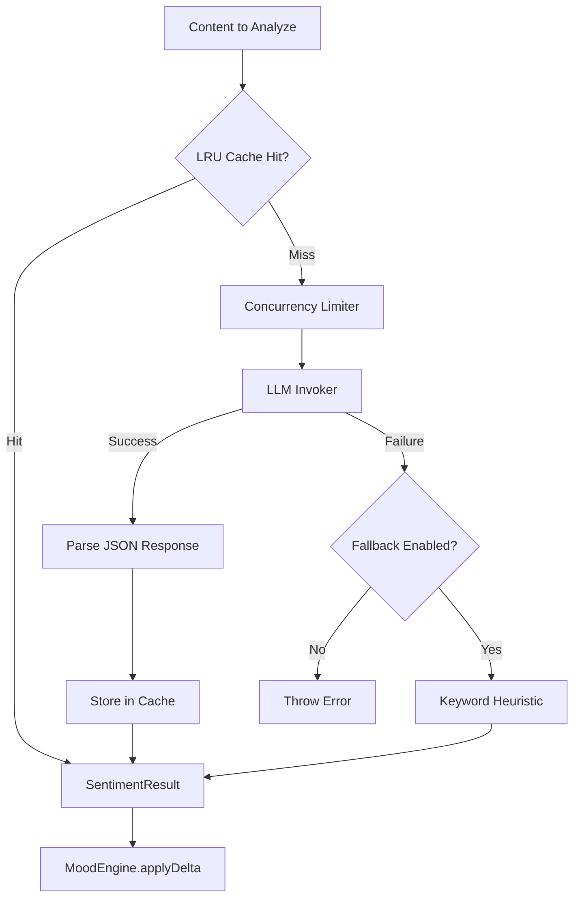

# LLM Sentiment Analysis

The `LLMSentimentAnalyzer` replaces keyword-based sentiment analysis with LLM-powered understanding, producing nuanced PAD (Pleasure-Arousal-Dominance) scores that integrate directly with the Wunderland `MoodEngine`. It features an LRU cache, concurrency limiting, and automatic fallback to keyword heuristics when the LLM is unavailable.

## Architecture Overview



## Quick Start

```typescript
import { LLMSentimentAnalyzer } from 'wunderland';

const analyzer = new LLMSentimentAnalyzer({
  invoker: async (prompt) => {
    const res = await openai.chat.completions.create({
      model: 'gpt-4o-mini',
      messages: [{ role: 'user', content: prompt }],
    });
    return res.choices[0].message.content ?? '';
  },
});

// Analyze sentiment
const result = await analyzer.analyzeSentiment('This project is amazing!');
console.log(result);
// {
//   sentiment: 0.8,    // -1 to 1 (very negative to very positive)
//   arousal: 0.4,      // -1 to 1 (calm to excited)
//   dominance: 0.1,    // -1 to 1 (submissive to commanding)
//   reasoning: 'Strongly positive expression of enthusiasm',
//   fromLLM: true
// }
```

## SentimentResult

Every analysis returns a `SentimentResult` with PAD-compatible scores:

| Field | Type | Range | Description |
|-------|------|-------|-------------|
| `sentiment` | `number` | -1 to 1 | Overall sentiment (valence). Negative = negative emotion, positive = positive emotion |
| `arousal` | `number` | -1 to 1 | Energy level. Negative = calm/sleepy, positive = excited/intense |
| `dominance` | `number` | -1 to 1 | Assertiveness. Negative = submissive/uncertain, positive = commanding |
| `reasoning` | `string` | -- | Brief explanation of the classification |
| `fromLLM` | `boolean` | -- | `true` if LLM analyzed it, `false` if keyword fallback was used |

## Configuration

```typescript
const analyzer = new LLMSentimentAnalyzer({
  // Required: LLM invoker function
  invoker: myInvoker,

  // Fall back to keyword analysis on LLM failure (default: true)
  fallbackToKeyword: true,

  // Cache TTL in milliseconds (default: 300000 = 5 minutes)
  cacheTtlMs: 300_000,

  // Maximum cache entries (default: 256)
  maxCacheSize: 256,

  // Maximum concurrent LLM calls (default: 3)
  maxConcurrency: 3,
});
```

| Option | Default | Description |
|--------|---------|-------------|
| `invoker` | *required* | Function that sends a prompt to an LLM and returns the response text |
| `fallbackToKeyword` | `true` | Whether to use keyword heuristics when the LLM call fails |
| `cacheTtlMs` | `300000` | How long cached results are valid (milliseconds) |
| `maxCacheSize` | `256` | Maximum number of entries in the LRU cache |
| `maxConcurrency` | `3` | Maximum simultaneous LLM calls (prevents overload) |

## Mood Impact Analysis

The analyzer can compute a `MoodDelta` that represents how new content should shift the agent's current mood. Deltas are small (-0.3 to 0.3) because moods shift gradually, not dramatically.

```typescript
import { LLMSentimentAnalyzer } from 'wunderland';
import type { PADState } from 'wunderland';

const currentMood: PADState = {
  valence: 0.5,   // Currently positive
  arousal: 0.2,   // Fairly calm
  dominance: 0.3, // Mildly assertive
};

const delta = await analyzer.analyzeMoodImpact(
  'The server is down and users are complaining!',
  currentMood,
);

console.log(delta);
// {
//   valence: -0.2,     // Mood shifts negative
//   arousal: 0.25,     // Energy increases (stress)
//   dominance: -0.1,   // Slight loss of control feeling
//   trigger: 'Urgent server outage with user complaints'
// }
```

The `MoodDelta` is directly compatible with `MoodEngine.applyDelta()`:

```typescript
const newMood = moodEngine.applyDelta(currentMood, delta);
```

## Conversation Tone Analysis

Analyze the overall tone across multiple messages in a conversation, with trend detection:

```typescript
const messages = [
  'Thanks for the help!',
  'Hmm, this is getting frustrating.',
  'Wait, I think I see the issue now.',
  'Yes! That fixed it! Thank you so much!',
];

const tone = await analyzer.analyzeConversationTone(messages);
console.log(tone);
// {
//   averageSentiment: 0.35,
//   averageArousal: 0.2,
//   trend: 'improving',     // 'improving' | 'declining' | 'stable'
//   messageCount: 4
// }
```

The trend is computed by comparing the average sentiment of the first half of messages against the second half. A delta greater than 0.15 indicates `'improving'`; less than -0.15 indicates `'declining'`.

## Caching Behavior

The analyzer uses an LRU (Least Recently Used) cache with TTL-based expiration:

- **Cache key**: A djb2 hash of the content string
- **Cache hit**: Returns the cached `SentimentResult` immediately (no LLM call)
- **Cache miss**: Calls the LLM, stores the result, and returns it
- **Eviction**: When the cache reaches `maxCacheSize`, the oldest entry is evicted
- **Expiration**: Entries older than `cacheTtlMs` are treated as misses

```typescript
// First call — LLM is invoked
const r1 = await analyzer.analyzeSentiment('Hello world');
console.log(r1.fromLLM); // true

// Second call within TTL — cache hit
const r2 = await analyzer.analyzeSentiment('Hello world');
console.log(r2.fromLLM); // true (same result, no new LLM call)

// Clear the cache manually
analyzer.clearCache();
```

## Concurrency Limiting

The built-in concurrency limiter prevents overwhelming the LLM provider with simultaneous requests. When `maxConcurrency` parallel calls are in flight, additional requests queue until a slot becomes available.

This is especially important when:
- Analyzing multiple messages in `analyzeConversationTone()`
- Multiple users trigger sentiment analysis simultaneously
- The LLM provider has rate limits

## Keyword Fallback

When the LLM call fails (network error, rate limit, malformed response), the analyzer can fall back to a keyword-based heuristic. This uses word lists to score sentiment:

- **Positive words**: great, good, excellent, amazing, wonderful, fantastic, brilliant, love, happy, excited, helpful, thanks, awesome, perfect, beautiful, impressive, outstanding, delightful
- **Negative words**: bad, terrible, awful, horrible, hate, angry, frustrated, disappointing, useless, broken, wrong, fail, worst, ugly, annoying, painful, disgusting, pathetic, stupid
- **High arousal words**: urgent, exciting, amazing, incredible, emergency, critical, astonishing, shocking, explosive, wild, insane

Fallback results have `fromLLM: false` and `dominance: 0` (the keyword approach cannot detect dominance).

```typescript
// Force keyword-only analysis by disabling fallback and catching errors,
// or by using a failing invoker
const keywordOnly = new LLMSentimentAnalyzer({
  invoker: async () => { throw new Error('disabled'); },
  fallbackToKeyword: true,
});

const result = await keywordOnly.analyzeSentiment('This is great and amazing!');
console.log(result.fromLLM); // false
console.log(result.sentiment); // ~0.67 (2 positive / 3 total scored)
```

## SmallModelResolver Integration

The `SmallModelResolver` selects the cheapest/fastest model for sentiment analysis based on your configured provider:

```typescript
import { SmallModelResolver, LLMSentimentAnalyzer } from 'wunderland';

const resolver = new SmallModelResolver({ primaryProvider: 'openai' });
const { providerId, modelId } = resolver.resolveSmall();
// => { providerId: 'openai', modelId: 'gpt-4o-mini' }

const analyzer = new LLMSentimentAnalyzer({
  invoker: async (prompt) => {
    return await callModel(providerId, modelId, prompt);
  },
});
```

See [Model Providers](./model-providers.md) for the full small-model mapping table.

## Related

- [Style Adaptation](./style-adaptation.md) -- communication style learning
- [Social Features](./social-features.md) -- MoodEngine and social network
- [Model Providers](./model-providers.md) -- provider configuration and SmallModelResolver
- [HEXACO Personality](./hexaco-personality.md) -- personality traits that influence mood
