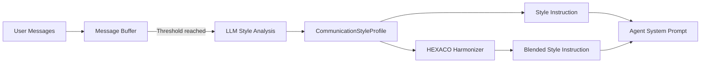

# Communication Style Adaptation

The `StyleAdaptationEngine` learns each user's communication preferences over time and generates tailored style instructions that are appended to the agent's system prompt. This allows agents to naturally adapt their tone, verbosity, and structure to match how each user prefers to interact.

## How It Works



1. **Ingestion** -- user messages are collected in a per-user buffer (up to 50 messages, LRU eviction).
2. **Analysis** -- when the buffer reaches the minimum sample size (default: 5 messages), the engine sends the last 30 messages to an LLM for style profiling.
3. **Profiling** -- the LLM returns a structured `CommunicationStyleProfile` with six dimensions.
4. **Instruction generation** -- the profile is converted into a natural-language paragraph (e.g., "Use a casual, conversational tone. Keep responses concise...").
5. **Re-analysis** -- every N messages (default: 10), the engine re-runs the analysis to track evolving preferences.

## CommunicationStyleProfile

The profile captures six dimensions of communication style, each scored from 0.0 to 1.0:

| Dimension | 0.0 | 1.0 | Description |
|-----------|-----|-----|-------------|
| `formality` | Casual (slang, abbreviations) | Formal (proper grammar, titles) | Overall tone register |
| `verbosity` | Terse (one-word answers) | Verbose (long explanations) | Preferred response length |
| `technicality` | Layperson (avoids jargon) | Expert (heavy technical language) | Technical depth |
| `emotionalTone` | Clinical/detached | Warm/expressive | Emotional engagement level |
| `structurePreference` | -- | -- | `'prose'`, `'bullets'`, or `'mixed'` |
| `humorTolerance` | No humor | Frequent humor | Receptiveness to wit/jokes |

Additionally, each profile tracks:

| Field | Description |
|-------|-------------|
| `sampleSize` | Number of messages analyzed |
| `confidence` | Profile confidence (0--1), rises asymptotically as more messages are collected |
| `lastUpdatedAt` | ISO-8601 timestamp of last profile update |

## Quick Start

```typescript
import { StyleAdaptationEngine } from 'wunderland';

const engine = new StyleAdaptationEngine({
  invoker: async (prompt) => {
    const res = await openai.chat.completions.create({
      model: 'gpt-4o-mini',
      messages: [{ role: 'user', content: prompt }],
    });
    return res.choices[0].message.content ?? '';
  },
});

// Ingest user messages over time
await engine.ingestUserMessage('user-1', 'hey can u help me debug this?');
await engine.ingestUserMessage('user-1', 'nvm found it lol');
await engine.ingestUserMessage('user-1', 'ok so now im getting a weird error');
await engine.ingestUserMessage('user-1', 'its saying null ref on line 42');
await engine.ingestUserMessage('user-1', 'any ideas?');

// Generate a style instruction to append to the system prompt
const instruction = engine.generateStyleInstruction('user-1');
// => "Use a casual, conversational tone. Keep responses concise and to the point..."
```

## Configuration Options

```typescript
const engine = new StyleAdaptationEngine({
  // Required: LLM invoker function
  invoker: myInvoker,

  // Minimum messages before generating the first profile (default: 5)
  minSampleSize: 5,

  // Maximum messages to retain per user (default: 50, LRU eviction)
  maxMessageHistory: 50,

  // Re-analyze every N new messages (default: 10)
  reanalyzeEvery: 10,
});
```

| Option | Default | Description |
|--------|---------|-------------|
| `invoker` | *required* | Function that sends a prompt to an LLM and returns the response text |
| `minSampleSize` | `5` | Minimum messages before first profile generation |
| `maxMessageHistory` | `50` | Maximum buffered messages per user (oldest evicted) |
| `reanalyzeEvery` | `10` | Trigger re-analysis every N new messages |

## HEXACO Personality Harmonization

The engine can blend a user's style preferences with the agent's HEXACO personality traits, finding a natural middle ground that respects both the user's preferences and the agent's character.

```typescript
const instruction = engine.harmonizeWithPersonality('user-1', {
  honesty: 0.9,
  emotionality: 0.3,
  extraversion: 0.4,
  agreeableness: 0.7,
  conscientiousness: 0.95,
  openness: 0.85,
});
// => "Use a balanced, semi-formal tone. Aim for moderate detail..."
// May include notes about personality tension, e.g.:
// "Note: while you tend toward formality, this user prefers a more relaxed tone..."
```

### How Harmonization Works

HEXACO traits are mapped to style dimensions to derive the agent's "natural" style:

| Style Dimension | HEXACO Mapping |
|----------------|----------------|
| Formality | `conscientiousness * 0.6 + (1 - extraversion) * 0.4` |
| Verbosity | `extraversion * 0.5 + openness * 0.3 + 0.2` |
| Emotional Tone | `emotionality * 0.5 + agreeableness * 0.3 + extraversion * 0.2` |
| Humor | `extraversion * 0.4 + openness * 0.4 + (1 - conscientiousness) * 0.2` |

The blending uses a **60/40 split** -- 60% weight on the user's measured preferences, 40% on the agent's personality-derived style. This ensures the agent adapts to the user while retaining its character.

When the gap between user preference and agent personality exceeds 0.3 on a dimension, the engine adds a contextual note (e.g., "Note: while you tend toward a casual style, this user prefers a more polished tone -- elevate your language slightly.").

## Style Instruction Examples

Based on different profile values, the engine generates instructions like:

| Profile | Generated Instruction |
|---------|----------------------|
| Casual developer | "Use a casual, conversational tone. Keep responses concise and to the point. Feel free to use domain-specific terminology. Maintain a neutral, clinical tone. Use bullet points and lists when presenting multiple items." |
| Formal executive | "Use a formal, professional tone. Provide thorough, detailed explanations. Avoid jargon and technical terms; explain concepts in simple language. Be warm and personable. Present information in flowing prose paragraphs." |
| Technical expert | "Use a balanced, semi-formal tone. Aim for moderate detail. Feel free to use domain-specific terminology. Use a moderately warm tone. Mix prose and bullet points as appropriate. Light humor and wit are welcome." |

## Profile Persistence

Profiles can be saved and restored across sessions:

```typescript
// Get the current profile
const profile = engine.getProfile('user-1');
if (profile) {
  // Save to your database
  await db.saveStyleProfile('user-1', profile);
}

// Later, restore it
const saved = await db.loadStyleProfile('user-1');
if (saved) {
  engine.loadProfile('user-1', saved);
}
```

## Clearing Profiles

```typescript
// Clear a single user's profile and message buffer
engine.clearProfile('user-1');
```

## Integration with Agent Pipeline

In a typical agent setup, the style instruction is appended to the system prompt before each LLM call:

```typescript
import { StyleAdaptationEngine } from 'wunderland';

// During agent initialization
const styleEngine = new StyleAdaptationEngine({ invoker: myInvoker });

// On each user message
async function handleMessage(userId: string, message: string) {
  // Ingest for learning
  await styleEngine.ingestUserMessage(userId, message);

  // Generate style instruction
  const styleInstruction = styleEngine.harmonizeWithPersonality(
    userId,
    agent.hexacoTraits,
  );

  // Append to system prompt
  const systemPrompt = [
    agent.baseSystemPrompt,
    styleInstruction ? `\n\nCommunication style: ${styleInstruction}` : '',
  ].join('');

  // Call LLM with the style-aware prompt
  const response = await llm.chat({
    system: systemPrompt,
    messages: [{ role: 'user', content: message }],
  });

  return response;
}
```

## Related

- [HEXACO Personality](./hexaco-personality.md) -- the personality trait system
- [Creating Agents](./creating-agents.md) -- agent configuration
- [LLM Sentiment Analysis](./llm-sentiment.md) -- mood-aware sentiment analysis
