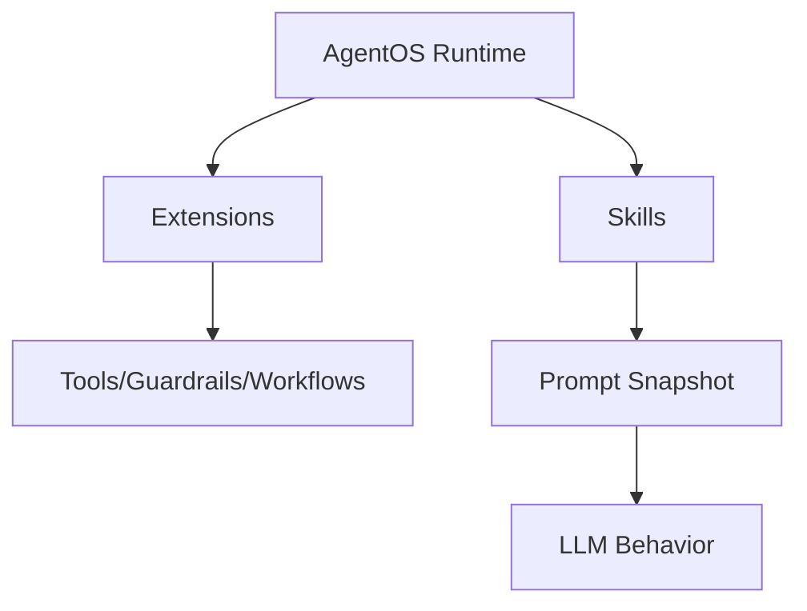
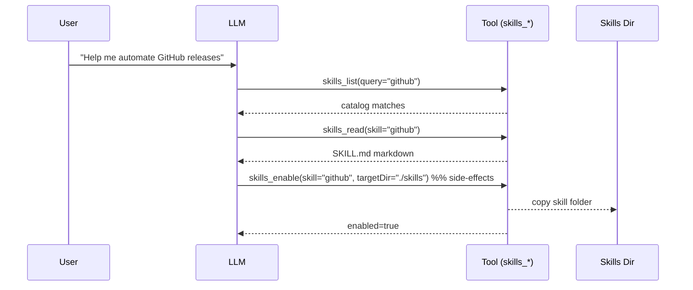

# Skills (SKILL.md)

Skills are **modular prompt modules** that extend what an AgentOS-based agent can do. Each skill lives in a folder containing a `SKILL.md` file:

- YAML frontmatter: metadata, requirements, install specs, invocation policy
- Markdown body: instructions injected into an agent’s system prompt (or fetched on-demand)

## Skill Docs

- Skill format: [`SKILL.md`](./skill-format)
- Skills extension (tools): [`@framers/agentos-ext-skills`](./skills-extension)
- Curated skills registry: [`@framers/agentos-skills-registry`](./agentos-skills-registry) (data + typed SDK + factories)

## Skills vs Extensions

Skills and extensions solve different problems:

- **Extensions**: runtime code (tools, guardrails, workflows) loaded into AgentOS via the extensions system.
- **Skills**: prompt-level “how to” modules that teach an agent _when_ and _how_ to use tools and workflows.



## Loading Skills With `SkillRegistry`

Use `SkillRegistry` to load skills from one or more directories and compile them into a single prompt snapshot:

```ts
import { SkillRegistry } from '@framers/agentos/skills';

const registry = new SkillRegistry();
await registry.loadFromDirs(['./skills']);

const snapshot = registry.buildSnapshot({ platform: process.platform, strict: true });
console.log(snapshot.prompt);
```

## Curated Skills Packages

The curated catalog ships as a single package:

- `@framers/agentos-skills-registry`: SKILL.md files + registry.json + typed catalog + query helpers + factories

It supports a lightweight import path:

```ts
import { searchSkills, getSkillsByCategory } from '@framers/agentos-skills-registry/catalog';
```

…and a factory path that lazy-loads `@framers/agentos` only when you call it:

```ts
import { createCuratedSkillSnapshot } from '@framers/agentos-skills-registry';

const snapshot = await createCuratedSkillSnapshot({ skills: ['github', 'weather'] });
```

## On-Demand Skill Discovery (Lazy)

If you don’t want to inject all skill prompt content up front, load the **skills tool extension**:

- `@framers/agentos-ext-skills`: exposes `skills_list`, `skills_read`, `skills_status`, `skills_enable`, `skills_install`

This enables a “lazy” flow where the model can:

1. List/search skills (`skills_list`)
2. Fetch a specific `SKILL.md` only when needed (`skills_read`)
3. Enable a skill into a local skills directory (HITL-gated) (`skills_enable`)



## Example: Inject Skills Snapshot Into a System Prompt

One common integration pattern is:

1. Build a skills snapshot at startup (or per-session)
2. Append `snapshot.prompt` into your system prompt

This is how the `wunderland` CLI’s `--skills-dir` support works.
