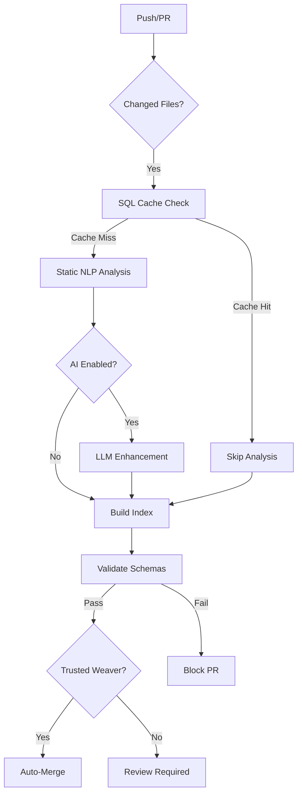

<div align="center">
  <a href="https://frame.dev" target="_blank" rel="noopener">
    
  </a>

# Frame Codex

**Frame Codex at [frame.dev](https://frame.dev/codex)** - The best and most optimized collection of humanity's knowledge and research, designed for both AI consumption and human exploration.

*The OS for humans, the codex of humanity.*

[](https://github.com/framersai/codex)
[](https://creativecommons.org/licenses/by/4.0/)
[](docs/contributing/how-to-submit.md)
[](https://openstrand.ai)
[](https://github.com/framersai/codex/actions)
[](https://github.com/framersai/codex/actions/workflows/test.yml)


[Browse](https://frame.dev/codex) • [Documentation](docs/DEVELOPMENT.md) • [Contributing](docs/contributing/how-to-submit.md) • [Changelog](docs/CHANGELOG_SYSTEM.md) • [Security](SECURITY.md) • [Discord](https://discord.gg/VXXC4SJMKh)

**AI Infrastructure for Superintelligence.**

</div>

---

## Overview

Frame Codex is a data-only knowledge repository designed as the canonical source of structured information for AI systems and humans alike. **At [frame.dev/codex](https://frame.dev/codex), Frame Codex offers the best and most optimized collection of humanity's knowledge and research** - curated for both AI consumption (LLM ingestion, semantic search) and human exploration (beautiful UI, discovery).

This repository contains:

- **Pure content** - [Weaves](./weaves) (top-level directories), looms (any folder inside a weave), strands (markdown files), tags, and schemas
- **Markdown-only** - The primary source of truth (OpenStrand ingests any file type and serializes to markdown)
- **No UI** - The viewer interface lives at [frame.dev/codex](https://frame.dev/codex)
- **LLM-optimized** - Structured for knowledge graph ingestion by OpenStrand and other AI systems
- **AI + Human Friendly** - YAML frontmatter, semantic embeddings, and beautiful rendering for optimal consumption by both machines and people

**📚 Browse the knowledge weaves:** All content is organized in the [`/weaves`](./weaves) directory.

### Frame Codex vs OpenStrand

- **Frame Codex**: Public markdown knowledge repository (this repo) - read-only, curated, version-controlled
- **OpenStrand**: Full personal knowledge management platform at [openstrand.ai](https://openstrand.ai) - supports any file type (images, videos, PDFs, code), AI analysis, serialization to markdown, private workspaces, and advanced features

**Schema**: Frame Codex follows the [OpenStrand schema specification](https://openstrand.ai/docs/schema) for weaves, looms, and strands. Looms are now inferred from folders (no `looms/` or `strands/` prefixes required) and strands are any markdown files within a weave.
Strand frontmatter now supports both `extractiveSummary` (deterministic NLP) and `aiSummary` (LLM) fields, plus a `notes` array for short bullet annotations that surface inside the Frame.dev viewer.

## 🔄 Automated Indexing Workflow

Frame Codex uses a **hybrid NLP + LLM approach** with smart caching and manual override options:

### Static NLP Tools (Always On, No API Keys Required)

1. **TF-IDF Analysis** - Extracts keywords based on term frequency and inverse document frequency
2. **N-gram Extraction** - Identifies multi-word phrases and technical terms
3. **Vocabulary Matching** - Auto-tags content using controlled vocabulary from `tags/index.yaml`
4. **Schema Validation** - Ensures compliance with OpenStrand schema (weave/loom/strand structure with organic folders)
5. **Duplicate Detection** - Catches near-duplicate content using fuzzy matching
6. **Content Quality** - Minimum length, forbidden patterns (lorem ipsum, TODO)

### Optional LLM Enhancement (API Key Required)

Enabled via `OPENAI_API_KEY` secret (set `AI_PROVIDER=disabled` to skip):

1. **Semantic Analysis** - Deep understanding of context and meaning (GPT-4)
2. **Quality Scoring** - 0-100 score based on clarity, accuracy, completeness
3. **Tag Suggestions** - AI-powered tag recommendations beyond vocabulary
4. **Relationship Detection** - Finds connections between strands
5. **Summary Generation** - Creates concise summaries for missing frontmatter

**Cost**: ~$0.01-0.20 per PR (depending on content length: 100-10K words)

### GitHub Actions Workflows



**Workflows**:
- `.github/workflows/auto-index.yml` - Builds index on every commit (static NLP)
- `.github/workflows/ai-enhance-pr.yml` - Optional AI analysis on PRs
- `.github/workflows/auto-merge-weavers.yml` - Auto-approves PRs from trusted contributors
- `.github/workflows/changelog.yml` - Daily changelog generation (git + GitHub API)
- `.github/workflows/test.yml` - Runs validation suite (no API keys)

### Manual Overrides & Controls

You have full control over automation:

```yaml
# In .github/secrets (repository settings)
SQL_CACHE_DISABLED=true          # Force full re-index (bypass cache)
AI_PROVIDER=disabled             # Disable LLM enhancement entirely
AUTO_CATALOG_MERGE=false         # Require manual approval for re-catalogs
```

**Per-file overrides** (in frontmatter):
```yaml
---
skip_ai: true        # Exclude this file from AI analysis
skip_index: true     # Don't include in search index
manual_tags: true    # Don't auto-suggest tags
---
```

**Gitignore patterns**: Add paths to `.gitignore` or `scripts/auto-index.js` → `IGNORED_PATTERNS` array.

## 🏷️ Block Tagging

Frame Codex supports **block-level tagging** for granular content discovery. Every paragraph, heading, code block, and list can have associated tags.

### Inline Tags (Recommended)

Add tags directly in your markdown using `#hashtag` syntax:

```markdown
This section covers React hooks for state management. #react #hooks #frontend

## Custom Hooks #advanced

Building reusable hooks is essential for #clean-code and #maintainability.
```

**Rules:**
- Must start with a letter: `#react` ✓, `#123` ✗
- Can contain letters, numbers, hyphens, underscores, slashes: `#web/javascript` ✓
- Case-insensitive (normalized to lowercase): `#React` → `react`
- Reserved patterns skipped: `#h1` - `#h6` (markdown headings)

**Inline tags get 100% confidence** and always appear in the final index.

### Automatic NLP Tags

In addition to inline tags, the Codex pipeline automatically suggests tags using:

1. **Vocabulary Matching** - From `tags/index.yaml` controlled vocabulary
2. **TF-IDF Extraction** - Statistically significant terms
3. **Document Propagation** - Inherits relevant tags from document metadata

Suggested tags with **≥50% confidence are auto-confirmed** during index build.

### Tag Sources & Colors

| Source | Confidence | Color | Description |
|--------|------------|-------|-------------|
| `inline` | 100% | Blue | Explicit `#hashtag` in content |
| `user` | 100% | Emerald | Manually confirmed by contributor |
| `nlp` | 30-85% | Cyan | Vocabulary + TF-IDF extraction |
| `llm` | 50-95% | Violet | AI-suggested (optional) |
| `existing` | 35-75% | Emerald | Propagated from document tags |

### CLI Commands

```bash
# Process blocks and calculate worthiness
node scripts/block-processor.js --all

# Build the blocks index (includes auto-confirm)
npm run build:index

# View block stats
cat codex-blocks.json | jq '.stats'
```

See [HYBRID_TAGGING_DATAFLOW.md](docs/HYBRID_TAGGING_DATAFLOW.md) for complete architecture.

## Architecture

The Codex uses the OpenStrand four-tier knowledge hierarchy:

- **Fabric** - Collection of weaves (Frame Codex itself is a fabric containing multiple knowledge universes)
- **Weave** - Complete knowledge universe with no cross-weave dependencies (e.g., `weaves/technology/`, `weaves/science/`)
- **Loom** - Any subdirectory inside a weave, curated collection of related strands (topic/module, auto-detected from folder structure)
- **Strand** - Atomic knowledge unit (individual markdown file at any depth within its weave)

### SQL Cache Layer

Frame Codex uses [@framers/sql-storage-adapter](https://github.com/framersai/sql-storage-adapter) for intelligent caching:

**CI/GitHub Actions (better-sqlite3):**
- Stores file metadata, SHA hashes, and analysis results in `.cache/codex.db`
- Only re-processes files that have changed (SHA comparison)
- Reduces indexing time from ~30s to ~2-5s on typical PRs (85-95% speedup)
- Cache persists across workflow runs via GitHub Actions cache

**Browser (IndexedDB via Frame.dev Codex UI):**
- Caches fetched Codex strands locally for faster reloads
- SQL-backed cache lives entirely in your browser (IndexedDB/sql.js), never on Frame.dev servers
- No secrets or tokens are ever stored in this cache—only public markdown content
- Quota: 50MB–1GB+ depending on browser

**Performance:**
- First run: ~30s (full analysis, populates cache)
- Subsequent runs: ~2-5s (diff only, 85-95% cache hit rate)
- Storage: ~500KB-2MB for 100 files

**Configuration:**
```bash
SQL_CACHE_DISABLED=true  # Disable SQL caching (falls back to full indexing)
```

### Search Data (BM25 + Semantic Embeddings)

After building the main index, generate the search artifacts consumed by `frame.dev/codex`:

```bash
npm run index           # builds codex-index.json
npm run build:search    # builds codex-search.json (BM25 + MiniLM embeddings)
```

`codex-search.json` contains:

- **BM25 postings** for every token (term frequency per strand)
- **Document metadata** (path, title, summary, weave/loom, doc length)
- **Packed Float32 embeddings** (MiniLM-L6-v2, mean pooled, normalized) stored as base64

These assets are completely static, so they can be hosted on GitHub Pages or any CDN. Frame.dev downloads them once and performs all ranking + semantic re-ranking in the browser (no server calls, no API keys).

## Repository Structure

```
codex/
├── schema/              # JSON/YAML schemas for validation
│   ├── weave.schema.yaml
│   ├── loom.schema.yaml
│   └── strand.schema.yaml
├── tags/               # Controlled vocabulary
│   └── index.yaml     # Subjects, topics, subtopics
├── weaves/            # Knowledge universes (each top-level folder = weave)
│   ├── frame/
│   │   ├── weave.yaml
│   │   ├── overview.md                     # Strand at weave root
│   │   ├── research/                      # Loom (folder) inferred automatically
│   │   │   ├── loom.yaml (optional)
│   │   │   └── roadmap.md
│   │   └── guides/building/primer.md      # Nested loom (guides/building)
│   └── wiki/
├── docs/              # Documentation & static assets
│   ├── logos/
│   └── assets/
├── scripts/           # Build and utility scripts
│   └── build-index.mjs
└── index.json        # Generated search index
```

## Usage

### For AI/LLM Integration

Frame.dev and OpenStrand consume this content via:

1. **GitHub API** - Dynamic folder browsing
2. **Raw URLs** - Direct content fetching
3. **Index File** - Pre-compiled `index.json` for search

```javascript
// Example: Fetch a strand (file at any depth inside a weave)
const response = await fetch(
  'https://raw.githubusercontent.com/framersai/codex/main/weaves/frame/overview.md'
);
const content = await response.text();
```

### Using Quarry as the Codex Viewer

The primary UI for browsing Frame Codex is [Quarry](https://frame.dev/quarry) at [`https://frame.dev/codex`](https://frame.dev/codex):

- **Browse**: Tree + outline view with loom/strand badges
- **Search**: NLP-enhanced client-side search (names + content, typo-tolerant)
- **Bookmarks & History**: Stored locally in your browser
- **Contribution Modal**: AI-assisted PR creation with optional GitHub PAT

> Privacy: Quarry stores bookmarks, history, preferences, and SQL cache **only in your browser**.
> GitHub Personal Access Tokens (PATs), if you choose to provide one, are held only in memory while the contribution modal is open and are sent directly to GitHub—never to any Frame.dev backend and never written to localStorage/IndexedDB/SQL.

### Pointing Quarry at Your Own Repository

You can reuse Quarry to render *any* GitHub-hosted Codex-style repository:

1. **Fork `framersai/frame.dev`**
2. In the `apps/frame.dev` app, configure the Codex repo via environment variables:

   ```bash
   # .env.local
   NEXT_PUBLIC_CODEX_REPO_OWNER=your-github-username-or-org
   NEXT_PUBLIC_CODEX_REPO_NAME=your-codex-repo
   NEXT_PUBLIC_CODEX_REPO_BRANCH=main
   ```

3. The viewer reads these in `components/codex/constants.ts` (`REPO_CONFIG`) and will render your repository instead of `framersai/codex`.
4. Deploy your fork (e.g., Vercel, Netlify, GitHub Pages) and you now have a hosted Codex UI for your own knowledge fabric.

### Building the Index

```bash
# Install dependencies
npm install

# Generate search index with auto-categorization
npm run index

# Build lightweight index (original)
npm run build:index

# Validate all schemas and content
npm run validate

# Check for duplicate content
npm run check-duplicates
```

## Contributing

We welcome contributions! Our automated systems help ensure quality:

> Important: Only submit content you own or have permission to publish under a permissive license (CC-BY-4.0 or compatible). Do not submit proprietary or copyrighted material without explicit written permission.

### Quick Start
1. Fork this repository
2. Generate a template: `npm run generate-template -- "Your Title"`
3. Add your content following the schema
4. Validate: `npm run validate`
5. Submit a PR using our template

### Automated Features
- **Auto-Indexing**: NLP-powered categorization (TF-IDF, n-grams) - **No API keys needed**
- **Auto-Tagging**: Smart tag suggestions via vocabulary matching
- **Validation**: Quality assurance checks (schema, content, duplicates)
- **AI Enhancement** (Optional): GPT-4/Claude analysis with quality scoring
- **Auto-Merge**: Trusted Weavers (5+ contributions) get instant merge

### Quality Standards
- Minimum 100 characters of meaningful content  
- No placeholder text (lorem ipsum, TODO, FIXME)  
- Complete metadata (title, summary, tags)  
- Valid schema compliance  
- Proper categorization  

See [Contributing Guide](docs/contributing/how-to-submit.md) for details.

---

## GitHub Secrets (For Maintainers)

### Required Secrets

Add these to repository settings → Secrets and variables → Actions:

```bash
# Required for auto-merge workflow
GH_PAT=ghp_xxxxxxxxxxxxxxxxxxxx
# GitHub Personal Access Token with 'repo' scope
# Create at: https://github.com/settings/tokens/new?scopes=repo

# Optional: AI-powered PR enhancement
OPENAI_API_KEY=sk-xxxxxxxxxxxxxxxxxxxx
# Get at: https://platform.openai.com/api-keys

# Auto-merge control for catalog updates (default: false)
AUTO_CATALOG_MERGE=false
# Set to 'true' to auto-merge full re-catalog PRs
# Recommended: keep false and manually review metadata changes

# Configuration (optional)
AI_PROVIDER=disabled
# Set to 'disabled' to skip AI enhancement entirely
# Leave unset or set to 'openai' to enable
```

### Secret Usage

- **GH_PAT**: Required for auto-merge workflow to approve and merge PRs
- **OPENAI_API_KEY**: Optional, enables AI quality analysis (cost varies by content length: ~$0.01-0.20/PR for 100-10K words)
- **AUTO_CATALOG_MERGE**: Set to `true` to auto-merge full re-catalog PRs (default: `false`, requires manual approval)
- **AI_PROVIDER**: Set to `disabled` to skip AI enhancement

**Note:** The indexer and validator work WITHOUT any API keys. AI enhancement is purely optional for advanced quality analysis.

## Repository Structure

The Codex is organized hierarchically:
- **Weaves**: Complete knowledge universes
- **Looms**: Curated topic collections
- **Strands**: Individual knowledge units

## Integration

This repository is designed to be consumed by:

- **[Frame.dev](https://frame.dev)** - Web viewer interface with GraphQL API support
- **[OpenStrand](https://openstrand.ai)** - Personal knowledge management
- **Your Application** - Via REST or GraphQL API

### 🔑 GitHub GraphQL API & Rate Limits

Quarry at [frame.dev/codex](https://frame.dev/codex) uses the GitHub GraphQL API for efficient tree fetching:

**Free for Everyone**:
- No cost to use (GitHub API is free for all public repos)
- Unauth limit: 60 requests/hour
- With PAT (Personal Access Token): 5,000 requests/hour

**Optional: Personal Access Token**:

To improve your rate limits, you can optionally set `GH_PAT` or `NEXT_PUBLIC_GH_PAT` as an environment variable:

1. Create token at [github.com/settings/tokens/new](https://github.com/settings/tokens/new)
2. Required scope: `public_repo` (read public repositories)
3. Set env var: `export GH_PAT=ghp_xxxxxxxxxxxx`
4. The viewer will automatically use it for API calls

**Privacy**: Your PAT (if provided) is used only client-side in your browser for GitHub API calls. It never leaves your machine and is not sent to Frame.dev servers.

**Fallback**: If GraphQL fails or no PAT is provided, the viewer automatically falls back to the REST API.

See [lib/githubGraphql.ts](https://github.com/framersai/frame.dev/blob/master/apps/frame.dev/lib/githubGraphql.ts) for implementation details.

### 🔒 Privacy & Data Storage

**Client-Side Only**:
- Quarry stores data only in your browser (IndexedDB/localStorage)
- No tracking, analytics, or telemetry
- No data sent to Frame.dev servers
- No cookies (except essential session cookies if you're logged in to GitHub)

**What We Store Locally**:
- Cached index data (for offline access)
- Your bookmarks and reading history (localStorage)
- User preferences (theme, font size, sidebar state)

**What We Don't Store**:
- Personal information
- GitHub tokens (only used in-memory for API calls)
- Browsing history beyond your bookmarks

**GDPR Compliance**: Since we don't collect or store personal data on servers, no GDPR consent is required. All data stays in your browser.

**Clear Your Data**: Use browser dev tools (Application → Storage → Clear) or the "Clear Cache" button in Preferences (coming soon).

## 📄 License

Frame Codex content is licensed under [CC-BY-4.0](LICENSE), making it free for:
- Commercial use
- Modification
- Distribution
- Private use

With attribution requirement.

---

<div align="center">
  <br/>
  
  ### Connect
  
  [Website](https://frame.dev) • [Quarry](https://frame.dev/quarry) • [Frame Codex](https://frame.dev/codex) • [OpenStrand](https://openstrand.ai) • [Discord](https://discord.gg/framedev) • [GitHub](https://github.com/framersai)
  
  <br/>
  
  <sub>Building humanity's knowledge repository for the AI age</sub>
</div>