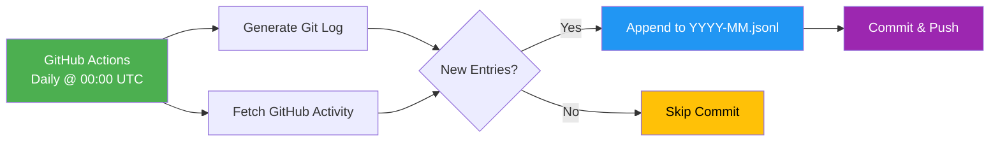
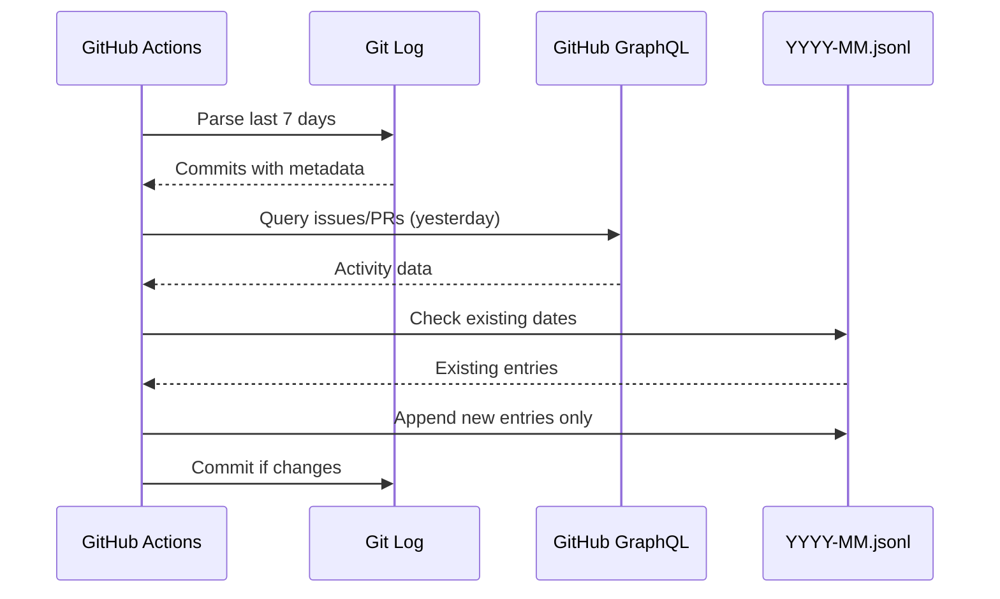

# Frame Codex History

Automated changelog and activity tracking for Frame Codex using **append-only JSONL format**.

## Architecture



## Structure

```
codex-history/
├── 2025-01.jsonl     # All activity for January 2025 (one JSON per line)
├── 2025-02.jsonl     # All activity for February 2025
├── ...
└── README.md         # This file
```

**Format:** [JSONL (JSON Lines)](https://jsonlines.org/) - one JSON object per line, one file per month.

**Benefits:**
- ✅ **Append-only**: No overwrites, safe for concurrent writes
- ✅ **Deduplication**: Automatically skips existing dates
- ✅ **Compact**: 12 files/year instead of 365
- ✅ **Streamable**: Parse line-by-line without loading entire file
- ✅ **Empty days skipped**: Only records days with activity

## Data Flow



## Entry Types

Each line in a `.jsonl` file is one of two types:

### 1. Git Commits

```json
{
  "date": "2025-01-15",
  "totalCommits": 5,
  "byType": {
    "feat": [...],
    "fix": [...],
    "chore": [...]
  },
  "commits": [
    {
      "sha": "abc1234",
      "fullSha": "abc1234567890...",
      "author": "John Doe",
      "email": "john@example.com",
      "date": "2025-01-15T10:30:00Z",
      "url": "https://github.com/framersai/codex/commit/abc1234",
      "type": "feat",
      "scope": "indexer",
      "description": "add SQL caching",
      "body": "Detailed commit message..."
    }
  ]
}
```

### 2. GitHub Activity

```json
{
  "type": "github_activity",
  "date": "2025-01-15",
  "repository": "framersai/codex",
  "summary": {
    "issuesCreated": 2,
    "issuesClosed": 1,
    "prsMerged": 3,
    "total": 6
  },
  "created": [
    {
      "number": 42,
      "title": "Add new feature",
      "url": "https://github.com/framersai/codex/issues/42",
      "createdAt": "2025-01-15T14:20:00Z",
      "author": "johndoe",
      "labels": ["enhancement", "good-first-issue"]
    }
  ],
  "closed": [...],
  "merged": [...]
}
```

## Automation

### Daily Generation

A GitHub Actions workflow runs daily at 00:00 UTC:

1. **Git Changelog**: Parses last 7 days of commits
2. **Issue Activity**: Fetches yesterday's GitHub activity via GraphQL
3. **Append**: Adds new entries to monthly `.jsonl` files (skips duplicates)
4. **Commit**: Only if new entries were added

### Manual Trigger

Generate history for a specific date range:

```bash
# Via GitHub Actions
gh workflow run changelog.yml --repo framersai/codex -f since=2025-01-01

# Or locally
cd apps/codex

# Git changelog
node scripts/generate-changelog.js --since 2025-01-01

# Issue activity (requires GH_PAT)
GH_PAT=ghp_xxx node scripts/fetch-issue-activity.js --since 2025-01-01
```

## Querying History

### Command Line (jq)

```bash
# Read all entries for January 2025
cat codex-history/2025-01.jsonl | jq '.'

# Find all features added
cat codex-history/2025-01.jsonl | jq 'select(.commits) | .commits[] | select(.type == "feat")'

# Count total commits per day
cat codex-history/2025-01.jsonl | jq 'select(.commits) | {date, totalCommits}'

# Find issues with specific label
cat codex-history/2025-01.jsonl | jq 'select(.type == "github_activity") | .created[] | select(.labels | contains(["bug"]))'

# Get activity summary for the month
cat codex-history/2025-01.jsonl | jq 'select(.type == "github_activity") | .summary'
```

### JavaScript/TypeScript

```typescript
import fs from 'fs'
import readline from 'readline'

// Stream-read JSONL file (memory efficient)
async function readMonth(year: number, month: number) {
  const file = `codex-history/${year}-${month.toString().padStart(2, '0')}.jsonl`
  const entries: any[] = []
  
  const rl = readline.createInterface({
    input: fs.createReadStream(file),
    crlfDelay: Infinity
  })
  
  for await (const line of rl) {
    if (line.trim()) {
      entries.push(JSON.parse(line))
    }
  }
  
  return entries
}

// Get all features for January
const january = await readMonth(2025, 1)
const features = january
  .filter(entry => entry.commits)
  .flatMap(entry => entry.commits.filter(c => c.type === 'feat'))

console.log(`${features.length} features added in January`)

// Get total GitHub activity
const activity = january
  .filter(entry => entry.type === 'github_activity')
  .reduce((sum, entry) => sum + entry.summary.total, 0)

console.log(`${activity} issues/PRs in January`)
```

### Python

```python
import json

# Read JSONL file
def read_month(year, month):
    file = f'codex-history/{year}-{month:02d}.jsonl'
    entries = []
    with open(file, 'r') as f:
        for line in f:
            if line.strip():
                entries.append(json.loads(line))
    return entries

# Get all features
january = read_month(2025, 1)
features = [
    commit
    for entry in january if 'commits' in entry
    for commit in entry['commits'] if commit['type'] == 'feat'
]

print(f"{len(features)} features added in January")
```

### AI Prompts

> "Summarize the changes in Frame Codex for January 2025. Focus on new features and bug fixes."

The AI can stream-read `2025-01.jsonl` line-by-line and generate a comprehensive summary without loading the entire file into memory.

## Configuration

### GitHub Secrets

Add to `framersai/codex` repository settings:

**Required:**
- `GH_PAT`: GitHub Personal Access Token with `repo` scope
  - Used for issue/PR activity tracking
  - Generate at: https://github.com/settings/tokens/new?scopes=repo

**Optional:**
- None (git changelog works without any secrets)

### Workflow Customization

Edit `.github/workflows/changelog.yml`:

```yaml
on:
  schedule:
    # Change frequency (default: daily at 00:00 UTC)
    - cron: '0 0 * * *'
```

## Storage & Performance

- **Size**: ~5-30 KB per month (depends on activity)
- **Retention**: Indefinite (files are small and valuable)
- **Performance**: Stream-readable, no need to load entire file
- **Cleanup**: Not needed; history is the point
- **Deduplication**: Automatic (re-running for same date is a no-op)

## Migration from Old Format

If you have old daily JSON files (`YYYY-MM-DD.json`), they can coexist with the new format. The workflow only writes to `.jsonl` files.

To migrate old files to JSONL:

```bash
cd codex-history

# Combine all January 2025 JSON files into one JSONL
for file in 2025-01-*.json; do
  cat "$file" >> 2025-01.jsonl
done

# Clean up old files
rm 2025-01-*.json
```

## Learn More

- [JSONL Specification](https://jsonlines.org/)
- [Conventional Commits](https://www.conventionalcommits.org/)
- [GitHub GraphQL API](https://docs.github.com/en/graphql)
- [Frame Codex Changelog System](../docs/CHANGELOG_SYSTEM.md)
