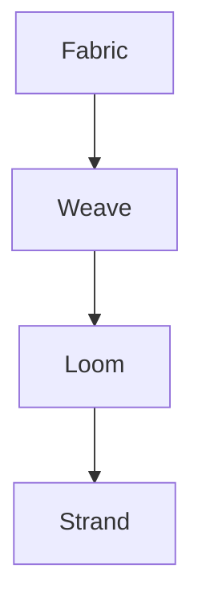
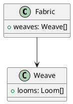

---
blocks:
  - id: markdown-features-guide
    line: 1
    endLine: 1
    type: heading
    headingLevel: 1
    headingText: Markdown Features Guide
    tags: []
    suggestedTags: []
    worthiness:
      score: 0.755
      signals:
        topicShift: 0.5
        entityDensity: 0.75
        semanticNovelty: 0.587
        structuralImportance: 1
  - id: block-3
    line: 3
    endLine: 4
    type: paragraph
    tags: []
    suggestedTags:
      - tag: ai
        confidence: 0.7
        source: nlp
        reasoning: 'Vocabulary match: subjects'
    worthiness:
      score: 0.515
      signals:
        topicShift: 0.742
        entityDensity: 0.357
        semanticNovelty: 0.68
        structuralImportance: 0.405
    extractiveSummary: >-
      Frame Codex supports **GitHub Flavored Markdown (GFM)** plus custom
      enhancements for knowledge management
  - id: philosophy
    line: 5
    endLine: 5
    type: heading
    headingLevel: 2
    headingText: Philosophy
    tags: []
    suggestedTags: []
    worthiness:
      score: 0.855
      signals:
        topicShift: 1
        entityDensity: 0.5
        semanticNovelty: 0.986
        structuralImportance: 0.95
  - id: block-7
    line: 7
    endLine: 7
    type: blockquote
    tags: []
    suggestedTags:
      - tag: ai
        confidence: 0.7
        source: nlp
        reasoning: 'Vocabulary match: subjects'
      - tag: design
        confidence: 0.7
        source: nlp
        reasoning: 'Vocabulary match: subjects'
    worthiness:
      score: 0.527
      signals:
        topicShift: 1
        entityDensity: 0.083
        semanticNovelty: 0.656
        structuralImportance: 0.5
  - id: block-9
    line: 9
    endLine: 10
    type: paragraph
    tags: []
    suggestedTags: []
    worthiness:
      score: 0.418
      signals:
        topicShift: 0.73
        entityDensity: 0.175
        semanticNovelty: 0.618
        structuralImportance: 0.3
  - id: text-formatting
    line: 11
    endLine: 11
    type: heading
    headingLevel: 2
    headingText: Text Formatting
    tags: []
    suggestedTags: []
    worthiness:
      score: 0.833
      signals:
        topicShift: 1
        entityDensity: 0.667
        semanticNovelty: 0.844
        structuralImportance: 0.85
  - id: basic-emphasis
    line: 13
    endLine: 13
    type: heading
    headingLevel: 3
    headingText: Basic Emphasis
    tags: []
    suggestedTags: []
    worthiness:
      score: 0.808
      signals:
        topicShift: 1
        entityDensity: 0.667
        semanticNovelty: 0.981
        structuralImportance: 0.7
  - id: block-15
    line: 15
    endLine: 21
    type: code
    tags: []
    suggestedTags: []
    worthiness:
      score: 0.681
      signals:
        topicShift: 1
        entityDensity: 0.267
        semanticNovelty: 0.847
        structuralImportance: 0.7
  - id: block-23
    line: 23
    endLine: 23
    type: list
    tags: []
    suggestedTags: []
    worthiness:
      score: 0.582
      signals:
        topicShift: 1
        entityDensity: 0.25
        semanticNovelty: 0.986
        structuralImportance: 0.35
  - id: block-25
    line: 25
    endLine: 27
    type: list
    tags: []
    suggestedTags: []
    worthiness:
      score: 0.629
      signals:
        topicShift: 1
        entityDensity: 0.364
        semanticNovelty: 0.905
        structuralImportance: 0.45
  - id: block-28
    line: 28
    endLine: 30
    type: paragraph
    tags: []
    suggestedTags: []
    worthiness:
      score: 0.445
      signals:
        topicShift: 1
        entityDensity: 0
        semanticNovelty: 0.849
        structuralImportance: 0.215
  - id: subscript-and-superscript
    line: 31
    endLine: 31
    type: heading
    headingLevel: 3
    headingText: Subscript and Superscript
    tags: []
    suggestedTags: []
    worthiness:
      score: 0.748
      signals:
        topicShift: 1
        entityDensity: 0.5
        semanticNovelty: 0.889
        structuralImportance: 0.7
  - id: block-33
    line: 33
    endLine: 36
    type: code
    tags: []
    suggestedTags: []
    worthiness:
      score: 0.645
      signals:
        topicShift: 1
        entityDensity: 0
        semanticNovelty: 1
        structuralImportance: 0.7
  - id: block-38
    line: 38
    endLine: 40
    type: paragraph
    tags: []
    suggestedTags: []
    worthiness:
      score: 0.377
      signals:
        topicShift: 0.5
        entityDensity: 0
        semanticNovelty: 1
        structuralImportance: 0.22
  - id: headings
    line: 41
    endLine: 41
    type: heading
    headingLevel: 2
    headingText: Headings
    tags: []
    suggestedTags: []
    worthiness:
      score: 0.714
      signals:
        topicShift: 0.5
        entityDensity: 0.5
        semanticNovelty: 0.959
        structuralImportance: 0.85
  - id: block-43
    line: 43
    endLine: 50
    type: code
    tags: []
    suggestedTags: []
    worthiness:
      score: 0.702
      signals:
        topicShift: 1
        entityDensity: 0.316
        semanticNovelty: 0.89
        structuralImportance: 0.7
  - id: block-52
    line: 52
    endLine: 56
    type: list
    tags: []
    suggestedTags: []
    worthiness:
      score: 0.542
      signals:
        topicShift: 0.782
        entityDensity: 0.203
        semanticNovelty: 0.712
        structuralImportance: 0.55
  - id: lists
    line: 58
    endLine: 58
    type: heading
    headingLevel: 2
    headingText: Lists
    tags: []
    suggestedTags: []
    worthiness:
      score: 0.806
      signals:
        topicShift: 1
        entityDensity: 0.5
        semanticNovelty: 0.917
        structuralImportance: 0.85
  - id: unordered-lists
    line: 60
    endLine: 60
    type: heading
    headingLevel: 3
    headingText: Unordered Lists
    tags: []
    suggestedTags: []
    worthiness:
      score: 0.657
      signals:
        topicShift: 0.293
        entityDensity: 0.667
        semanticNovelty: 0.932
        structuralImportance: 0.7
  - id: block-62
    line: 62
    endLine: 71
    type: code
    tags: []
    suggestedTags: []
    worthiness:
      score: 0.676
      signals:
        topicShift: 1
        entityDensity: 0.333
        semanticNovelty: 0.737
        structuralImportance: 0.7
  - id: block-73
    line: 73
    endLine: 77
    type: list
    tags: []
    suggestedTags: []
    worthiness:
      score: 0.443
      signals:
        topicShift: 0.063
        entityDensity: 0.353
        semanticNovelty: 0.75
        structuralImportance: 0.55
  - id: ordered-lists
    line: 79
    endLine: 79
    type: heading
    headingLevel: 3
    headingText: Ordered Lists
    tags: []
    suggestedTags: []
    worthiness:
      score: 0.794
      signals:
        topicShift: 1
        entityDensity: 0.667
        semanticNovelty: 0.912
        structuralImportance: 0.7
  - id: block-81
    line: 81
    endLine: 87
    type: code
    tags: []
    suggestedTags: []
    worthiness:
      score: 0.677
      signals:
        topicShift: 0.833
        entityDensity: 0.469
        semanticNovelty: 0.741
        structuralImportance: 0.7
  - id: block-89
    line: 89
    endLine: 93
    type: list
    tags: []
    suggestedTags: []
    worthiness:
      score: 0.466
      signals:
        topicShift: 0
        entityDensity: 0.5
        semanticNovelty: 0.741
        structuralImportance: 0.55
  - id: task-lists
    line: 95
    endLine: 95
    type: heading
    headingLevel: 3
    headingText: Task Lists
    tags: []
    suggestedTags: []
    worthiness:
      score: 0.786
      signals:
        topicShift: 1
        entityDensity: 0.667
        semanticNovelty: 0.874
        structuralImportance: 0.7
  - id: block-97
    line: 97
    endLine: 101
    type: code
    tags: []
    suggestedTags: []
    worthiness:
      score: 0.591
      signals:
        topicShift: 0.388
        entityDensity: 0.367
        semanticNovelty: 0.885
        structuralImportance: 0.7
  - id: block-103
    line: 103
    endLine: 105
    type: list
    tags: []
    suggestedTags: []
    worthiness:
      score: 0.433
      signals:
        topicShift: 0
        entityDensity: 0.393
        semanticNovelty: 0.885
        structuralImportance: 0.45
  - id: links
    line: 107
    endLine: 107
    type: heading
    headingLevel: 2
    headingText: Links
    tags: []
    suggestedTags: []
    worthiness:
      score: 0.811
      signals:
        topicShift: 1
        entityDensity: 0.5
        semanticNovelty: 0.945
        structuralImportance: 0.85
  - id: external-links
    line: 109
    endLine: 109
    type: heading
    headingLevel: 3
    headingText: External Links
    tags: []
    suggestedTags: []
    worthiness:
      score: 0.659
      signals:
        topicShift: 0.293
        entityDensity: 0.667
        semanticNovelty: 0.942
        structuralImportance: 0.7
  - id: block-111
    line: 111
    endLine: 114
    type: code
    tags: []
    suggestedTags:
      - tag: ai
        confidence: 0.7
        source: nlp
        reasoning: 'Vocabulary match: subjects'
    worthiness:
      score: 0.755
      signals:
        topicShift: 1
        entityDensity: 0.571
        semanticNovelty: 0.837
        structuralImportance: 0.7
  - id: block-116
    line: 116
    endLine: 117
    type: paragraph
    tags: []
    suggestedTags:
      - tag: ai
        confidence: 0.7
        source: nlp
        reasoning: 'Vocabulary match: subjects'
    worthiness:
      score: 0.554
      signals:
        topicShift: 0.27
        entityDensity: 1
        semanticNovelty: 0.893
        structuralImportance: 0.205
    extractiveSummary: '[OpenAI](https://openai'
  - id: internal-strand-links
    line: 118
    endLine: 118
    type: heading
    headingLevel: 3
    headingText: Internal Strand Links
    tags: []
    suggestedTags: []
    worthiness:
      score: 0.809
      signals:
        topicShift: 1
        entityDensity: 0.75
        semanticNovelty: 0.881
        structuralImportance: 0.7
  - id: block-120
    line: 120
    endLine: 123
    type: code
    tags: []
    suggestedTags:
      - tag: architecture
        confidence: 0.7
        source: nlp
        reasoning: 'Vocabulary match: topics'
    worthiness:
      score: 0.826
      signals:
        topicShift: 1
        entityDensity: 0.8
        semanticNovelty: 0.907
        structuralImportance: 0.7
  - id: autolinks
    line: 125
    endLine: 125
    type: heading
    headingLevel: 3
    headingText: Autolinks
    tags: []
    suggestedTags: []
    worthiness:
      score: 0.767
      signals:
        topicShift: 1
        entityDensity: 0.5
        semanticNovelty: 0.986
        structuralImportance: 0.7
  - id: block-127
    line: 127
    endLine: 129
    type: code
    tags: []
    suggestedTags: []
    worthiness:
      score: 0.638
      signals:
        topicShift: 1
        entityDensity: 0.083
        semanticNovelty: 0.86
        structuralImportance: 0.7
  - id: block-131
    line: 131
    endLine: 132
    type: paragraph
    tags: []
    suggestedTags: []
    worthiness:
      score: 0.425
      signals:
        topicShift: 0.293
        entityDensity: 0.5
        semanticNovelty: 0.849
        structuralImportance: 0.205
  - id: reference-links
    line: 133
    endLine: 133
    type: heading
    headingLevel: 3
    headingText: Reference Links
    tags: []
    suggestedTags: []
    worthiness:
      score: 0.8
      signals:
        topicShift: 1
        entityDensity: 0.667
        semanticNovelty: 0.942
        structuralImportance: 0.7
  - id: block-135
    line: 135
    endLine: 140
    type: code
    tags: []
    suggestedTags:
      - tag: openstrand
        confidence: 0.7
        source: nlp
        reasoning: 'Vocabulary match: topics'
    worthiness:
      score: 0.729
      signals:
        topicShift: 1
        entityDensity: 0.5
        semanticNovelty: 0.793
        structuralImportance: 0.7
  - id: images
    line: 142
    endLine: 142
    type: heading
    headingLevel: 2
    headingText: Images
    tags: []
    suggestedTags: []
    worthiness:
      score: 0.809
      signals:
        topicShift: 1
        entityDensity: 0.5
        semanticNovelty: 0.931
        structuralImportance: 0.85
  - id: single-image
    line: 144
    endLine: 144
    type: heading
    headingLevel: 3
    headingText: Single Image
    tags: []
    suggestedTags: []
    worthiness:
      score: 0.798
      signals:
        topicShift: 1
        entityDensity: 0.667
        semanticNovelty: 0.932
        structuralImportance: 0.7
  - id: block-146
    line: 146
    endLine: 149
    type: code
    tags: []
    suggestedTags: []
    worthiness:
      score: 0.632
      signals:
        topicShift: 0.526
        entityDensity: 0.5
        semanticNovelty: 0.785
        structuralImportance: 0.7
  - id: automatic-gallery-3-images
    line: 151
    endLine: 151
    type: heading
    headingLevel: 3
    headingText: Automatic Gallery (3+ Images)
    tags: []
    suggestedTags: []
    worthiness:
      score: 0.826
      signals:
        topicShift: 1
        entityDensity: 0.8
        semanticNovelty: 0.905
        structuralImportance: 0.7
  - id: block-153
    line: 153
    endLine: 154
    type: paragraph
    tags: []
    suggestedTags: []
    worthiness:
      score: 0.482
      signals:
        topicShift: 0.702
        entityDensity: 0.324
        semanticNovelty: 0.805
        structuralImportance: 0.285
  - id: block-155
    line: 155
    endLine: 160
    type: code
    tags: []
    suggestedTags: []
    worthiness:
      score: 0.73
      signals:
        topicShift: 1
        entityDensity: 0.444
        semanticNovelty: 0.872
        structuralImportance: 0.7
  - id: block-162
    line: 162
    endLine: 162
    type: paragraph
    tags: []
    suggestedTags: []
    worthiness:
      score: 0.713
      signals:
        topicShift: 1
        entityDensity: 1
        semanticNovelty: 0.959
        structuralImportance: 0.205
  - id: block-163
    line: 163
    endLine: 167
    type: list
    tags: []
    suggestedTags: []
    worthiness:
      score: 0.659
      signals:
        topicShift: 1
        entityDensity: 0.333
        semanticNovelty: 0.918
        structuralImportance: 0.55
  - id: image-sizing-html
    line: 169
    endLine: 169
    type: heading
    headingLevel: 3
    headingText: Image Sizing (HTML)
    tags: []
    suggestedTags: []
    worthiness:
      score: 0.781
      signals:
        topicShift: 1
        entityDensity: 0.625
        semanticNovelty: 0.897
        structuralImportance: 0.7
  - id: block-171
    line: 171
    endLine: 173
    type: code
    tags: []
    suggestedTags: []
    worthiness:
      score: 0.709
      signals:
        topicShift: 1
        entityDensity: 0.3
        semanticNovelty: 0.943
        structuralImportance: 0.7
  - id: code
    line: 175
    endLine: 175
    type: heading
    headingLevel: 2
    headingText: Code
    tags: []
    suggestedTags: []
    worthiness:
      score: 0.787
      signals:
        topicShift: 1
        entityDensity: 0.5
        semanticNovelty: 0.821
        structuralImportance: 0.85
  - id: inline-code
    line: 177
    endLine: 177
    type: heading
    headingLevel: 3
    headingText: Inline Code
    tags: []
    suggestedTags: []
    worthiness:
      score: 0.637
      signals:
        topicShift: 0.293
        entityDensity: 0.667
        semanticNovelty: 0.835
        structuralImportance: 0.7
  - id: block-179
    line: 179
    endLine: 181
    type: code
    tags: []
    suggestedTags: []
    worthiness:
      score: 0.724
      signals:
        topicShift: 1
        entityDensity: 0.438
        semanticNovelty: 0.846
        structuralImportance: 0.7
  - id: block-183
    line: 183
    endLine: 184
    type: paragraph
    tags: []
    suggestedTags: []
    worthiness:
      score: 0.376
      signals:
        topicShift: 0
        entityDensity: 0.5
        semanticNovelty: 0.846
        structuralImportance: 0.235
  - id: code-blocks
    line: 185
    endLine: 185
    type: heading
    headingLevel: 3
    headingText: Code Blocks
    tags: []
    suggestedTags: []
    worthiness:
      score: 0.779
      signals:
        topicShift: 1
        entityDensity: 0.667
        semanticNovelty: 0.835
        structuralImportance: 0.7
  - id: block-187
    line: 187
    endLine: 188
    type: code
    tags: []
    suggestedTags: []
    worthiness:
      score: 0.626
      signals:
        topicShift: 1
        entityDensity: 0
        semanticNovelty: 0.904
        structuralImportance: 0.7
  - id: block-189
    line: 189
    endLine: 192
    type: paragraph
    tags: []
    suggestedTags: []
    worthiness:
      score: 0.551
      signals:
        topicShift: 1
        entityDensity: 0.278
        semanticNovelty: 0.901
        structuralImportance: 0.29
    extractiveSummary: |-
      function fibonacci(n) {
        if (n <= 1) return n
        return fibonacci(n - 1) + fibonacci(n - 2)
      }
  - id: block-193
    line: 193
    endLine: 194
    type: code
    tags: []
    suggestedTags: []
    worthiness:
      score: 0.645
      signals:
        topicShift: 1
        entityDensity: 0
        semanticNovelty: 1
        structuralImportance: 0.7
  - id: block-196
    line: 196
    endLine: 196
    type: paragraph
    tags: []
    suggestedTags: []
    worthiness:
      score: 0.491
      signals:
        topicShift: 0.5
        entityDensity: 0.5
        semanticNovelty: 0.952
        structuralImportance: 0.215
  - id: block-197
    line: 197
    endLine: 203
    type: list
    tags: []
    suggestedTags:
      - tag: graph
        confidence: 0.7
        source: nlp
        reasoning: 'Vocabulary match: topics'
    worthiness:
      score: 0.56
      signals:
        topicShift: 1
        entityDensity: 0.02
        semanticNovelty: 0.725
        structuralImportance: 0.6
  - id: code-with-line-numbers
    line: 205
    endLine: 205
    type: heading
    headingLevel: 3
    headingText: Code with Line Numbers
    tags: []
    suggestedTags: []
    worthiness:
      score: 0.761
      signals:
        topicShift: 1
        entityDensity: 0.6
        semanticNovelty: 0.828
        structuralImportance: 0.7
  - id: block-207
    line: 207
    endLine: 208
    type: code
    tags: []
    suggestedTags: []
    worthiness:
      score: 0.699
      signals:
        topicShift: 1
        entityDensity: 0.25
        semanticNovelty: 0.959
        structuralImportance: 0.7
  - id: block-209
    line: 209
    endLine: 213
    type: paragraph
    tags: []
    suggestedTags: []
    worthiness:
      score: 0.562
      signals:
        topicShift: 1
        entityDensity: 0.216
        semanticNovelty: 0.864
        structuralImportance: 0.385
    extractiveSummary: const phi = (1 + Math
  - id: block-214
    line: 214
    endLine: 215
    type: code
    tags: []
    suggestedTags: []
    worthiness:
      score: 0.645
      signals:
        topicShift: 1
        entityDensity: 0
        semanticNovelty: 1
        structuralImportance: 0.7
  - id: executable-code-blocks
    line: 217
    endLine: 217
    type: heading
    headingLevel: 3
    headingText: Executable Code Blocks
    tags: []
    suggestedTags: []
    worthiness:
      score: 0.701
      signals:
        topicShift: 0.5
        entityDensity: 0.75
        semanticNovelty: 0.841
        structuralImportance: 0.7
  - id: block-219
    line: 219
    endLine: 220
    type: paragraph
    tags: []
    suggestedTags: []
    worthiness:
      score: 0.404
      signals:
        topicShift: 0.615
        entityDensity: 0.15
        semanticNovelty: 0.78
        structuralImportance: 0.25
  - id: block-221
    line: 221
    endLine: 222
    type: code
    tags: []
    suggestedTags: []
    worthiness:
      score: 0.578
      signals:
        topicShift: 0.764
        entityDensity: 0
        semanticNovelty: 0.903
        structuralImportance: 0.7
  - id: block-223
    line: 223
    endLine: 223
    type: paragraph
    tags: []
    suggestedTags: []
    worthiness:
      score: 0.493
      signals:
        topicShift: 1
        entityDensity: 0.2
        semanticNovelty: 0.82
        structuralImportance: 0.225
  - id: block-224
    line: 224
    endLine: 225
    type: code
    tags: []
    suggestedTags: []
    worthiness:
      score: 0.645
      signals:
        topicShift: 1
        entityDensity: 0
        semanticNovelty: 1
        structuralImportance: 0.7
  - id: block-227
    line: 227
    endLine: 230
    type: list
    tags: []
    suggestedTags:
      - tag: api
        confidence: 0.7
        source: nlp
        reasoning: 'Vocabulary match: subtopics'
    worthiness:
      score: 0.512
      signals:
        topicShift: 0.5
        entityDensity: 0.25
        semanticNovelty: 0.874
        structuralImportance: 0.5
  - id: block-232
    line: 232
    endLine: 232
    type: list
    tags: []
    suggestedTags: []
    worthiness:
      score: 0.639
      signals:
        topicShift: 1
        entityDensity: 0.5
        semanticNovelty: 0.959
        structuralImportance: 0.35
  - id: block-234
    line: 234
    endLine: 240
    type: code
    tags: []
    suggestedTags: []
    worthiness:
      score: 0.66
      signals:
        topicShift: 1
        entityDensity: 0.217
        semanticNovelty: 0.806
        structuralImportance: 0.7
  - id: block-242
    line: 242
    endLine: 243
    type: paragraph
    tags: []
    suggestedTags:
      - tag: ai
        confidence: 0.7
        source: nlp
        reasoning: 'Vocabulary match: subjects'
    worthiness:
      score: 0.545
      signals:
        topicShift: 0.872
        entityDensity: 0.563
        semanticNovelty: 0.732
        structuralImportance: 0.24
    extractiveSummary: 'See the full [Executable Code Guide]('
  - id: tables
    line: 244
    endLine: 244
    type: heading
    headingLevel: 2
    headingText: Tables
    tags: []
    suggestedTags: []
    worthiness:
      score: 0.82
      signals:
        topicShift: 1
        entityDensity: 0.5
        semanticNovelty: 0.986
        structuralImportance: 0.85
  - id: block-246
    line: 246
    endLine: 253
    type: code
    tags: []
    suggestedTags:
      - tag: api
        confidence: 0.7
        source: nlp
        reasoning: 'Vocabulary match: subtopics'
    worthiness:
      score: 0.725
      signals:
        topicShift: 1
        entityDensity: 0.386
        semanticNovelty: 0.917
        structuralImportance: 0.7
  - id: block-255
    line: 255
    endLine: 255
    type: list
    tags: []
    suggestedTags: []
    worthiness:
      score: 0.645
      signals:
        topicShift: 1
        entityDensity: 0.5
        semanticNovelty: 0.986
        structuralImportance: 0.35
  - id: block-257
    line: 257
    endLine: 261
    type: code
    tags: []
    suggestedTags: []
    worthiness:
      score: 0.71
      signals:
        topicShift: 1
        entityDensity: 0.406
        semanticNovelty: 0.817
        structuralImportance: 0.7
  - id: block-263
    line: 263
    endLine: 265
    type: table
    tags: []
    suggestedTags: []
    worthiness:
      score: 0.499
      signals:
        topicShift: 0
        entityDensity: 0.433
        semanticNovelty: 0.817
        structuralImportance: 0.65
  - id: blockquotes
    line: 267
    endLine: 267
    type: heading
    headingLevel: 2
    headingText: Blockquotes
    tags: []
    suggestedTags: []
    worthiness:
      score: 0.82
      signals:
        topicShift: 1
        entityDensity: 0.5
        semanticNovelty: 0.986
        structuralImportance: 0.85
  - id: block-269
    line: 269
    endLine: 276
    type: code
    tags: []
    suggestedTags: []
    worthiness:
      score: 0.683
      signals:
        topicShift: 1
        entityDensity: 0.321
        semanticNovelty: 0.787
        structuralImportance: 0.7
  - id: block-278
    line: 278
    endLine: 279
    type: blockquote
    tags: []
    suggestedTags: []
    worthiness:
      score: 0.431
      signals:
        topicShift: 0.196
        entityDensity: 0.219
        semanticNovelty: 0.809
        structuralImportance: 0.5
  - id: horizontal-rules
    line: 281
    endLine: 281
    type: heading
    headingLevel: 2
    headingText: Horizontal Rules
    tags: []
    suggestedTags: []
    worthiness:
      score: 0.86
      signals:
        topicShift: 1
        entityDensity: 0.667
        semanticNovelty: 0.981
        structuralImportance: 0.85
  - id: block-283
    line: 283
    endLine: 287
    type: code
    tags: []
    suggestedTags: []
    worthiness:
      score: 0.705
      signals:
        topicShift: 1
        entityDensity: 0.25
        semanticNovelty: 0.986
        structuralImportance: 0.7
  - id: block-289
    line: 289
    endLine: 290
    type: paragraph
    tags: []
    suggestedTags: []
    worthiness:
      score: 0.563
      signals:
        topicShift: 1
        entityDensity: 0.375
        semanticNovelty: 0.96
        structuralImportance: 0.22
    extractiveSummary: 'All three render as:'
  - id: block-291
    line: 291
    endLine: 291
    type: list
    tags: []
    suggestedTags: []
    worthiness:
      score: 0.523
      signals:
        topicShift: 1
        entityDensity: 0
        semanticNovelty: 1
        structuralImportance: 0.35
  - id: html-support
    line: 293
    endLine: 293
    type: heading
    headingLevel: 2
    headingText: HTML Support
    tags: []
    suggestedTags: []
    worthiness:
      score: 0.749
      signals:
        topicShift: 0.5
        entityDensity: 0.667
        semanticNovelty: 0.922
        structuralImportance: 0.85
  - id: block-295
    line: 295
    endLine: 296
    type: paragraph
    tags: []
    suggestedTags: []
    worthiness:
      score: 0.506
      signals:
        topicShift: 0.75
        entityDensity: 0.438
        semanticNovelty: 0.815
        structuralImportance: 0.24
    extractiveSummary: 'Frame Codex supports raw HTML for advanced layouts:'
  - id: block-297
    line: 297
    endLine: 302
    type: code
    tags: []
    suggestedTags:
      - tag: ffd700
        confidence: 1
        source: inline
        reasoning: Explicit inline hashtag in content
        lineNumber: 1
      - tag: b8860b
        confidence: 1
        source: inline
        reasoning: Explicit inline hashtag in content
        lineNumber: 1
    worthiness:
      score: 0.73
      signals:
        topicShift: 1
        entityDensity: 0.447
        semanticNovelty: 0.865
        structuralImportance: 0.7
  - id: detailssummary-collapsible
    line: 304
    endLine: 304
    type: heading
    headingLevel: 3
    headingText: Details/Summary (Collapsible)
    tags: []
    suggestedTags:
      - tag: ai
        confidence: 0.7
        source: nlp
        reasoning: 'Vocabulary match: subjects'
    worthiness:
      score: 0.751
      signals:
        topicShift: 1
        entityDensity: 0.5
        semanticNovelty: 0.905
        structuralImportance: 0.7
  - id: block-306
    line: 306
    endLine: 317
    type: code
    tags: []
    suggestedTags:
      - tag: ai
        confidence: 0.7
        source: nlp
        reasoning: 'Vocabulary match: subjects'
    worthiness:
      score: 0.554
      signals:
        topicShift: 0.518
        entityDensity: 0.3
        semanticNovelty: 0.653
        structuralImportance: 0.7
  - id: block-319
    line: 319
    endLine: 319
    type: html
    tags: []
    suggestedTags: []
    worthiness:
      score: 0.497
      signals:
        topicShift: 0.583
        entityDensity: 0.5
        semanticNovelty: 0.917
        structuralImportance: 0.205
  - id: block-320
    line: 320
    endLine: 320
    type: html
    tags: []
    suggestedTags: []
    worthiness:
      score: 0.542
      signals:
        topicShift: 1
        entityDensity: 0.333
        semanticNovelty: 0.916
        structuralImportance: 0.215
  - id: block-322
    line: 322
    endLine: 323
    type: paragraph
    tags: []
    suggestedTags: []
    worthiness:
      score: 0.523
      signals:
        topicShift: 1
        entityDensity: 0.25
        semanticNovelty: 0.917
        structuralImportance: 0.22
    extractiveSummary: Hidden content goes here
  - id: block-324
    line: 324
    endLine: 326
    type: list
    tags: []
    suggestedTags:
      - tag: ai
        confidence: 0.7
        source: nlp
        reasoning: 'Vocabulary match: subjects'
    worthiness:
      score: 0.557
      signals:
        topicShift: 1
        entityDensity: 0.3
        semanticNovelty: 0.624
        structuralImportance: 0.45
  - id: block-328
    line: 328
    endLine: 328
    type: html
    tags: []
    suggestedTags:
      - tag: ai
        confidence: 0.7
        source: nlp
        reasoning: 'Vocabulary match: subjects'
    worthiness:
      score: 0.58
      signals:
        topicShift: 1
        entityDensity: 0.5
        semanticNovelty: 0.917
        structuralImportance: 0.205
  - id: emojis
    line: 330
    endLine: 330
    type: heading
    headingLevel: 2
    headingText: Emojis
    tags: []
    suggestedTags: []
    worthiness:
      score: 0.82
      signals:
        topicShift: 1
        entityDensity: 0.5
        semanticNovelty: 0.986
        structuralImportance: 0.85
  - id: block-332
    line: 332
    endLine: 334
    type: code
    tags: []
    suggestedTags: []
    worthiness:
      score: 0.738
      signals:
        topicShift: 1
        entityDensity: 0.417
        semanticNovelty: 0.945
        structuralImportance: 0.7
  - id: block-336
    line: 336
    endLine: 339
    type: paragraph
    tags: []
    suggestedTags: []
    worthiness:
      score: 0.525
      signals:
        topicShift: 1
        entityDensity: 0.192
        semanticNovelty: 0.921
        structuralImportance: 0.265
    extractiveSummary: "\U0001F680 \U0001F3A8 \U0001F4DA ✨ \U0001F525\nOr use Unicode directly: ✨ \U0001F31F \U0001F4AB ⭐"
  - id: footnotes
    line: 340
    endLine: 340
    type: heading
    headingLevel: 2
    headingText: Footnotes
    tags: []
    suggestedTags: []
    worthiness:
      score: 0.82
      signals:
        topicShift: 1
        entityDensity: 0.5
        semanticNovelty: 0.986
        structuralImportance: 0.85
  - id: block-342
    line: 342
    endLine: 346
    type: code
    tags: []
    suggestedTags: []
    worthiness:
      score: 0.677
      signals:
        topicShift: 1
        entityDensity: 0.269
        semanticNovelty: 0.822
        structuralImportance: 0.7
  - id: mentions-and-hashtags
    line: 348
    endLine: 348
    type: heading
    headingLevel: 2
    headingText: Mentions and Hashtags
    tags: []
    suggestedTags: []
    worthiness:
      score: 0.8
      signals:
        topicShift: 1
        entityDensity: 0.5
        semanticNovelty: 0.889
        structuralImportance: 0.85
  - id: block-350
    line: 350
    endLine: 353
    type: code
    tags: []
    suggestedTags:
      - tag: topic
        confidence: 1
        source: inline
        reasoning: Explicit inline hashtag in content
        lineNumber: 2
    worthiness:
      score: 0.641
      signals:
        topicShift: 1
        entityDensity: 0
        semanticNovelty: 0.981
        structuralImportance: 0.7
  - id: block-355
    line: 355
    endLine: 356
    type: paragraph
    tags: []
    suggestedTags:
      - tag: indexing
        confidence: 0.7
        source: nlp
        reasoning: 'Vocabulary match: subtopics'
    worthiness:
      score: 0.502
      signals:
        topicShift: 1
        entityDensity: 0.136
        semanticNovelty: 0.892
        structuralImportance: 0.255
    extractiveSummary: These are parsed for semantic indexing but don't create hyperlinks (yet)
  - id: control-flags-hidden-from-render
    line: 357
    endLine: 357
    type: heading
    headingLevel: 2
    headingText: Control Flags (Hidden from Render)
    tags: []
    suggestedTags: []
    worthiness:
      score: 0.852
      signals:
        topicShift: 1
        entityDensity: 0.667
        semanticNovelty: 0.938
        structuralImportance: 0.85
  - id: block-359
    line: 359
    endLine: 360
    type: paragraph
    tags: []
    suggestedTags: []
    worthiness:
      score: 0.451
      signals:
        topicShift: 0.885
        entityDensity: 0.094
        semanticNovelty: 0.762
        structuralImportance: 0.28
  - id: block-361
    line: 361
    endLine: 365
    type: code
    tags: []
    suggestedTags:
      - tag: ai
        confidence: 0.7
        source: nlp
        reasoning: 'Vocabulary match: subjects'
      - tag: search
        confidence: 0.7
        source: nlp
        reasoning: 'Vocabulary match: subtopics'
    worthiness:
      score: 0.72
      signals:
        topicShift: 1
        entityDensity: 0.386
        semanticNovelty: 0.893
        structuralImportance: 0.7
  - id: block-367
    line: 367
    endLine: 368
    type: paragraph
    tags: []
    suggestedTags: []
    worthiness:
      score: 0.532
      signals:
        topicShift: 1
        entityDensity: 0.25
        semanticNovelty: 0.944
        structuralImportance: 0.23
    extractiveSummary: These are automatically stripped before rendering
  - id: math-notation-coming-soon
    line: 369
    endLine: 369
    type: heading
    headingLevel: 2
    headingText: Math Notation (Coming Soon)
    tags: []
    suggestedTags: []
    worthiness:
      score: 0.888
      signals:
        topicShift: 1
        entityDensity: 0.8
        semanticNovelty: 0.952
        structuralImportance: 0.85
  - id: block-371
    line: 371
    endLine: 378
    type: code
    tags: []
    suggestedTags: []
    worthiness:
      score: 0.708
      signals:
        topicShift: 1
        entityDensity: 0.3
        semanticNovelty: 0.938
        structuralImportance: 0.7
  - id: diagrams-coming-soon
    line: 380
    endLine: 380
    type: heading
    headingLevel: 2
    headingText: Diagrams (Coming Soon)
    tags: []
    suggestedTags: []
    worthiness:
      score: 0.877
      signals:
        topicShift: 1
        entityDensity: 0.75
        semanticNovelty: 0.96
        structuralImportance: 0.85
  - id: mermaid
    line: 382
    endLine: 382
    type: heading
    headingLevel: 3
    headingText: Mermaid
    tags: []
    suggestedTags:
      - tag: ai
        confidence: 0.7
        source: nlp
        reasoning: 'Vocabulary match: subjects'
    worthiness:
      score: 0.764
      signals:
        topicShift: 1
        entityDensity: 0.5
        semanticNovelty: 0.972
        structuralImportance: 0.7
  - id: block-384
    line: 384
    endLine: 385
    type: code
    tags: []
    suggestedTags: []
    worthiness:
      score: 0.439
      signals:
        topicShift: 0
        entityDensity: 0
        semanticNovelty: 0.972
        structuralImportance: 0.7
  - id: block-386
    line: 386
    endLine: 389
    type: paragraph
    tags: []
    suggestedTags:
      - tag: graph
        confidence: 0.7
        source: nlp
        reasoning: 'Vocabulary match: topics'
    worthiness:
      score: 0.567
      signals:
        topicShift: 1
        entityDensity: 0.409
        semanticNovelty: 0.877
        structuralImportance: 0.255
    extractiveSummary: |-
      graph TD
          A[Fabric] --> B[Weave]
          B --> C[Loom]
          C --> D[Strand]
  - id: block-390
    line: 390
    endLine: 391
    type: code
    tags: []
    suggestedTags: []
    worthiness:
      score: 0.645
      signals:
        topicShift: 1
        entityDensity: 0
        semanticNovelty: 1
        structuralImportance: 0.7
  - id: plantuml
    line: 393
    endLine: 393
    type: heading
    headingLevel: 3
    headingText: PlantUML
    tags: []
    suggestedTags: []
    worthiness:
      score: 0.789
      signals:
        topicShift: 0.5
        entityDensity: 1
        semanticNovelty: 0.972
        structuralImportance: 0.7
  - id: block-395
    line: 395
    endLine: 396
    type: code
    tags: []
    suggestedTags: []
    worthiness:
      score: 0.439
      signals:
        topicShift: 0
        entityDensity: 0
        semanticNovelty: 0.972
        structuralImportance: 0.7
  - id: block-397
    line: 397
    endLine: 398
    type: paragraph
    tags: []
    suggestedTags: []
    worthiness:
      score: 0.561
      signals:
        topicShift: 1
        entityDensity: 0.375
        semanticNovelty: 0.952
        structuralImportance: 0.22
    extractiveSummary: |-
      @startuml
      class Fabric {
  - id: block-399
    line: 399
    endLine: 399
    type: list
    tags: []
    suggestedTags: []
    worthiness:
      score: 0.679
      signals:
        topicShift: 1
        entityDensity: 0.667
        semanticNovelty: 0.951
        structuralImportance: 0.35
  - id: block-400
    line: 400
    endLine: 401
    type: paragraph
    tags: []
    suggestedTags: []
    worthiness:
      score: 0.49
      signals:
        topicShift: 0.5
        entityDensity: 0.5
        semanticNovelty: 0.942
        structuralImportance: 0.22
  - id: block-402
    line: 402
    endLine: 402
    type: list
    tags: []
    suggestedTags: []
    worthiness:
      score: 0.683
      signals:
        topicShift: 1
        entityDensity: 0.667
        semanticNovelty: 0.971
        structuralImportance: 0.35
  - id: block-403
    line: 403
    endLine: 405
    type: paragraph
    tags: []
    suggestedTags: []
    worthiness:
      score: 0.616
      signals:
        topicShift: 1
        entityDensity: 0.6
        semanticNovelty: 0.936
        structuralImportance: 0.225
    extractiveSummary: |-
      }
      Fabric --> Weave
      @enduml
  - id: block-406
    line: 406
    endLine: 407
    type: code
    tags: []
    suggestedTags: []
    worthiness:
      score: 0.645
      signals:
        topicShift: 1
        entityDensity: 0
        semanticNovelty: 1
        structuralImportance: 0.7
  - id: frontmatter-yaml
    line: 409
    endLine: 409
    type: heading
    headingLevel: 2
    headingText: Frontmatter (YAML)
    tags: []
    suggestedTags: []
    worthiness:
      score: 0.715
      signals:
        topicShift: 0.5
        entityDensity: 0.5
        semanticNovelty: 0.961
        structuralImportance: 0.85
  - id: block-411
    line: 411
    endLine: 412
    type: paragraph
    tags: []
    suggestedTags: []
    worthiness:
      score: 0.483
      signals:
        topicShift: 1
        entityDensity: 0.188
        semanticNovelty: 0.759
        structuralImportance: 0.24
  - id: block-413
    line: 413
    endLine: 423
    type: code
    tags: []
    suggestedTags:
      - tag: metadata
        confidence: 0.7
        source: nlp
        reasoning: 'Vocabulary match: subtopics'
    worthiness:
      score: 0.659
      signals:
        topicShift: 0.66
        entityDensity: 0.471
        semanticNovelty: 0.821
        structuralImportance: 0.7
  - id: block-425
    line: 425
    endLine: 426
    type: paragraph
    tags: []
    suggestedTags: []
    worthiness:
      score: 0.454
      signals:
        topicShift: 0.912
        entityDensity: 0.125
        semanticNovelty: 0.748
        structuralImportance: 0.26
  - id: best-practices
    line: 427
    endLine: 427
    type: heading
    headingLevel: 2
    headingText: Best Practices
    tags: []
    suggestedTags: []
    worthiness:
      score: 0.852
      signals:
        topicShift: 1
        entityDensity: 0.667
        semanticNovelty: 0.942
        structuralImportance: 0.85
  - id: do
    line: 429
    endLine: 429
    type: heading
    headingLevel: 3
    headingText: ✅ Do
    tags: []
    suggestedTags: []
    worthiness:
      score: 0.728
      signals:
        topicShift: 1
        entityDensity: 0.333
        semanticNovelty: 1
        structuralImportance: 0.7
  - id: block-431
    line: 431
    endLine: 435
    type: list
    tags: []
    suggestedTags: []
    worthiness:
      score: 0.476
      signals:
        topicShift: 0.5
        entityDensity: 0.167
        semanticNovelty: 0.71
        structuralImportance: 0.55
  - id: dont
    line: 437
    endLine: 437
    type: heading
    headingLevel: 3
    headingText: ❌ Don't
    tags: []
    suggestedTags: []
    worthiness:
      score: 0.715
      signals:
        topicShift: 1
        entityDensity: 0.333
        semanticNovelty: 0.931
        structuralImportance: 0.7
  - id: block-439
    line: 439
    endLine: 443
    type: list
    tags: []
    suggestedTags: []
    worthiness:
      score: 0.586
      signals:
        topicShift: 1
        entityDensity: 0.226
        semanticNovelty: 0.688
        structuralImportance: 0.55
  - id: advanced-recursive-strand-composition
    line: 445
    endLine: 445
    type: heading
    headingLevel: 2
    headingText: 'Advanced: Recursive Strand Composition'
    tags: []
    suggestedTags: []
    worthiness:
      score: 0.902
      signals:
        topicShift: 1
        entityDensity: 0.9
        semanticNovelty: 0.897
        structuralImportance: 0.85
  - id: block-447
    line: 447
    endLine: 448
    type: paragraph
    tags: []
    suggestedTags: []
    worthiness:
      score: 0.434
      signals:
        topicShift: 0.548
        entityDensity: 0.313
        semanticNovelty: 0.813
        structuralImportance: 0.24
  - id: block-449
    line: 449
    endLine: 451
    type: code
    tags: []
    suggestedTags: []
    worthiness:
      score: 0.662
      signals:
        topicShift: 0.877
        entityDensity: 0.25
        semanticNovelty: 0.893
        structuralImportance: 0.7
  - id: block-453
    line: 453
    endLine: 454
    type: paragraph
    tags: []
    suggestedTags: []
    worthiness:
      score: 0.469
      signals:
        topicShift: 0.691
        entityDensity: 0.286
        semanticNovelty: 0.886
        structuralImportance: 0.235
  - id: block-455
    line: 455
    endLine: 468
    type: code
    tags: []
    suggestedTags:
      - tag: metadata
        confidence: 0.7
        source: nlp
        reasoning: 'Vocabulary match: subtopics'
    worthiness:
      score: 0.727
      signals:
        topicShift: 1
        entityDensity: 0.476
        semanticNovelty: 0.814
        structuralImportance: 0.7
  - id: block-470
    line: 470
    endLine: 471
    type: paragraph
    tags: []
    suggestedTags:
      - tag: ai
        confidence: 0.7
        source: nlp
        reasoning: 'Vocabulary match: subjects'
    worthiness:
      score: 0.508
      signals:
        topicShift: 1
        entityDensity: 0.179
        semanticNovelty: 0.843
        structuralImportance: 0.27
    extractiveSummary: >-
      This allows AI to treat the **entire collection as a single traversable
      knowledge node**
  - id: block-472
    line: 472
    endLine: 472
    type: list
    tags: []
    suggestedTags: []
    worthiness:
      score: 0.523
      signals:
        topicShift: 1
        entityDensity: 0
        semanticNovelty: 1
        structuralImportance: 0.35
  - id: see-also
    line: 474
    endLine: 474
    type: heading
    headingLevel: 2
    headingText: See Also
    tags: []
    suggestedTags: []
    worthiness:
      score: 0.754
      signals:
        topicShift: 0.5
        entityDensity: 0.667
        semanticNovelty: 0.951
        structuralImportance: 0.85
  - id: block-476
    line: 476
    endLine: 478
    type: list
    tags: []
    suggestedTags:
      - tag: search
        confidence: 0.7
        source: nlp
        reasoning: 'Vocabulary match: subtopics'
    worthiness:
      score: 0.693
      signals:
        topicShift: 1
        entityDensity: 0.667
        semanticNovelty: 0.842
        structuralImportance: 0.45
  - id: block-480
    line: 480
    endLine: 480
    type: list
    tags: []
    suggestedTags: []
    worthiness:
      score: 0.54
      signals:
        topicShift: 1
        entityDensity: 0
        semanticNovelty: 1
        structuralImportance: 0.4
  - id: block-482
    line: 482
    endLine: 487
    type: paragraph
    tags: []
    suggestedTags: []
    worthiness:
      score: 0.444
      signals:
        topicShift: 0.5
        entityDensity: 0.464
        semanticNovelty: 0.581
        structuralImportance: 0.32
---
# Markdown Features Guide

Frame Codex supports **GitHub Flavored Markdown (GFM)** plus custom enhancements for knowledge management. This guide covers every feature available to you.

## Philosophy

> "Markdown is a lightweight markup language with plain-text formatting syntax designed so that it can be converted to HTML and many other formats."

In Frame Codex, markdown serves as the **universal language** for human-readable knowledge that machines can also parse, index, and synthesize.

## Text Formatting

### Basic Emphasis

```markdown
*italic* or _italic_
**bold** or __bold__
***bold italic*** or ___bold italic___
~~strikethrough~~
`inline code`
```

**Renders as:**

*italic* or _italic_  
**bold** or __bold__  
***bold italic*** or ___bold italic___  
~~strikethrough~~  
`inline code`

### Subscript and Superscript

```markdown
H~2~O  
E = mc^2^
```

H~2~O  
E = mc^2^

## Headings

```markdown
# Heading 1
## Heading 2
### Heading 3
#### Heading 4
##### Heading 5
###### Heading 6
```

**Best practices:**
- Use one `#` heading per strand (the title)
- Start hierarchy at `##` for sections
- Don't skip levels (e.g., `##` → `####`)
- Keep headings concise and descriptive

## Lists

### Unordered Lists

```markdown
- Item 1
- Item 2
  - Nested item 2.1
  - Nested item 2.2
- Item 3

* Also works
+ This too
```

- Item 1
- Item 2
  - Nested item 2.1
  - Nested item 2.2
- Item 3

### Ordered Lists

```markdown
1. First item
2. Second item
   1. Nested ordered
   2. Another nested
3. Third item
```

1. First item
2. Second item
   1. Nested ordered
   2. Another nested
3. Third item

### Task Lists

```markdown
- [x] Completed task
- [ ] Uncompleted task
- [ ] Another task
```

- [x] Completed task
- [ ] Uncompleted task
- [ ] Another task

## Links

### External Links

```markdown
[OpenAI](https://openai.com)
[Link with title](https://example.com "Example Site")
```

[OpenAI](https://openai.com)

### Internal Strand Links

```markdown
[Architecture Overview](/wiki/architecture/overview)
[Getting Started](./getting-started)
```

### Autolinks

```markdown
https://frame.dev automatically becomes a link
```

https://frame.dev

### Reference Links

```markdown
I love [Frame Codex][1] and [OpenStrand][2].

[1]: https://frame.dev
[2]: https://github.com/openstrand
```

## Images

### Single Image

```markdown


```

### Automatic Gallery (3+ Images)

When you add 3 or more images consecutively, Frame Codex automatically creates a **golden-framed Art Deco gallery**:

```markdown


```

Features:
- Golden ratio layout (φ ≈ 1.618)
- Art Deco corner ornaments
- Hover effects
- Responsive grid
- Theme-aware styling

### Image Sizing (HTML)

```markdown

```

## Code

### Inline Code

```markdown
Use `const` instead of `var` in JavaScript.
```

Use `const` instead of `var` in JavaScript.

### Code Blocks

````markdown
```javascript
function fibonacci(n) {
  if (n <= 1) return n
  return fibonacci(n - 1) + fibonacci(n - 2)
}
```
````

Supported languages include:
- `javascript` / `typescript` / `jsx` / `tsx`
- `python` / `rust` / `go` / `c` / `cpp` / `java`
- `bash` / `shell` / `powershell`
- `json` / `yaml` / `toml` / `xml`
- `markdown` / `html` / `css` / `scss`
- `sql` / `graphql`
- And many more!

### Code with Line Numbers

````markdown
```typescript {1,3-5}
const phi = (1 + Math.sqrt(5)) / 2  // highlighted
const fibonacci = (n: number): number => {
  if (n <= 1) return n  // highlighted
  return fibonacci(n - 1) + fibonacci(n - 2)  // highlighted
}
```
````

### Executable Code Blocks

Add `exec` after the language to make code blocks **runnable**:

````markdown
```javascript exec
console.log("This code can be executed!");
```
````

**Supported languages:**
- **JavaScript/TypeScript** - Runs in browser via Web Worker
- **Python/Bash** - Runs on backend (requires server with execution enabled)
- **Go/Rust** - Runs via external playground APIs

**Example:**

```javascript exec
// Click the Run button to execute this code!
const numbers = [1, 2, 3, 4, 5];
const doubled = numbers.map(n => n * 2);
console.log("Original:", numbers);
console.log("Doubled:", doubled);
```

See the full [Executable Code Guide](./executable-code) for details.

## Tables

```markdown
| Feature | Status | Priority |
|---------|--------|----------|
| Gallery | ✅ Done | High |
| Voice Recorder | ✅ Done | Medium |
| Q&A System | 🚧 In Progress | High |
| API | 📋 Planned | Low |
```

**Alignment:**

```markdown
| Left-aligned | Center-aligned | Right-aligned |
|:------------|:--------------:|--------------:|
| Text        | Text           | Text          |
```

| Left-aligned | Center-aligned | Right-aligned |
|:------------|:--------------:|--------------:|
| Text        | Text           | Text          |

## Blockquotes

```markdown
> "The best way to predict the future is to invent it."
> — Alan Kay

> Nested quotes:
>> "Knowledge is power."
>> — Francis Bacon
```

> "The best way to predict the future is to invent it."  
> — Alan Kay

## Horizontal Rules

```markdown
---
***
___
```

All three render as:

---

## HTML Support

Frame Codex supports raw HTML for advanced layouts:

```html
<div style="text-align: center; padding: 2rem; background: linear-gradient(135deg, #FFD700, #B8860B); border-radius: 0.5rem;">
  <h3>Art Deco Box</h3>
  <p>Custom styled content</p>
</div>
```

### Details/Summary (Collapsible)

```markdown
<details>
<summary>Click to expand</summary>

Hidden content goes here!

- Can contain markdown
- And lists
- And **formatting**

</details>
```

<details>
<summary>Click to expand</summary>

Hidden content goes here!

- Can contain markdown
- And lists
- And **formatting**

</details>

## Emojis

```markdown
:rocket: :art: :books: :sparkles: :fire:
```

🚀 🎨 📚 ✨ 🔥

Or use Unicode directly: ✨ 🌟 💫 ⭐

## Footnotes

```markdown
Here's a sentence with a footnote[^1].

[^1]: This is the footnote content.
```

## Mentions and Hashtags

```markdown
@username
#topic
```

These are parsed for semantic indexing but don't create hyperlinks (yet).

## Control Flags (Hidden from Render)

Add metadata flags at the top of your strand that won't appear in the rendered view:

```markdown
skip_ai: true # Exclude from AI analysis
skip_index: true # Don't include in search index
manual_tags: true # Don't auto-suggest tags
```

These are automatically stripped before rendering.

## Math Notation (Coming Soon)

```markdown
Inline: $E = mc^2$

Block:
$$
\phi = \frac{1 + \sqrt{5}}{2} \approx 1.618033988749895
$$
```

## Diagrams (Coming Soon)

### Mermaid

````markdown

````

### PlantUML

````markdown

````

## Frontmatter (YAML)

Add metadata at the **end** of your strand:

```markdown
---

metadata:
title: My Strand
tags: [knowledge, tutorial]
created: 2024-01-15
author: Your Name
status: draft
---
```

This data is indexed for search and displayed in the metadata panel.

## Best Practices

### ✅ Do

- Use semantic headings (`#`, `##`, `###`)
- Add alt text to all images
- Keep lines under 120 characters for readability
- Use code blocks with language specifiers
- Add frontmatter metadata for better discovery

### ❌ Don't

- Use HTML when markdown will suffice
- Skip heading levels
- Embed very large images (optimize first)
- Use generic alt text like "image1"
- Forget to save your drafts!

## Advanced: Recursive Strand Composition

Frame Codex supports **strand-in-strand** composition using catalog schemas:

```markdown

```

Where `catalog.json` defines a logical strand collection:

```json
{
  "type": "gallery",
  "strands": [
    "./photo1.jpg",
    "./photo2.jpg",
    "./photo3.jpg"
  ],
  "metadata": {
    "title": "Art Deco Buildings",
    "location": "New York"
  }
}
```

This allows AI to treat the **entire collection as a single traversable knowledge node**.

---

## See Also

- [Getting Started](/wiki/tutorials/getting-started)
- [Media Guide](/wiki/tutorials/media-guide)
- [Search Guide](/wiki/tutorials/search-guide)

---

metadata:
title: Markdown Features Guide
tags: [tutorial, markdown, syntax, reference]
level: intermediate
created: 2024-01-15
