# Development Story Architecture Diagrams

Visual representations of the key architectural components described in the development story.

## 1. Overall System Architecture

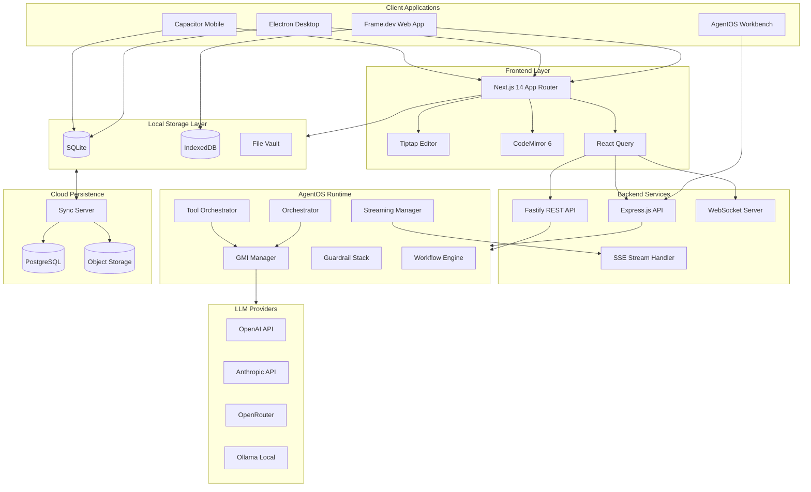

## 2. AgentOS GMI Architecture

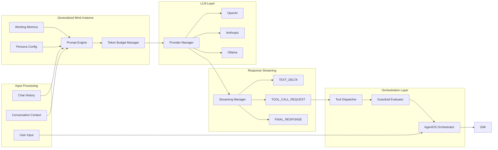

## 3. Emergent Agency System

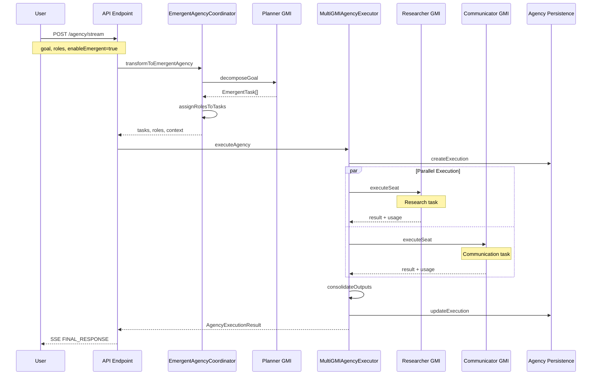

## 4. SQL Storage Adapter Resolution

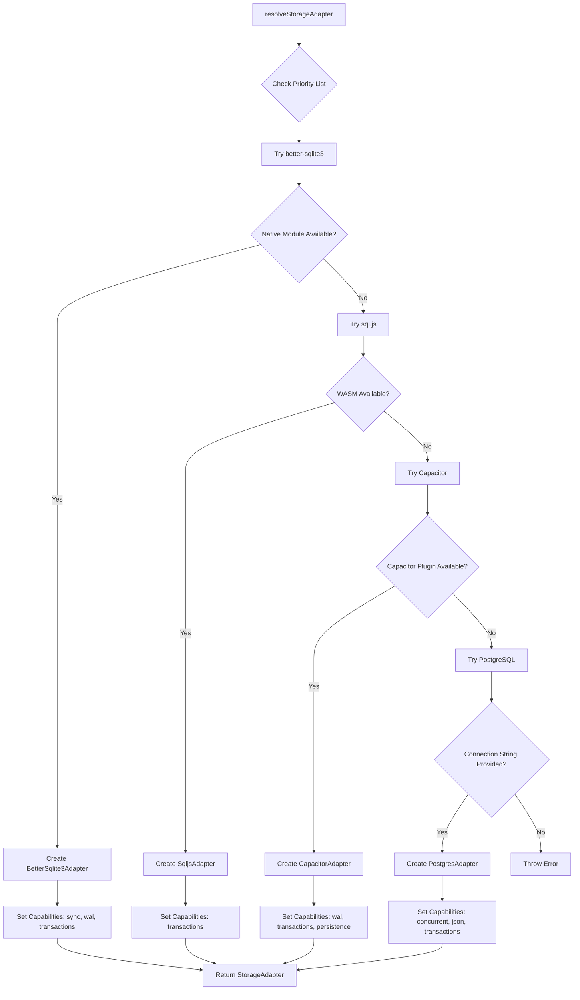

## 5. Vector Clock Sync Protocol

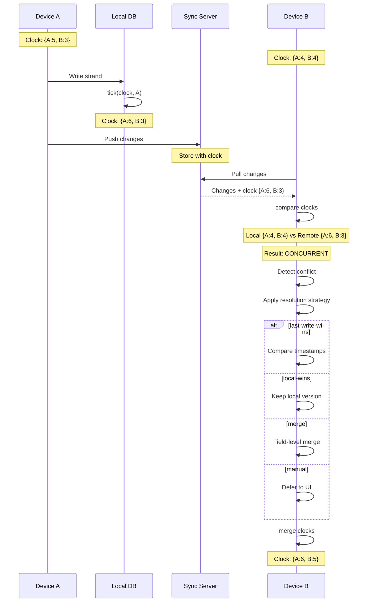

## 6. Zero-Knowledge Encryption Flow

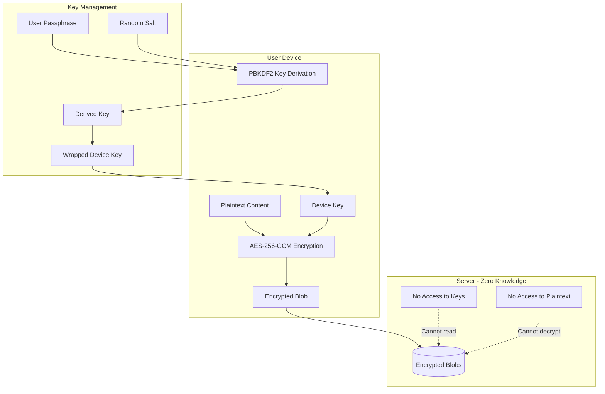

## 7. Editor Stack Architecture

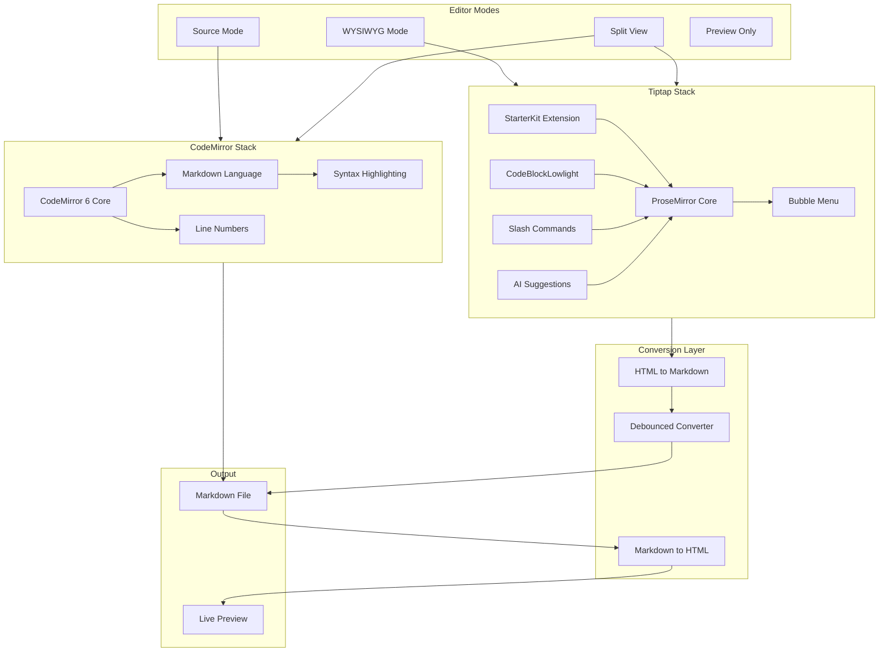

## 8. NLP Classification Pipeline

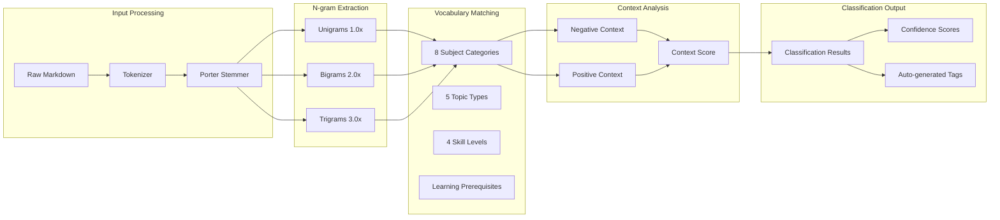

## 9. Workflow Engine Architecture

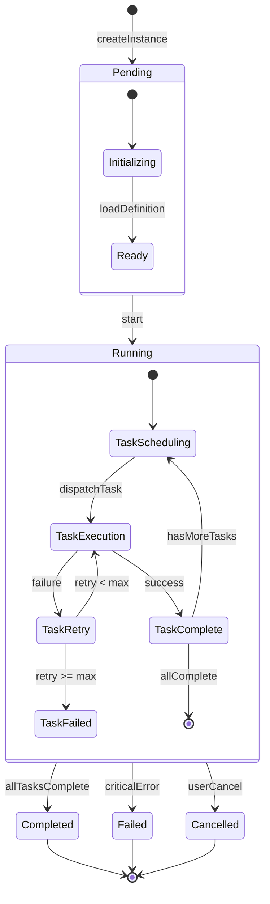

## 10. Development Timeline

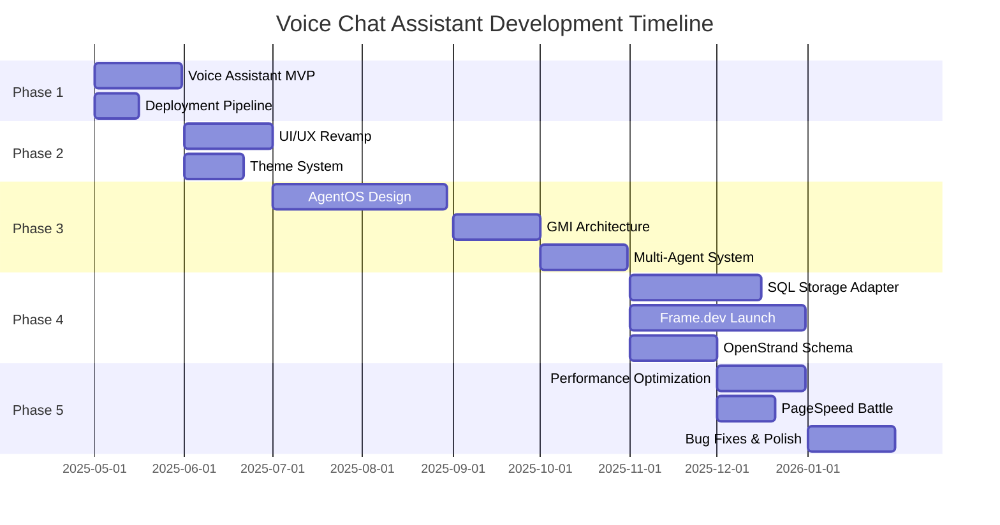

## 11. Commit Distribution

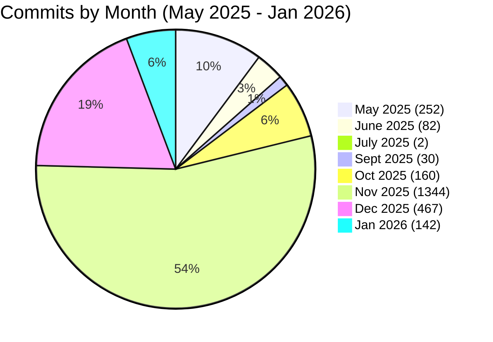

## 12. Technology Stack Overview

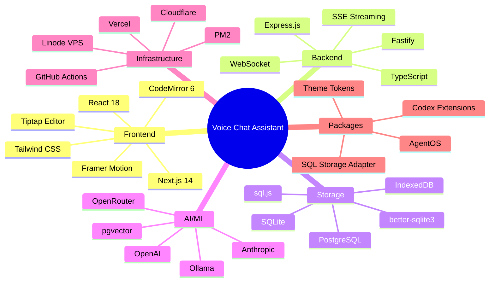

---

_These diagrams are rendered using Mermaid.js and can be viewed in any Mermaid-compatible markdown renderer (GitHub, VS Code with extensions, etc.)_
