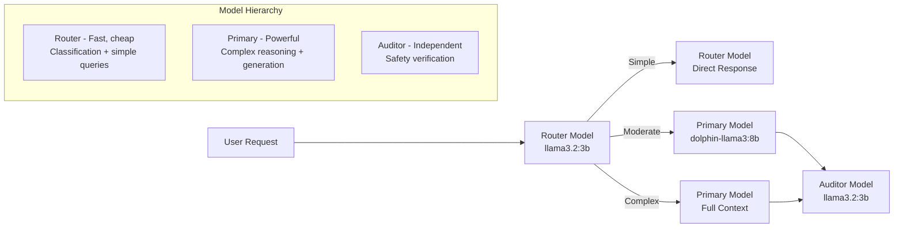

# Inference Routing

The `HierarchicalInferenceRouter` intelligently routes requests to different models based on complexity analysis. Simple questions go to a fast, lightweight model; complex tasks go to a more powerful model. This optimizes for both cost and quality.

## Concept



The inference hierarchy uses three model roles:

| Role | Purpose | Default Model | Temperature |
|------|---------|---------------|-------------|
| **Router** | Classifies request complexity; handles simple queries directly | `llama3.2:3b` | 0.1 |
| **Primary** | Handles moderate and complex tasks with full reasoning | `dolphin-llama3:8b` | 0.7 |
| **Auditor** | Independent safety verification of primary model output | `llama3.2:3b` | 0.0 |

## Basic Usage

```typescript
import { HierarchicalInferenceRouter } from 'wunderland';

const router = new HierarchicalInferenceRouter(
  {
    hierarchy: {
      routerModel: {
        providerId: 'ollama',
        modelId: 'llama3.2:3b',
        role: 'router',
        maxTokens: 512,
        temperature: 0.1,
      },
      primaryModel: {
        providerId: 'ollama',
        modelId: 'dolphin-llama3:8b',
        role: 'primary',
        maxTokens: 4096,
        temperature: 0.7,
      },
      auditorModel: {
        providerId: 'ollama',
        modelId: 'llama3.2:3b',
        role: 'auditor',
        maxTokens: 256,
        temperature: 0.0,
      },
    },
  },
  // Model invocation callback
  async (model, prompt, systemPrompt) => {
    const response = await ollama.generate({
      model: model.modelId,
      prompt,
      system: systemPrompt,
      options: {
        temperature: model.temperature,
        num_predict: model.maxTokens,
      },
    });
    return response.text;
  }
);

// Route a request
const decision = await router.route('Write a poem about quantum entanglement');
console.log(decision.targetModel.modelId); // 'dolphin-llama3:8b'
console.log(decision.complexity);          // 'complex'
console.log(decision.requiresAudit);       // true
```

## Routing Decision

Every call to `route()` returns a `RoutingDecision` object:

```typescript
interface RoutingDecision {
  /** Which model to use */
  targetModel: ModelTarget;
  /** Why this model was selected */
  routingReason: string;
  /** Classified complexity */
  complexity: 'simple' | 'moderate' | 'complex';
  /** Estimated cost in USD */
  estimatedCost: number;
  /** Whether the auditor should verify the output */
  requiresAudit: boolean;
  /** Confidence in the classification (0-1) */
  confidence: number;
}
```

Routing rules:
- **Simple** queries go to the router model. Audit is only required if tools are needed.
- **Moderate** queries go to the primary model. Audit is required.
- **Complex** queries go to the primary model with full context. Audit is required.

## Complexity Analysis

The router uses two strategies to determine complexity, falling back from LLM-based to heuristic if the model is unavailable.

### LLM-Based Analysis

When a model invoker is provided, the router sends the input to the fast router model with a classification prompt. The model responds with JSON:

```json
{
  "complexity": "complex",
  "reasoning": "Creative writing task requiring poem generation",
  "requiresTools": false
}
```

LLM-based analysis has a confidence of **0.85**.

### Heuristic Analysis

When no model invoker is available (or the LLM call fails), a heuristic analyzer evaluates:

| Signal | Score Impact | Examples |
|--------|-------------|---------|
| Short input (< 10 words) | Base | "Hello", "Thanks" |
| Long input (> 100 words) | +0.3 | Detailed specifications |
| Creative writing keywords | +0.4 | "write a poem", "create a story" |
| Code generation keywords | +0.4 | "create a function", "build a component" |
| Analysis keywords | +0.3 | "analyze", "compare", "evaluate" |
| Implementation keywords | +0.3 | "implement", "build", "develop" |
| Optimization keywords | +0.3 | "refactor", "optimize", "improve" |
| Contains code blocks | +0.2 | Triple backticks, `function`, `class` |
| Tool-requiring keywords | +0.1 | "search", "calculate", "fetch" |

Heuristic analysis has a confidence of **0.7**.

Complexity thresholds:
- `score < 0.2` --> `simple`
- `score < 0.5` --> `moderate`
- `score >= 0.5` --> `complex`

## Configuration Options

```typescript
interface RouterConfig {
  /** Model hierarchy (router, primary, auditor) */
  hierarchy: InferenceHierarchyConfig;
  /** Enable caching of routing decisions (default: true) */
  enableCaching?: boolean;
  /** Cache TTL in milliseconds (default: 60000) */
  cacheTTLMs?: number;
  /** Custom routing prompt template */
  routingPrompt?: RoutingPromptTemplate;
  /** Complexity threshold for routing to primary (default: 0.5) */
  complexityThreshold?: number;
  /** Cost threshold requiring approval (default: 0.1) */
  costApprovalThreshold?: number;
  /** Enable debug logging (default: false) */
  debug?: boolean;
}
```

### Caching

The router caches routing decisions by default. Identical or very similar inputs return the cached decision without re-analysis. The cache uses a 60-second TTL by default.

```typescript
const router = new HierarchicalInferenceRouter({
  enableCaching: true,
  cacheTTLMs: 120000, // 2-minute cache
});

// First call: analyzes complexity
const decision1 = await router.route('What is 2+2?');

// Second call within TTL: returns cached decision
const decision2 = await router.route('What is 2+2?');

// Clear cache manually
router.clearCache();
```

### Custom Routing Prompts

Override the default classification prompt with a domain-specific one:

```typescript
const router = new HierarchicalInferenceRouter({
  routingPrompt: {
    name: 'medical-router',
    systemPrompt: `You are a medical query router. Classify requests as:
- "simple": Basic health questions, symptom lookup
- "moderate": Treatment comparisons, drug interactions
- "complex": Diagnostic reasoning, treatment planning

Respond with JSON: {"complexity": "...", "reasoning": "...", "requiresTools": true/false}`,
    userPromptTemplate: 'Analyze this medical query:\n\n{input}',
    outputSchema: {
      type: 'json',
      properties: { complexity: {}, reasoning: {}, requiresTools: {} },
    },
  },
});
```

### Cost Estimation

The router estimates inference cost based on token count and model-specific rates:

| Model | Cost per 1K Tokens |
|-------|-------------------|
| `llama3.2:3b` (local) | $0.00001 |
| `dolphin-llama3:8b` (local) | $0.00005 |
| `gpt-4` | $0.03 |
| `claude-3` | $0.015 |

Token estimation uses a rough `length / 4` heuristic for input, multiplied by complexity-dependent output multipliers:
- Simple: 0.5x input tokens
- Moderate: 1.5x input tokens
- Complex: 3x input tokens

## Using with Cloud Models

The hierarchy is model-agnostic. Here is an example using OpenAI models:

```typescript
const router = new HierarchicalInferenceRouter({
  hierarchy: {
    routerModel: {
      providerId: 'openai',
      modelId: 'gpt-4o-mini',
      role: 'router',
      maxTokens: 512,
      temperature: 0.1,
    },
    primaryModel: {
      providerId: 'openai',
      modelId: 'gpt-4o',
      role: 'primary',
      maxTokens: 4096,
      temperature: 0.7,
    },
    auditorModel: {
      providerId: 'openai',
      modelId: 'gpt-4o-mini',
      role: 'auditor',
      maxTokens: 256,
      temperature: 0.0,
    },
    fallbackChain: [
      {
        providerId: 'ollama',
        modelId: 'dolphin-llama3:8b',
        role: 'fallback',
        maxTokens: 4096,
        temperature: 0.7,
      },
    ],
  },
});
```

## Statistics

The router tracks routing statistics for observability:

```typescript
const stats = router.getStatistics();
// {
//   totalRequests: 150,
//   routerModelRequests: 85,    // Simple queries
//   primaryModelRequests: 65,   // Moderate + complex queries
//   fallbackRequests: 0,
//   avgRoutingLatencyMs: 12.5,
//   cacheHitRate: 0.35,
//   complexityBreakdown: { simple: 85, moderate: 42, complex: 23 }
// }

// Reset statistics
router.resetStatistics();
```

## Updating the Hierarchy at Runtime

```typescript
// Switch primary model
router.updateHierarchy({
  primaryModel: {
    providerId: 'openai',
    modelId: 'gpt-4o',
    role: 'primary',
    maxTokens: 8192,
    temperature: 0.5,
  },
});
// Cache is automatically cleared on hierarchy change

// Inspect current config
const hierarchy = router.getHierarchy();
```
