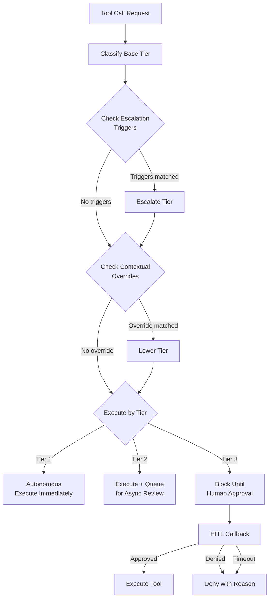

# Step-Up Authorization

The `StepUpAuthorizationManager` implements human-in-the-loop (HITL) authorization for agent tool execution. It classifies tool calls into risk tiers and applies escalation rules, contextual overrides, and tenant-specific policies to determine whether a tool call should execute autonomously, be queued for async review, or require synchronous human approval.

## Concept

Not all tool calls carry the same risk. A read-only database query is fundamentally different from a financial transaction. Wunderland uses a three-tier model to match authorization requirements to actual risk:



## Risk Tiers

| Tier | Enum | Behavior | Examples |
|------|------|----------|---------|
| **Tier 1** | `TIER_1_AUTONOMOUS` | Execute without approval. No audit trail. | Read-only queries, logging, search |
| **Tier 2** | `TIER_2_ASYNC_REVIEW` | Execute immediately, but queue for human review after the fact. | Data modifications, API calls, sending messages |
| **Tier 3** | `TIER_3_SYNC_HITL` | Block execution until a human approves or denies. | Financial transactions, system admin, irreversible deletions |

## Basic Setup

```typescript
import {
  StepUpAuthorizationManager,
  DEFAULT_STEP_UP_AUTH_CONFIG,
  ToolRiskTier,
} from 'wunderland';

const authManager = new StepUpAuthorizationManager(
  DEFAULT_STEP_UP_AUTH_CONFIG,
  // HITL callback -- called when Tier 3 approval is needed
  async (request) => {
    // Send to your UI, Slack, email, etc.
    console.log(`Approval needed: ${request.description}`);
    console.log(`Severity: ${request.severity}`);
    console.log(`Reversible: ${request.reversible}`);

    // Wait for human decision
    const decision = await myApprovalSystem.requestApproval(request);

    return {
      actionId: request.actionId,
      approved: decision.approved,
      rejectionReason: decision.reason,
      decidedBy: decision.userId,
      decidedAt: new Date(),
    };
  }
);
```

## Default Configuration

The `DEFAULT_STEP_UP_AUTH_CONFIG` provides sensible defaults:

```typescript
const DEFAULT_STEP_UP_AUTH_CONFIG = {
  // Unclassified tools default to autonomous
  defaultTier: ToolRiskTier.TIER_1_AUTONOMOUS,

  // Category-level overrides
  categoryTierOverrides: {
    data_modification: ToolRiskTier.TIER_2_ASYNC_REVIEW,
    external_api: ToolRiskTier.TIER_2_ASYNC_REVIEW,
    financial: ToolRiskTier.TIER_3_SYNC_HITL,
    communication: ToolRiskTier.TIER_2_ASYNC_REVIEW,
    system: ToolRiskTier.TIER_3_SYNC_HITL,
  },

  // Escalation triggers
  escalationTriggers: [
    { condition: 'high_value_threshold', escalateTo: ToolRiskTier.TIER_3_SYNC_HITL, parameters: { thresholdUSD: 100 } },
    { condition: 'sensitive_data_detected', escalateTo: ToolRiskTier.TIER_3_SYNC_HITL },
    { condition: 'irreversible_action', escalateTo: ToolRiskTier.TIER_3_SYNC_HITL },
  ],

  // HITL timeout
  approvalTimeoutMs: 300000, // 5 minutes
};
```

## Authorizing Tool Calls

```typescript
const result = await authManager.authorize({
  tool: {
    id: 'send-email',
    displayName: 'Send Email',
    category: 'communication',
    hasSideEffects: true,
  },
  args: {
    to: 'client@example.com',
    subject: 'Contract Update',
    body: 'Please review the attached...',
  },
  context: {
    userId: 'user-123',
    tenantId: 'acme-corp',
    sessionId: 'sess-456',
  },
  timestamp: new Date(),
});

if (result.authorized) {
  // Execute the tool
  console.log(`Authorized at Tier ${result.tier}`);
  if (result.auditRequired) {
    console.log('This action was queued for async review');
  }
} else {
  console.log(`Denied: ${result.denialReason}`);
}
```

### Authorization Result

```typescript
interface AuthorizationResult {
  /** Whether the action is authorized */
  authorized: boolean;
  /** Effective risk tier */
  tier: ToolRiskTier;
  /** Whether audit is required */
  auditRequired: boolean;
  /** Human decision details (Tier 3 only) */
  humanDecision?: {
    approved: boolean;
    decidedBy: string;
    decidedAt: Date;
    reason?: string;
  };
  /** Denial reason (if not authorized) */
  denialReason?: string;
}
```

## Tier Classification Flow

The effective tier for a tool call is determined through a multi-step process:

### 1. Base Classification

The base tier is resolved in priority order:

1. **Tenant-specific tool override** -- per-tool tier for this tenant
2. **Tenant-specific category override** -- per-category tier for this tenant
3. **Global tool override** -- `toolTierOverrides[toolId]`
4. **Global category override** -- `categoryTierOverrides[category]`
5. **Property-based** -- tools without side effects default to Tier 1; tools with high-risk capabilities (`capability:financial`, `capability:pii_access`, `capability:admin`) escalate to Tier 3
6. **Default tier** -- `defaultTier` from config

### 2. Escalation Triggers

After base classification, escalation triggers can only **raise** the tier:

| Trigger | Detection | Escalates To |
|---------|-----------|-------------|
| `high_value_threshold` | Monetary value in args exceeds threshold (default $100) | Tier 3 |
| `sensitive_data_detected` | Args contain SSN, credit card, or credential patterns | Tier 3 |
| `external_api_call` | Tool category is `external_api` | Configurable |
| `irreversible_action` | Tool has side effects and is not reversible | Tier 3 |
| `custom` | Custom evaluation function | Configurable |

### 3. Contextual Overrides

After escalation, contextual overrides can **lower** the tier:

| Context | Condition | Effect |
|---------|-----------|--------|
| `user_verified` | `context.userVerified === true` | Lower to override tier |
| `session_trusted` | `context.sessionTrusted === true` | Lower to override tier |
| `emergency_mode` | `context.emergencyMode === true` | Lower to override tier |
| `admin_override` | `context.adminOverride === true` | Lower to override tier |

## HITL Callback Configuration

The HITL callback receives a structured approval request:

```typescript
interface HITLApprovalRequest {
  actionId: string;
  description: string;          // e.g., "Execute Send Email: to=client@..."
  severity: 'low' | 'medium' | 'high' | 'critical';
  category?: string;
  agentId: string;
  context: Record<string, unknown>;
  potentialConsequences?: string[];
  reversible: boolean;
  estimatedCost?: { amount: number; currency: string };
  requestedAt: Date;
  timeoutMs?: number;           // 300000 (5 min) by default
}
```

The callback must return a decision:

```typescript
interface HITLApprovalDecision {
  actionId: string;
  approved: boolean;
  rejectionReason?: string;
  decidedBy: string;
  decidedAt: Date;
  feedback?: string;
}
```

:::warning
If no HITL callback is configured and a Tier 3 authorization is required, the tool call is **denied by default** with the reason "No HITL handler configured for Tier 3 authorization". Always configure a callback in production.
:::

### Example: Slack Integration

```typescript
const authManager = new StepUpAuthorizationManager(config, async (request) => {
  // Post to Slack
  const message = await slack.chat.postMessage({
    channel: '#agent-approvals',
    text: `Agent ${request.agentId} needs approval`,
    blocks: [
      {
        type: 'section',
        text: { type: 'mrkdwn', text: `*${request.description}*\nSeverity: ${request.severity}\nReversible: ${request.reversible}` },
      },
      {
        type: 'actions',
        elements: [
          { type: 'button', text: { type: 'plain_text', text: 'Approve' }, action_id: 'approve', style: 'primary' },
          { type: 'button', text: { type: 'plain_text', text: 'Deny' }, action_id: 'deny', style: 'danger' },
        ],
      },
    ],
  });

  // Wait for button click (with timeout)
  return await waitForSlackAction(message.ts, request.timeoutMs);
});
```

## Tenant Overrides

Multi-tenant deployments can set per-tenant risk policies:

```typescript
authManager.setTenantOverrides({
  tenantId: 'acme-corp',
  toolOverrides: new Map([
    ['delete-all-records', ToolRiskTier.TIER_3_SYNC_HITL],
    ['export-report', ToolRiskTier.TIER_1_AUTONOMOUS],
  ]),
  categoryOverrides: new Map([
    ['system', ToolRiskTier.TIER_3_SYNC_HITL],
    ['data_modification', ToolRiskTier.TIER_3_SYNC_HITL], // Stricter than default
  ]),
});

// Check tenant config
const overrides = authManager.getTenantOverrides('acme-corp');

// Remove tenant config
authManager.removeTenantOverrides('acme-corp');
```

## Async Review Queue

Tier 2 tool calls execute immediately but are queued for post-hoc review:

```typescript
// Get all pending reviews
const pending = authManager.getPendingReviews();

// Mark a review as completed
authManager.markReviewed(pending[0].itemId, {
  status: 'approved',      // or 'flagged' or 'rejected'
  reviewerId: 'admin-1',
  notes: 'Looks fine, legitimate email send.',
});

// Get full queue (including reviewed items)
const queue = authManager.getAsyncReviewQueue();

// Clear reviewed items from queue
const cleared = authManager.clearReviewedItems();
console.log(`Cleared ${cleared} reviewed items`);
```

## Statistics

```typescript
const stats = authManager.getStatistics();
// {
//   totalRequests: 250,
//   requestsByTier: { 1: 180, 2: 55, 3: 15 },
//   authorizedCount: 240,
//   deniedCount: 10,
//   pendingHITLCount: 0,
//   avgHITLResponseTimeMs: 12500,
//   asyncReviewQueueSize: 23,
// }
```

## Complete Example

```typescript
import {
  StepUpAuthorizationManager,
  ToolRiskTier,
} from 'wunderland';

// 1. Configure authorization
const authManager = new StepUpAuthorizationManager(
  {
    defaultTier: ToolRiskTier.TIER_1_AUTONOMOUS,
    categoryTierOverrides: {
      financial: ToolRiskTier.TIER_3_SYNC_HITL,
      data_modification: ToolRiskTier.TIER_2_ASYNC_REVIEW,
    },
    escalationTriggers: [
      {
        condition: 'high_value_threshold',
        escalateTo: ToolRiskTier.TIER_3_SYNC_HITL,
        parameters: { thresholdUSD: 50 },
      },
      {
        condition: 'sensitive_data_detected',
        escalateTo: ToolRiskTier.TIER_3_SYNC_HITL,
      },
    ],
    contextualOverrides: [
      {
        context: 'admin_override',
        overrideTier: ToolRiskTier.TIER_1_AUTONOMOUS,
      },
    ],
    approvalTimeoutMs: 120000, // 2 minutes
  },
  async (request) => {
    // Your HITL implementation
    return await requestHumanApproval(request);
  }
);

// 2. Set tenant policies
authManager.setTenantOverrides({
  tenantId: 'finance-dept',
  toolOverrides: new Map(),
  categoryOverrides: new Map([
    ['financial', ToolRiskTier.TIER_3_SYNC_HITL],
  ]),
});

// 3. Authorize tool calls
const result = await authManager.authorize({
  tool: {
    id: 'transfer-funds',
    displayName: 'Transfer Funds',
    category: 'financial',
    hasSideEffects: true,
    requiredCapabilities: ['capability:financial'],
  },
  args: { amount: 500, currency: 'USD', to: 'vendor-account' },
  context: {
    userId: 'user-1',
    tenantId: 'finance-dept',
    gmiId: 'agent-treasury',
  },
  timestamp: new Date(),
});

// result.tier === ToolRiskTier.TIER_3_SYNC_HITL
// result.authorized depends on the HITL callback response
```
