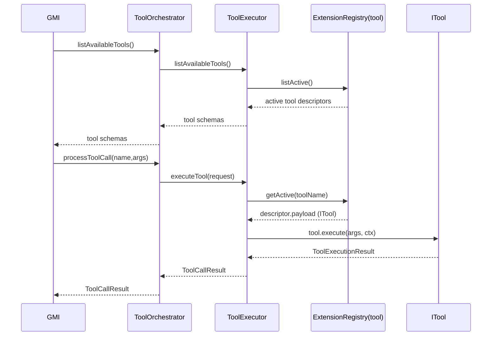

# How Extensions Work in AgentOS

AgentOS extensions are **runtime code** packaged as “extension packs”. Packs can add:

- Tools (`ITool`) for LLM tool calling
- Guardrails (`IGuardrailService`) for safety/policy
- Workflows (definitions + executors)
- Other runtime services (channels, memory providers, provenance, etc.)

This document focuses on how extensions become **callable tools**.

## Core Building Blocks

### Extension Pack

An extension pack is a bundle of descriptors.

```ts
export interface ExtensionPack {
  name: string;
  version?: string;
  descriptors: ExtensionDescriptor[];
  onActivate?: (ctx) => Promise<void> | void;
  onDeactivate?: (ctx) => Promise<void> | void;
}
```

### Extension Descriptor

Descriptors are registered into kind-specific registries (tools, guardrails, workflows, etc.).

```ts
export interface ExtensionDescriptor<TPayload = unknown> {
  id: string;
  kind: string; // 'tool', 'guardrail', ...
  payload: TPayload;
  priority?: number;
  requiredSecrets?: Array<{ id: string; optional?: boolean }>;
  onActivate?: (ctx) => Promise<void> | void;
  onDeactivate?: (ctx) => Promise<void> | void;
}
```

### Extension Registry (Stacking)

Each `(kind, id)` is a **stack**. The active entry is:

- highest `priority`
- tie-breaker: latest registration

## How Tool Calling Uses Extensions

Tools are stored in an extension registry of kind `tool`. The important invariant:

- `ToolExecutor` looks up tools by **tool call name**, which is `ITool.name`
- therefore, tool descriptors must use `descriptor.id === tool.name`



## Loading Packs (Extension Manifest)

AgentOS loads extensions from `extensionManifest.packs` via `ExtensionManager.loadManifest()`.

Packs load **sequentially** in manifest order.

### Pack Entry Types

Each pack entry can be:

1. `factory`: a function returning an `ExtensionPack`
2. `package`: dynamic `import()` of an npm package exporting `createExtensionPack()`
3. `module`: dynamic `import()` of a local file/module exporting `createExtensionPack()`

```mermaid
graph TD
  M[extensionManifest] --> EM[ExtensionManager.loadManifest]
  EM --> RP[resolve pack entry]
  RP --> P[ExtensionPack]
  P --> D[descriptors]
  D --> R[ExtensionRegistry (per kind)]
  R --> TE[ToolExecutor]
  TE --> TO[ToolOrchestrator]
```

### Example: Curated Registry (Recommended)

Use `@framers/agentos-extensions-registry` to build a manifest from installed curated extensions.

```ts
import { AgentOS } from '@framers/agentos';
import { createCuratedManifest } from '@framers/agentos-extensions-registry';

const extensionSecrets = {
  'serper.apiKey': process.env.SERPER_API_KEY!,
  'giphy.apiKey': process.env.GIPHY_API_KEY!,
};

const manifest = await createCuratedManifest({
  tools: 'all',
  channels: 'none',
  secrets: extensionSecrets,
});

const agentos = new AgentOS();
await agentos.initialize({
  extensionManifest: manifest,
  // Provide secrets here so `requiredSecrets` gating can be evaluated without relying on env vars.
  extensionSecrets,
  // ...other required AgentOS config
});
```

### Example: Load a Local Module Pack

```ts
extensionManifest: {
  packs: [
    {
      module: './extensions/my-pack.mjs',
      options: { /* your config */ },
      priority: 10,
    },
  ],
}
```

### Example: Load an npm Package Pack

```ts
extensionManifest: {
  packs: [
    {
      package: '@framers/agentos-ext-web-search',
      options: { /* your config */ },
      priority: 10,
    },
  ],
}
```

## Secrets & `requiredSecrets`

Descriptors can declare `requiredSecrets` to declare runtime dependencies (API keys, tokens, credentials).

AgentOS resolves secrets from:

1. `extensionSecrets` passed to AgentOS (host-provided)
2. `packs[].options.secrets` if present
3. environment variables mapped by the shared secret catalog (`extension-secrets.json`)

If a descriptor requires a non-optional secret and it can’t be resolved, AgentOS skips activating that descriptor.

## Overrides

You can disable or reprioritize individual descriptors using overrides:

- `extensionManifest.overrides` (inline)
- `extensionOverrides` on AgentOS config (host-provided)

Overrides currently apply to:

- tools
- guardrails
- response processors

Example: disable `giphy_search`:

```ts
extensionOverrides: {
  tools: {
    giphy_search: { enabled: false },
  },
},
```

## Lifecycle Hooks

- `pack.onActivate(ctx)` runs once per loaded pack before descriptors register
- `descriptor.onActivate(ctx)` runs when the descriptor becomes active for its `(kind,id)`
- `descriptor.onDeactivate(ctx)` runs when the descriptor is superseded or removed
- `pack.onDeactivate(ctx)` runs on AgentOS shutdown

You can listen to extension events:

```ts
extensionManager.on((event) => {
  console.log(event.type, event.timestamp, event.source);
});
```
