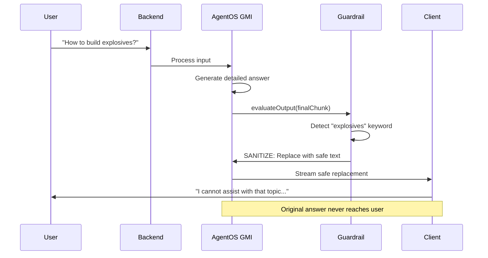

# AgentOS Guardrails: Mid-Stream Agent Decision Override

## Overview

AgentOS guardrails allow agents to "change their mind" mid-stream by inspecting and modifying their own output before it reaches the user. This enables:

- **Content policy enforcement**: Replace problematic output with safe alternatives
- **Cost control**: Abort expensive responses and substitute budget messages
- **Quality assurance**: Flag low-confidence answers for human review
- **Dynamic adaptation**: Allow the agent to self-correct based on real-time analysis

## How Guardrails Work

Guardrails implement the `IGuardrailService` interface from `@framers/agentos`:

```typescript
interface IGuardrailService {
  /** Evaluate user input BEFORE orchestration */
  evaluateInput?(payload: GuardrailInputPayload): Promise<GuardrailEvaluationResult | null>;
  
  /** Evaluate agent output BEFORE streaming to user (mid-stream decision) */
  evaluateOutput?(payload: GuardrailOutputPayload): Promise<GuardrailEvaluationResult | null>;
}
```

### Available Actions

- **ALLOW**: Pass content through unchanged
- **FLAG**: Allow but record metadata for analytics/audit
- **SANITIZE**: Replace content with a modified version (agent "changes its mind")
- **BLOCK**: Terminate the stream and emit an error chunk

## Example: Sensitive Topic Guardrail

This guardrail detects flagged keywords and replaces the agent's response:

```typescript
import { SensitiveTopicGuardrail } from './guardrails/SensitiveTopicGuardrail';

const guardrail = new SensitiveTopicGuardrail({
  flaggedTopics: ['self-harm', 'violence', 'illegal activity'],
  inputAction: 'sanitize',
  outputAction: 'sanitize', // Agent will replace its own answer
  replacementText: 'I cannot assist with that topic. Please ask something else.',
});

// Wire into AgentOS config
const config: AgentOSConfig = {
  // ... other config ...
  guardrailService: guardrail,
};
```

**What happens mid-stream:**
1. User asks: "How do I build a weapon?"
2. Agent generates a detailed response (LLM already computed it)
3. Before streaming to user, `evaluateOutput()` runs
4. Guardrail detects "weapon" → returns `SANITIZE` with replacement text
5. User sees: "I cannot assist with that topic..." instead of the original response
6. Agent "changed its mind" without re-generating

## Example: Cost Ceiling Guardrail

Abort responses that exceed a budget threshold:

```typescript
import { CostCeilingGuardrail } from './guardrails/CostCeilingGuardrail';

const costGuard = new CostCeilingGuardrail({
  maxCostUsd: 0.05, // 5 cents max per request
  inputTokenPricePer1k: 0.0001,
  outputTokenPricePer1k: 0.0002,
  budgetExceededText: 'This response exceeded the cost ceiling. Please refine your request.',
});
```

**What happens:**
1. User submits a complex query
2. Agent generates a 10,000-token response (costs $0.06)
3. `evaluateOutput()` checks token usage
4. Cost exceeds $0.05 → guardrail returns `SANITIZE`
5. User sees budget message instead of expensive output
6. Tokens are not charged (response was vetoed before delivery)

## Combining Guardrails

Use `composeGuardrails()` to stack multiple policies:

```typescript
import { composeGuardrails, createDefaultGuardrailStack } from './guardrails';

const guardStack = composeGuardrails([
  new SensitiveTopicGuardrail({ /* config */ }),
  new CostCeilingGuardrail({ /* config */ }),
  // Add more guardrails here
]);

// Or use the default stack:
const defaultGuards = createDefaultGuardrailStack({
  sensitiveTopics: ['custom-topic'],
  maxCostUsd: 0.10,
});
```

## Configuration in Backend

Guardrails are enabled via `AgentOSConfig`:

```typescript
// backend/src/integrations/agentos/agentos.integration.ts
async function buildEmbeddedAgentOSConfig(): Promise<AgentOSConfig> {
  // ... other config ...
  
  const guardrailService = (process.env.AGENTOS_ENABLE_GUARDRAILS === 'true' || process.env.NODE_ENV === 'production')
    ? createDefaultGuardrailStack()
    : undefined;

  return {
    // ... all other config fields ...
    guardrailService, // ← Wire guardrails here
  };
}
```

**Environment Variables:**
- `AGENTOS_ENABLE_GUARDRAILS=true` → Enable guardrails in development
- Default: guardrails enabled in production, disabled in dev

## Metadata and Audit Trail

Guardrail decisions are recorded in `chunk.metadata.guardrail`:

```json
{
  "type": "final_response",
  "finalResponseText": "I cannot assist with that topic...",
  "metadata": {
    "guardrail": {
      "output": [
        {
          "action": "sanitize",
          "reason": "Agent output sanitized due to policy violation.",
          "reasonCode": "SENSITIVE_OUTPUT_SANITIZED",
          "metadata": {
            "detectedTopics": ["violence"],
            "original": "[original agent response]"
          }
        }
      ]
    }
  }
}
```

This allows:
- **Client-side banners**: Show "Content was filtered" notices
- **Analytics**: Track how often guardrails trigger
- **Human review**: Flag sanitized outputs for manual inspection

## Creating Custom Guardrails

Implement `IGuardrailService`:

```typescript
import {
  GuardrailAction,
  type GuardrailInputPayload,
  type GuardrailOutputPayload,
  type GuardrailEvaluationResult,
  type IGuardrailService,
} from '@framers/agentos/guardrails/IGuardrailService';

export class MyCustomGuardrail implements IGuardrailService {
  async evaluateInput(payload: GuardrailInputPayload): Promise<GuardrailEvaluationResult | null> {
    const text = payload.input.textInput ?? '';
    if (text.includes('forbidden')) {
      return {
        action: GuardrailAction.BLOCK,
        reason: 'Forbidden keyword detected',
        reasonCode: 'CUSTOM_BLOCK',
      };
    }
    return null;
  }

  async evaluateOutput(payload: GuardrailOutputPayload): Promise<GuardrailEvaluationResult | null> {
    const chunk = payload.chunk as any;
    if (chunk.type === 'final_response') {
      const output = chunk.finalResponseText ?? '';
      if (output.length > 10000) {
        // Agent generated too much text; replace with summary
        return {
          action: GuardrailAction.SANITIZE,
          modifiedText: 'Response too verbose. Summary: [truncated]',
          reason: 'Output exceeded length limit',
          reasonCode: 'LENGTH_LIMIT',
        };
      }
    }
    return null;
  }
}
```

## Testing Guardrails

Use the Vitest harness from `packages/agentos/tests/core/guardrails.integration.spec.ts`:

```typescript
import { describe, it, expect } from 'vitest';
import { MyCustomGuardrail } from './MyCustomGuardrail';

describe('MyCustomGuardrail', () => {
  it('blocks forbidden input', async () => {
    const guard = new MyCustomGuardrail();
    const result = await guard.evaluateInput({
      context: { userId: 'test', sessionId: 'test' },
      input: { textInput: 'forbidden action' },
    } as any);
    expect(result?.action).toBe(GuardrailAction.BLOCK);
  });

  it('sanitizes verbose output', async () => {
    const guard = new MyCustomGuardrail();
    const result = await guard.evaluateOutput({
      context: { userId: 'test', sessionId: 'test' },
      chunk: {
        type: 'final_response',
        finalResponseText: 'x'.repeat(20000),
      } as any,
    } as any);
    expect(result?.action).toBe(GuardrailAction.SANITIZE);
  });
});
```

## Real-Time "Mind Change" Flow



## Best Practices

1. **Evaluate only final chunks**: Checking every TEXT_DELTA is expensive; focus on FINAL_RESPONSE.
2. **Keep decisions fast**: Guardrails run in the hot path; avoid heavy API calls.
3. **Log metadata**: Always populate `metadata` for audit trails.
4. **Compose wisely**: Order guardrails from most critical (safety) to least (analytics).
5. **Test edge cases**: Verify sanitize doesn't break markdown, JSON, etc.

## Further Reading

- AgentOS Architecture: `packages/agentos/docs/ARCHITECTURE.md` (§ Guardrail Service)
- Core interface: `packages/agentos/src/core/guardrails/IGuardrailService.ts`
- Integration tests: `packages/agentos/tests/core/guardrails.integration.spec.ts`
- Extension template: `packages/agentos-extensions/templates/guardrail/`


