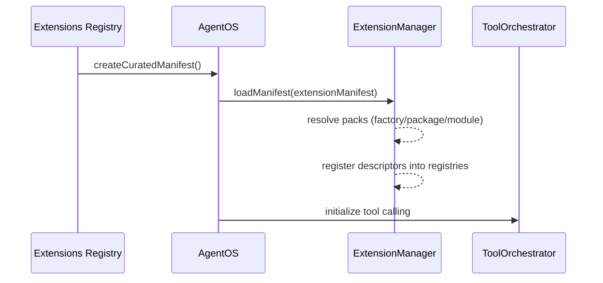

# Automatic Extension Loading

AgentOS loads extensions from an explicit `extensionManifest`. There is no hidden “plugin marketplace” behavior in core (no background npm installs, no hot-reload, no implicit caching).

So when we say “auto-loading” in the AgentOS ecosystem, it typically means:

- **Automatically build a manifest** from whatever curated extension packages are installed.
- **Load that manifest** during `AgentOS.initialize()`, making tool schemas available for tool calling.

## Recommended: Build a Curated Manifest

Use `@framers/agentos-extensions-registry` to build a manifest from installed curated packages. Missing optional dependencies are skipped.

```ts
import { AgentOS } from '@framers/agentos';
import { createCuratedManifest } from '@framers/agentos-extensions-registry';

const extensionSecrets = {
  'serper.apiKey': process.env.SERPER_API_KEY!,
  'giphy.apiKey': process.env.GIPHY_API_KEY!,
};

const manifest = await createCuratedManifest({
  tools: 'all',
  // Channels can have side effects (connect/poll/webhook). Enable explicitly.
  channels: 'none',
  secrets: extensionSecrets,
});

const agentos = new AgentOS();
await agentos.initialize({
  extensionManifest: manifest,
  extensionSecrets,
  // ...other required AgentOS config
});
```

## Load Flow



## What “Lazy Loading” Means (Today)

You’ll see “lazy” used in a few different ways:

- **Lazy optional dependencies**: the curated registry uses dynamic `import()` to include only installed extension packages.
- **Lazy heavy deps inside tools**: a tool’s `execute()` can dynamically `import()` heavy libraries on first call.
- **Lazy skills**: use `@framers/agentos-ext-skills` so the model can fetch `SKILL.md` content on demand.

What AgentOS does not do by default: wait for the model to request a tool and then reveal its schema. Tool calling requires schemas up front, so the host decides which tools to expose for a given session/turn.

## What Is Not Automatic (Yet)

- No core auto-install (`npm install`) of missing extensions.
- No core “extension marketplace UI”.
- No hot reload of extension packs.

There is an `ExtensionLoader` utility in `@framers/agentos` that experiments with registry scanning and auto-install, but it is not wired into `AgentOS.initialize()` and should be treated as experimental.
