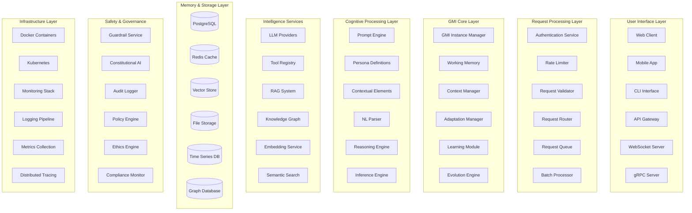
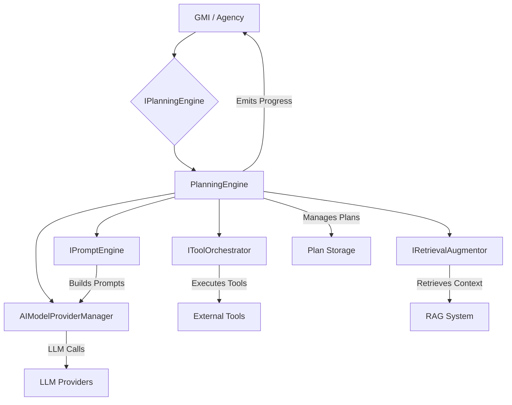
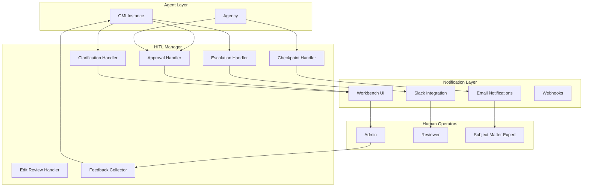
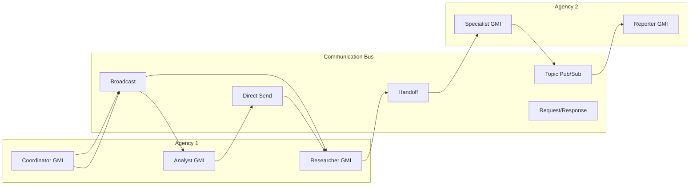

# AgentOS: The Complete Adaptive Intelligence Framework - Full Technical Documentation

For deployments that need immutability guarantees and auditability, see [Provenance & Immutability](./PROVENANCE_IMMUTABILITY.md) for `sealed`/`revisioned` storage policy enforcement, signed event ledgers, and optional external anchoring.

---

## System Architecture Overview

### The Complete AgentOS Ecosystem



### Complete Data Flow Architecture

```typescript
interface DataFlowArchitecture {
  // Request Processing Pipeline - Full Implementation
  async processRequest(input: UserInput): Promise<Response> {
    // Phase 1: Authentication & Validation
    const authContext = await this.authenticateRequest(input);
    const validatedInput = await this.validateInput(input, authContext);
    const rateLimitCheck = await this.checkRateLimit(authContext);
    const complianceCheck = await this.checkCompliance(input, authContext);
    
    // Phase 2: Context Assembly
    const context = await this.assembleContext({
      user: authContext.user,
      input: validatedInput,
      sessionHistory: await this.loadSessionHistory(authContext.sessionId),
      globalContext: await this.loadGlobalContext(),
      temporalContext: this.getTemporalContext(),
      environmentalContext: await this.getEnvironmentalContext(),
      conversationalContext: await this.analyzeConversationalContext(validatedInput)
    });
    
    // Phase 3: GMI Selection/Creation
    const gmi = await this.getOrCreateGMI({
      userId: authContext.user.id,
      personaId: context.personaId,
      sessionId: authContext.sessionId,
      initializationParams: context.gmiInitParams
    });
    
    // Phase 4: Memory Retrieval
    const relevantMemories = await gmi.retrieveRelevantMemories(context);
    context.memories = relevantMemories;
    
    // Phase 5: Knowledge Augmentation
    const augmentedKnowledge = await this.augmentKnowledge({
      query: validatedInput.content,
      context: context,
      persona: gmi.persona,
      memories: relevantMemories
    });
    
    // Phase 6: Prompt Construction
    const adaptivePrompt = await gmi.constructAdaptivePrompt({
      input: validatedInput,
      context: context,
      memories: relevantMemories,
      knowledge: augmentedKnowledge,
      learningState: gmi.getLearningState(),
      adaptationState: gmi.getAdaptationState()
    });
    
    // Phase 7: Pre-execution Guardrails
    const preCheckResult = await this.runPreExecutionGuardrails(
      adaptivePrompt,
      context
    );
    
    if (preCheckResult.blocked) {
      return this.createBlockedResponse(preCheckResult);
    }
    
    // Phase 8: Tool Orchestration
    const toolResults = await this.orchestrateTools({
      prompt: adaptivePrompt,
      context: context,
      availableTools: gmi.getAvailableTools()
    });
    
    // Phase 9: LLM Execution
    const llmResponse = await this.executeLLM({
      prompt: this.enrichPromptWithToolResults(adaptivePrompt, toolResults),
      model: this.selectModel(context),
      parameters: this.optimizeParameters(context),
      streaming: context.streamingEnabled
    });
    
    // Phase 10: Post-execution Guardrails
    const postCheckResult = await this.runPostExecutionGuardrails(
      llmResponse,
      context
    );
    
    const filteredResponse = postCheckResult.sanitize 
      ? await this.sanitizeResponse(llmResponse, postCheckResult)
      : llmResponse;
    
    // Phase 11: Response Processing
    const processedResponse = await this.processResponse({
      raw: filteredResponse,
      context: context,
      enrichments: await this.enrichResponse(filteredResponse, context),
      formatting: await this.formatResponse(filteredResponse, context.outputFormat)
    });
    
    // Phase 12: Memory Update
    await gmi.updateMemory({
      input: validatedInput,
      response: processedResponse,
      context: context,
      outcome: await this.evaluateOutcome(processedResponse, context),
      toolResults: toolResults
    });
    
    // Phase 13: Learning Integration
    await gmi.learn({
      interaction: {
        input: validatedInput,
        response: processedResponse,
        context: context,
        toolResults: toolResults
      },
      feedback: await this.collectFeedback(context),
      patterns: await this.detectPatterns(context),
      performance: await this.measurePerformance(context)
    });
    
    // Phase 14: Evolution Check
    if (await gmi.shouldEvolve()) {
      await gmi.evolve({
        interactionHistory: await gmi.getInteractionHistory(),
        performanceMetrics: await gmi.getPerformanceMetrics(),
        userFeedback: await gmi.getUserFeedback()
      });
    }
    
    // Phase 15: Analytics & Monitoring
    await this.recordAnalytics({
      request: input,
      response: processedResponse,
      performance: this.measurePerformance(),
      context: context,
      gmiState: gmi.getState()
    });
    
    return processedResponse;
  }
}
```

---

## Persona Definition System - Complete Implementation

### The Heart of AgentOS Intelligence

```typescript
interface IPersonaDefinition {
  // Core Identity Layer
  identity: {
    id: string;
    name: string;
    role: string;
    title?: string;
    organization?: string;
    version: string;
    
    personality: {
      traits: PersonalityTrait[];
      communication_style: CommunicationStyle;
      decision_making_style: DecisionMakingStyle;
      interaction_preferences: InteractionPreferences;
      emotional_range: EmotionalRange;
      cognitive_style: CognitiveStyle;
      social_dynamics: SocialDynamics;
      motivational_drivers: MotivationalDriver[];
      behavioral_tendencies: BehavioralTendency[];
    };
    
    expertise: {
      primary_domains: ExpertiseDomain[];
      secondary_domains: ExpertiseDomain[];
      skill_level: SkillLevel;
      experience_years?: number;
      certifications?: Certification[];
      specializations?: Specialization[];
      knowledge_bases?: KnowledgeBase[];
      methodologies?: Methodology[];
      tools_proficiency?: ToolProficiency[];
      industry_knowledge?: IndustryKnowledge[];
    };
    
    purpose: {
      primary_objective: string;
      secondary_objectives: string[];
      success_metrics: SuccessMetric[];
      value_proposition: string;
      target_outcomes: Outcome[];
      constraints: Constraint[];
      ethical_guidelines: EthicalGuideline[];
      quality_standards: QualityStandard[];
    };
    
    background?: {
      education?: Education[];
      experience?: Experience[];
      achievements?: Achievement[];
      publications?: Publication[];
      interests?: Interest[];
      values?: Value[];
      motivations?: Motivation[];
      cultural_context?: CulturalContext;
      life_experiences?: LifeExperience[];
    };
  };
  
  // Cognitive Configuration Layer
  cognitiveConfig: {
    reasoning: {
      style: ReasoningStyle;
      depth: ReasoningDepth;
      approach: ReasoningApproach;
      frameworks: ReasoningFramework[];
      biases_to_avoid: CognitiveBias[];
      heuristics: Heuristic[];
      logical_patterns: LogicalPattern[];
      inference_rules: InferenceRule[];
      problem_decomposition: DecompositionStrategy;
    };
    
    learning: {
      style: LearningStyle;
      rate: number;
      retention: RetentionConfig;
      consolidation: ConsolidationStrategy;
      transfer: TransferLearningConfig;
      meta_learning: MetaLearningConfig;
      reinforcement: ReinforcementConfig;
      curriculum: LearningCurriculum;
      adaptation_speed: number;
    };
    
    memory: {
      working_memory_capacity: number;
      consolidation_frequency: string;
      decay_rate: number;
      retrieval_strategies: RetrievalStrategy[];
      encoding_preferences: EncodingPreference[];
      forgetting_curve: ForgettingCurve;
      memory_palace: MemoryPalaceConfig;
      associative_networks: AssociativeNetwork[];
    };
    
    attention: {
      focus_duration: number;
      switching_cost: number;
      priority_system: PrioritySystem;
      distraction_resistance: number;
      multitasking_capability: number;
      salience_detection: SalienceDetection;
      vigilance_level: number;
      attention_restoration: AttentionRestoration;
    };
    
    creativity: {
      level: number;
      domains: string[];
      techniques: CreativityTechnique[];
      inspiration_sources: string[];
      constraints_handling: ConstraintHandling;
      ideation_methods: IdeationMethod[];
      lateral_thinking: LateralThinkingConfig;
      divergent_convergent_balance: number;
    };
    
    metacognition: {
      self_awareness: number;
      self_monitoring: SelfMonitoringConfig;
      self_regulation: SelfRegulationConfig;
      reflection_frequency: string;
      confidence_calibration: ConfidenceCalibration;
      error_awareness: ErrorAwareness;
      strategy_selection: StrategySelection;
    };
  };
  
  // Behavioral Configuration Layer
  behavioralConfig: {
    communication: {
      default_style: CommunicationProfile;
      adaptation_rules: CommunicationAdaptation[];
      language_patterns: LanguagePattern[];
      rhetorical_devices: RhetoricalDevice[];
      storytelling_approach: StorytellingStyle;
      active_listening: ActiveListeningConfig;
      empathy_expression: EmpathyExpression;
      conflict_communication: ConflictCommunication;
    };
    
    problem_solving: {
      methodology: ProblemSolvingMethodology;
      decomposition_strategy: DecompositionStrategy;
      solution_evaluation: EvaluationCriteria[];
      creativity_level: number;
      risk_tolerance: number;
      optimization_preference: OptimizationPreference;
      constraint_satisfaction: ConstraintSatisfaction;
      search_strategies: SearchStrategy[];
    };
    
    decision_making: {
      framework: DecisionFramework;
      criteria_weights: CriteriaWeight[];
      uncertainty_handling: UncertaintyStrategy;
      time_pressure_response: TimePressureStrategy;
      consultation_preference: ConsultationStyle;
      risk_assessment: RiskAssessment;
      value_alignment: ValueAlignment;
      regret_minimization: RegretMinimization;
    };
    
    collaboration: {
      style: CollaborationStyle;
      leadership_approach: LeadershipStyle;
      conflict_resolution: ConflictResolution;
      team_dynamics: TeamDynamicsPreference;
      delegation_strategy: DelegationStrategy;
      trust_building: TrustBuildingApproach;
      feedback_style: FeedbackStyle;
      consensus_building: ConsensusBuildingMethod;
    };
    
    emotional_intelligence: {
      self_awareness: number;
      self_regulation: number;
      motivation: number;
      empathy: number;
      social_skills: number;
      emotional_expression: EmotionalExpression;
      emotional_contagion: EmotionalContagion;
      mood_regulation: MoodRegulation;
    };
  };
  
  // Adaptation Configuration Layer
  adaptationConfig: {
    triggers: AdaptationTrigger[];
    strategies: AdaptationStrategy[];
    
    real_time: {
      enabled: boolean;
      sensitivity: number;
      response_time: number;
      stability_threshold: number;
      adaptation_rate: number;
      cooldown_period: number;
    };
    
    user_modeling: {
      enabled: boolean;
      model_complexity: 'simple' | 'moderate' | 'complex' | 'advanced';
      update_frequency: string;
      personalization_depth: number;
      preference_learning: PreferenceLearning;
      behavior_prediction: BehaviorPrediction;
      need_anticipation: NeedAnticipation;
    };
    
    context_awareness: {
      dimensions: ContextDimension[];
      sensitivity_matrix: SensitivityMatrix;
      adaptation_thresholds: AdaptationThreshold[];
      context_switching: ContextSwitching;
      ambient_awareness: AmbientAwareness;
    };
    
    performance_optimization: {
      enabled: boolean;
      metrics: OptimizationMetric[];
      strategies: OptimizationStrategy[];
      learning_rate: number;
      exploration_exploitation_balance: number;
      multi_objective_optimization: MultiObjectiveOptimization;
    };
    
    cultural_adaptation: {
      enabled: boolean;
      cultural_dimensions: CulturalDimension[];
      adaptation_strategies: CulturalAdaptationStrategy[];
      sensitivity_level: number;
    };
  };
  
  // Learning Configuration Layer
  learningConfig: {
    mechanisms: LearningMechanism[];
    
    reinforcement: {
      enabled: boolean;
      algorithm: ReinforcementAlgorithm;
      reward_function: RewardFunction;
      exploration_rate: number;
      discount_factor: number;
      learning_rate: number;
      eligibility_traces: EligibilityTraceConfig;
      experience_replay: ExperienceReplayConfig;
    };
    
    pattern_recognition: {
      enabled: boolean;
      pattern_types: PatternType[];
      minimum_occurrences: number;
      confidence_threshold: number;
      decay_rate: number;
      pattern_complexity_levels: number;
      abstraction_mechanism: AbstractionMechanism;
    };
    
    transfer_learning: {
      enabled: boolean;
      source_domains: string[];
      transfer_strategies: TransferStrategy[];
      adaptation_rate: number;
      negative_transfer_prevention: NegativeTransferPrevention;
      similarity_metrics: SimilarityMetric[];
    };
    
    meta_learning: {
      enabled: boolean;
      learning_to_learn: boolean;
      strategy_optimization: boolean;
      self_assessment: boolean;
      learning_curve_analysis: LearningCurveAnalysis;
      optimal_learning_path: OptimalLearningPath;
    };
    
    continual_learning: {
      enabled: boolean;
      catastrophic_forgetting_prevention: CatastrophicForgettingPrevention;
      memory_consolidation: MemoryConsolidationStrategy;
      task_interference_handling: TaskInterferenceHandling;
    };
  };
  
  // Memory Configuration Layer
  memoryConfig: {
    architecture: MemoryArchitecture;
    
    episodic: {
      enabled: boolean;
      capacity: number;
      retention_period: string;
      consolidation_strategy: ConsolidationStrategy;
      retrieval_cues: RetrievalCue[];
      emotion_tagging: EmotionTagging;
      context_binding: ContextBinding;
      temporal_organization: TemporalOrganization;
    };
    
    semantic: {
      enabled: boolean;
      knowledge_organization: KnowledgeOrganization;
      concept_linking: ConceptLinkingStrategy;
      abstraction_levels: number;
      update_mechanism: UpdateMechanism;
      schema_formation: SchemaFormation;
      category_learning: CategoryLearning;
    };
    
    procedural: {
      enabled: boolean;
      skill_acquisition: SkillAcquisitionStrategy;
      practice_requirements: PracticeRequirements;
      automaticity_threshold: number;
      skill_transfer: SkillTransferConfig;
      motor_programs: MotorProgramConfig;
      skill_decay: SkillDecayModel;
    };
    
    working: {
      capacity: number;
      duration: number;
      update_frequency: string;
      prioritization: PrioritizationStrategy;
      overflow_handling: OverflowStrategy;
      chunking_strategy: ChunkingStrategy;
      maintenance_rehearsal: MaintenanceRehearsal;
    };
    
    sensory: {
      enabled: boolean;
      duration: number;
      modalities: SensoryModality[];
      filtering: SensoryFiltering;
    };
    
    prospective: {
      enabled: boolean;
      intention_storage: IntentionStorage;
      reminder_mechanisms: ReminderMechanism[];
      goal_maintenance: GoalMaintenance;
    };
  };
}

// Advanced personality trait implementation
interface PersonalityTrait {
  name: string;
  intensity: number; // 0-100
  
  // Situational variations
  situational_modifiers: {
    situation: string;
    modifier: number; // -50 to +50
    duration: string;
    confidence: number;
  }[];
  
  // Behavioral manifestations
  behavioral_patterns: {
    pattern: string;
    frequency: number;
    contexts: string[];
    expressions: string[];
    intensity_modulation: IntensityModulation;
    cultural_variations: CulturalVariation[];
  }[];
  
  // Trait interactions
  interactions: {
    trait: string;
    relationship: 'amplifies' | 'suppresses' | 'modulates' | 'conflicts' | 'synergizes';
    strength: number;
    conditions: string[];
    bidirectional: boolean;
    temporal_dynamics: TemporalDynamics;
  }[];
  
  // Evolution parameters
  evolution: {
    mutable: boolean;
    learning_rate: number;
    stability: number;
    drift_resistance: number;
    reinforcement_sensitivity: number;
    extinction_resistance: number;
  };
  
  // Expression rules
  expression_rules: {
    verbal: ExpressionRule[];
    behavioral: ExpressionRule[];
    decision: ExpressionRule[];
    emotional: ExpressionRule[];
    cognitive: ExpressionRule[];
  };
  
  // Measurement and calibration
  measurement: {
    observable_indicators: ObservableIndicator[];
    assessment_methods: AssessmentMethod[];
    calibration_frequency: string;
    reliability_score: number;
  };
}

// Complete personality engine
class PersonalityEngine {
  private matrix: PersonalityMatrix;
  private traits: PersonalityTrait[];
  private dynamics: PersonalityDynamics;
  private evolution: PersonalityEvolution;
  private expression: PersonalityExpression;
  
  calculateBehavioralResponse(
    situation: Situation,
    context: Context,
    history: InteractionHistory
  ): BehavioralResponse {
    
    // Phase 1: Situation analysis
    const situationAnalysis = this.analyzeSituation(situation);
    
    // Phase 2: Context integration
    const contextualFactors = this.extractContextualFactors(context);
    
    // Phase 3: Historical influence
    const historicalInfluence = this.calculateHistoricalInfluence(history);
    
    // Phase 4: Trait activation
    const traitActivations = this.calculateTraitActivations(
      situationAnalysis,
      contextualFactors,
      historicalInfluence
    );
    
    // Phase 5: Trait interactions
    const interactedTraits = this.applyTraitInteractions(traitActivations);
    
    // Phase 6: Personality matrix influence
    const matrixInfluence = this.applyMatrixInfluence(interactedTraits);
    
    // Phase 7: Dynamic adjustments
    const dynamicAdjustments = this.applyDynamicAdjustments(
      matrixInfluence,
      this.dynamics
    );
    
    // Phase 8: Cultural modulation
    const culturallyModulated = this.applyCulturalModulation(
      dynamicAdjustments,
      context.culturalContext
    );
    
    // Phase 9: Behavioral synthesis
    const behavioralTendencies = this.synthesizeBehavioralTendencies(
      culturallyModulated
    );
    
    // Phase 10: Conflict resolution
    const resolved = this.resolveConflicts(behavioralTendencies);
    
    // Phase 11: Expression generation
    const expressed = this.generateExpression(resolved);
    
    // Phase 12: Final calibration
    const calibrated = this.calibrateFinalResponse(expressed, context);
    
    return {
      primary_behavior: calibrated.primary,
      secondary_behaviors: calibrated.secondary,
      suppressed_behaviors: calibrated.suppressed,
      confidence: calibrated.confidence,
      coherence_score: calibrated.coherence,
      authenticity_score: calibrated.authenticity
    };
  }
  
  evolvePersonality(
    interactions: Interaction[],
    outcomes: Outcome[],
    feedback: Feedback[]
  ): PersonalityEvolution {
    
    // Analyze patterns
    const behaviorPatterns = this.analyzeBehaviorPatterns(interactions);
    const outcomeCorrelations = this.correlateOutcomes(behaviors, outcomes);
    const feedbackSignals = this.processFeedback(feedback);
    
    // Calculate adaptation vectors
    const adaptationVectors = this.calculateAdaptationVectors(
      behaviorPatterns,
      outcomeCorrelations,
      feedbackSignals
    );
    
    // Apply evolutionary pressure
    const evolutionaryChanges = this.applyEvolutionaryPressure(
      adaptationVectors,
      this.evolution.parameters
    );
    
    // Ensure stability
    const stabilized = this.ensurePersonalityStability(
      evolutionaryChanges,
      this.traits
    );
    
    // Update traits
    const updatedTraits = this.updateTraits(this.traits, stabilized);
    
    // Update matrix
    const updatedMatrix = this.updateMatrix(this.matrix, stabilized);
    
    // Record evolution
    return {
      timestamp: Date.now(),
      changes: stabilized,
      updated_traits: updatedTraits,
      updated_matrix: updatedMatrix,
      fitness_improvement: this.calculateFitnessImprovement(
        this.traits,
        updatedTraits,
        outcomes
      ),
      stability_score: this.assessStability(updatedTraits, updatedMatrix)
    };
  }
}
```

---

## Prompt Engine Architecture - Complete Implementation

### The Intelligence Behind Adaptive Prompting

```typescript
interface IPromptEngine {
  // Core construction
  constructPrompt(
    persona: IPersonaDefinition,
    context: PromptExecutionContext
  ): Promise<AdaptivePrompt>;
  
  // Analysis
  analyzeContext(context: PromptExecutionContext): Promise<ContextAnalysis>;
  
  // Selection
  selectElements(
    available: ContextualPromptElement[],
    context: ContextAnalysis
  ): Promise<SelectedElement[]>;
  
  // Optimization
  optimizePrompt(
    prompt: RawPrompt,
    constraints: PromptConstraints
  ): Promise<OptimizedPrompt>;
}

class AdvancedPromptEngine implements IPromptEngine {
  private contextAnalyzer: ContextAnalyzer;
  private elementSelector: ElementSelector;
  private tokenOptimizer: TokenOptimizer;
  private promptAssembler: PromptAssembler;
  private validator: PromptValidator;
  private cache: PromptCache;
  private adaptationEngine: AdaptationEngine;
  private performanceTracker: PerformanceTracker;
  
  async constructPrompt(
    persona: IPersonaDefinition,
    context: PromptExecutionContext
  ): Promise<AdaptivePrompt> {
    
    // Phase 1: Deep context analysis
    const contextAnalysis = await this.analyzeContext(context);
    
    // Phase 2: Historical performance analysis
    const historicalPerformance = await this.analyzeHistoricalPerformance(
      persona,
      contextAnalysis
    );
    
    // Phase 3: Element scoring and selection
    const scoredElements = await this.scoreElements(
      persona.promptConfig.contextualElements,
      contextAnalysis,
      historicalPerformance
    );
    
    const selectedElements = await this.selectOptimalElements(
      scoredElements,
      context.tokenBudget
    );
    
    // Phase 4: Dynamic element generation
    const dynamicElements = await this.generateDynamicElements({
      persona,
      context: contextAnalysis,
      userState: context.workingMemory.userModel,
      conversationFlow: context.conversationHistory,
      adaptationSignals: contextAnalysis.adaptationSignals
    });
    
    // Phase 5: Example selection with relevance scoring
    const examples = await this.selectExamples({
      availableExamples: persona.promptConfig.exampleSets,
      context: contextAnalysis,
      selectionCriteria: {
        relevance_weight: 0.4,
        diversity_weight: 0.3,
        recency_weight: 0.2,
        success_weight: 0.1
      }
    });
    
    // Phase 6: Token budget optimization
    const tokenAllocation = await this.optimizeTokenAllocation({
      available: context.modelConfig.maxTokens,
      responseReserve: this.calculateResponseReserve(contextAnalysis),
      components: {
        base: persona.promptConfig.baseSystemPrompt,
        contextual: selectedElements,
        dynamic: dynamicElements,
        examples: examples,
        history: context.conversationHistory
      },
      priorities: this.calculateComponentPriorities(contextAnalysis)
    });
    
    // Phase 7: Prompt assembly with structure optimization
    const assembledPrompt = await this.assemblePrompt({
      components: {
        system: this.constructSystemSection(persona, selectedElements, dynamicElements),
        context: this.constructContextSection(contextAnalysis, context),
        examples: this.formatExamples(examples),
        history: this.compressHistory(context.conversationHistory, tokenAllocation.history),
        user: context.currentQuery
      },
      structure: this.determineOptimalStructure(contextAnalysis),
      formatting: this.selectFormatting(context.modelConfig)
    });
    
    // Phase 8: Compression and optimization
    const optimizedPrompt = await this.optimizePrompt(assembledPrompt, {
      tokenBudget: tokenAllocation,
      compressionStrategies: [
        new SummarizationCompression(),
        new RedundancyElimination(),
        new InformationDensification()
      ],
      qualityThreshold: 0.95
    });
    
    // Phase 9: Final validation
    const validationResult = await this.validatePrompt(optimizedPrompt);
    
    // Phase 10: Performance prediction
    const performancePrediction = await this.predictPerformance(
      optimizedPrompt,
      contextAnalysis
    );
    
    return {
      prompt: optimizedPrompt,
      metadata: {
        constructionTime: Date.now(),
        contextAnalysis,
        selectedElements: selectedElements.map(e => e.id),
        tokenUsage: this.calculateTokenUsage(optimizedPrompt),
        performancePrediction,
        optimizationMetrics: validationResult.metrics
      }
    };
  }
  
  private async analyzeContext(
    context: PromptExecutionContext
  ): Promise<ContextAnalysis> {
    
    return {
      // User analysis
      user: {
        skillLevel: await this.assessSkillLevel(context),
        emotionalState: await this.detectEmotionalState(context),
        cognitiveLoad: await this.assessCognitiveLoad(context),
        preferences: await this.inferPreferences(context),
        learningStyle: await this.identifyLearningStyle(context),
        engagement: await this.measureEngagement(context),
        frustration: await this.detectFrustration(context)
      },
      
      // Task analysis
      task: {
        type: await this.classifyTaskType(context.currentQuery),
        complexity: await this.assessComplexity(context.currentQuery),
        domain: await this.identifyDomain(context.currentQuery),
        requirements: await this.extractRequirements(context.currentQuery),
        constraints: await this.identifyConstraints(context.currentQuery),
        urgency: await this.assessUrgency(context)
      },
      
      // Conversation analysis
      conversation: {
        phase: await this.identifyConversationPhase(context),
        momentum: await this.assessMomentum(context),
        coherence: await this.measureCoherence(context),
        topicDrift: await this.detectTopicDrift(context),
        successIndicators: await this.identifySuccessIndicators(context),
        signals: await this.extractSignals(context)
      },
      
      // Environmental analysis
      environmental: {
        timeOfDay: new Date().getHours(),
        sessionDuration: context.sessionDuration,
        deviceType: context.deviceType,
        location: context.location,
        distractionLevel: await this.assessDistractionLevel(context)
      },
      
      // Adaptation signals
      adaptationSignals: {
        adjustComplexity: await this.shouldAdjustComplexity(context),
        changeApproach: await this.shouldChangeApproach(context),
        increaseEmpathy: await this.shouldIncreaseEmpathy(context),
        provideExamples: await this.shouldProvideExamples(context),
        summarize: await this.shouldSummarize(context)
      }
    };
  }
}

// Element selection with sophisticated scoring
class ElementSelector {
  private scorer: ElementScorer;
  private optimizer: SelectionOptimizer;
  private conflictResolver: ConflictResolver;
  private performancePredictor: PerformancePredictor;
  
  async selectOptimalElements(
    scoredElements: ScoredElement[],
    tokenBudget: number
  ): Promise<SelectedElement[]> {
    
    // Build selection graph
    const selectionGraph = this.buildSelectionGraph(scoredElements);
    
    // Identify synergies
    const synergies = this.identifySynergies(scoredElements);
    
    // Identify conflicts
    const conflicts = this.identifyConflicts(scoredElements);
    
    // Run optimization algorithm
    const optimizationResult = await this.optimizer.optimize({
      elements: scoredElements,
      graph: selectionGraph,
      synergies: synergies,
      conflicts: conflicts,
      budget: tokenBudget,
      algorithm: 'dynamic_programming_with_constraints'
    });
    
    // Resolve remaining conflicts
    const resolved = await this.conflictResolver.resolve(
      optimizationResult.selected,
      conflicts
    );
    
    // Predict performance impact
    const performanceImpact = await this.performancePredictor.predict(resolved);
    
    return resolved.map(element => ({
      ...element,
      expectedImpact: performanceImpact[element.id]
    }));
  }
  
  private buildSelectionGraph(elements: ScoredElement[]): SelectionGraph {
    const graph = new SelectionGraph();
    
    for (const element of elements) {
      graph.addNode(element);
      
      // Add dependencies
      for (const dep of element.dependencies || []) {
        const depElement = elements.find(e => e.id === dep);
        if (depElement) {
          graph.addEdge(element, depElement, 'depends_on');
        }
      }
      
      // Add mutual exclusions
      for (const exclusion of element.mutuallyExclusive || []) {
        const exElement = elements.find(e => e.id === exclusion);
        if (exElement) {
          graph.addEdge(element, exElement, 'excludes');
        }
      }
    }
    
    return graph;
  }
}

// Token optimization engine
class TokenOptimizer {
  private compressionStrategies: CompressionStrategy[];
  private qualityEvaluator: QualityEvaluator;
  private budgetAllocator: BudgetAllocator;
  
  async optimizeTokenAllocation(config: TokenOptimizationConfig): Promise<TokenAllocation> {
    // Calculate base requirements
    const baseRequirements = this.calculateBaseRequirements(config.components);
    
    // Check if compression needed
    const totalRequired = Object.values(baseRequirements).reduce((a, b) => a + b, 0);
    
    if (totalRequired <= config.available) {
      return this.createAllocation(baseRequirements, config.available);
    }
    
    // Need compression - run optimization
    const optimizationSpace = this.defineOptimizationSpace(config);
    
    // Multi-objective optimization
    const paretoFront = await this.findParetoOptimal(optimizationSpace, {
      objectives: [
        'maximize_information_content',
        'maximize_relevance',
        'minimize_tokens',
        'maintain_coherence'
      ],
      constraints: [
        `total_tokens <= ${config.available}`,
        'quality_score >= 0.9',
        'each_component_min_viable'
      ]
    });
    
    // Select best from Pareto front
    const selected = this.selectFromParetoFront(paretoFront, config.priorities);
    
    return selected;
  }
  
  private async findParetoOptimal(
    space: OptimizationSpace,
    config: OptimizationConfig
  ): Promise<ParetoSolution[]> {
    
    const population = this.initializePopulation(space, 100);
    const generations = 50;
    
    for (let gen = 0; gen < generations; gen++) {
      // Evaluate fitness
      const evaluated = await this.evaluatePopulation(population, config.objectives);
      
      // Select parents
      const parents = this.selectParents(evaluated);
      
      // Crossover and mutation
      const offspring = this.generateOffspring(parents);
      
      // Environmental selection
      population = this.environmentalSelection([...evaluated, ...offspring]);
    }
    
    return this.extractParetoFront(population);
  }
}
```

---

## Working Memory & Context System - Complete Implementation

```typescript
interface IWorkingMemory {
  // Core state management
  state: CognitiveState;
  userModel: UserModel;
  conversationDynamics: ConversationDynamics;
  performanceMetrics: PerformanceMetrics;
  
  // Update mechanisms
  updateFromInteraction(interaction: Interaction): Promise<MemoryUpdate>;
  consolidate(): Promise<ConsolidationResult>;
  decay(time: number): void;
  
  // Retrieval mechanisms  
  getRelevantContext(query: ContextQuery): RelevantContext;
  predictNextState(): PredictedState;
}

class AdvancedWorkingMemory implements IWorkingMemory {
  // State components
  private cognitiveState: CognitiveState;
  private userModel: UserModel;
  private conversationDynamics: ConversationDynamics;
  private performanceMetrics: PerformanceMetrics;
  private attentionModel: AttentionModel;
  private emotionalModel: EmotionalModel;
  
  // Processing engines
  private patternRecognizer: PatternRecognizer;
  private statePredictor: StatePredictor;
  private consolidationEngine: ConsolidationEngine;
  private decayModel: DecayModel;
  
  async updateFromInteraction(
    interaction: Interaction
  ): Promise<MemoryUpdate> {
    
    const updates: MemoryUpdateItem[] = [];
    
    // Phase 1: Signal extraction
    const signals = await this.extractSignals(interaction);
    
    // Phase 2: User model update
    const userModelUpdate = await this.updateUserModel(interaction, signals);
    if (userModelUpdate.changed) {
      updates.push(userModelUpdate);
    }
    
    // Phase 3: Cognitive state update
    const cognitiveUpdate = await this.updateCognitiveState(interaction, signals);
    if (cognitiveUpdate.changed) {
      updates.push(cognitiveUpdate);
    }
    
    // Phase 4: Conversation dynamics update
    const dynamicsUpdate = await this.updateConversationDynamics(interaction);
    if (dynamicsUpdate.changed) {
      updates.push(dynamicsUpdate);
    }
    
    // Phase 5: Performance metrics update
    const performanceUpdate = await this.updatePerformanceMetrics(interaction);
    updates.push(performanceUpdate);
    
    // Phase 6: Pattern detection
    const patterns = await this.patternRecognizer.detectPatterns({
      interaction,
      signals,
      history: this.getRecentHistory()
    });
    
    if (patterns.length > 0) {
      updates.push({
        type: 'patterns_detected',
        patterns,
        confidence: patterns[0].confidence
      });
    }
    
    // Phase 7: Attention update
    const attentionUpdate = await this.updateAttentionModel(interaction);
    if (attentionUpdate.focusShifted) {
      updates.push(attentionUpdate);
    }
    
    // Phase 8: Emotional model update
    const emotionalUpdate = await this.updateEmotionalModel(interaction, signals);
    if (emotionalUpdate.changed) {
      updates.push(emotionalUpdate);
    }
    
    // Phase 9: Apply updates atomically
    await this.applyUpdates(updates);
    
    // Phase 10: Trigger consolidation if needed
    if (this.shouldConsolidate(updates)) {
      await this.consolidate();
    }
    
    return {
      updates,
      patterns,
      consolidationTriggered: this.shouldConsolidate(updates),
      timestamp: Date.now()
    };
  }
  
  private async updateUserModel(
    interaction: Interaction,
    signals: Signal[]
  ): Promise<UserModelUpdate> {
    
    const currentModel = this.userModel;
    const updatedModel = { ...currentModel };
    
    // Update skill level
    const skillAssessment = await this.assessSkillLevel(interaction);
    if (skillAssessment.confidence > 0.7) {
      updatedModel.skillLevel = this.smoothUpdate(
        currentModel.skillLevel,
        skillAssessment.level,
        0.3
      );
    }
    
    // Update preferences
    const preferenceSignals = signals.filter(s => s.type === 'preference');
    for (const signal of preferenceSignals) {
      updatedModel.preferences[signal.dimension] = this.updatePreference(
        currentModel.preferences[signal.dimension],
        signal.value,
        signal.confidence
      );
    }
    
    // Update learning style
    const learningIndicators = this.extractLearningIndicators(interaction);
    if (learningIndicators.length > 0) {
      updatedModel.learningStyle = this.refineLearningStyle(
        currentModel.learningStyle,
        learningIndicators
      );
    }
    
    // Update engagement model
    updatedModel.engagement = this.updateEngagementModel(
      currentModel.engagement,
      interaction
    );
    
    // Update frustration model
    updatedModel.frustration = this.updateFrustrationModel(
      currentModel.frustration,
      signals
    );
    
    return {
      type: 'user_model',
      changed: !this.modelsEqual(currentModel, updatedModel),
      previous: currentModel,
      updated: updatedModel,
      confidence: this.calculateModelConfidence(updatedModel)
    };
  }
  
  private async updateCognitiveState(
    interaction: Interaction,
    signals: Signal[]
  ): Promise<CognitiveStateUpdate> {
    
    const newState: CognitiveState = {
      mood: await this.calculateMood(interaction, signals),
      confidence: await this.calculateConfidence(interaction),
      cognitiveLoad: await this.assessCognitiveLoad(interaction),
      focus: await this.determineFocus(interaction),
      energy: this.calculateEnergy(),
      stress: await this.assessStress(signals),
      clarity: await this.assessClarity(interaction)
    };
    
    return {
      type: 'cognitive_state',
      changed: !this.statesEqual(this.cognitiveState, newState),
      previous: this.cognitiveState,
      updated: newState,
      triggers: this.identifyStateTriggers(this.cognitiveState, newState)
    };
  }
  
  async consolidate(): Promise<ConsolidationResult> {
    // Extract patterns across multiple timescales
    const patterns = await this.consolidationEngine.extractPatterns({
      shortTerm: this.getShortTermMemory(),
      mediumTerm: this.getMediumTermMemory(),
      workingMemory: this.getWorkingMemoryState()
    });
    
    // Identify insights
    const insights = await this.consolidationEngine.deriveInsights(patterns);
    
    // Create abstractions
    const abstractions = await this.consolidationEngine.createAbstractions(
      patterns,
      insights
    );
    
    // Update consolidated knowledge
    const consolidatedKnowledge = await this.consolidationEngine.consolidate({
      patterns,
      insights,
      abstractions,
      existingKnowledge: this.getConsolidatedKnowledge()
    });
    
    // Prune redundant information
    const pruned = await this.consolidationEngine.prune(
      this.getMemoryContents(),
      consolidatedKnowledge
    );
    
    return {
      patterns,
      insights,
      abstractions,
      consolidatedKnowledge,
      prunedItems: pruned,
      timestamp: Date.now()
    };
  }
}

// Pattern recognition engine
class PatternRecognizer {
  private sequenceDetector: SequenceDetector;
  private temporalAnalyzer: TemporalAnalyzer;
  private behavioralAnalyzer: BehavioralAnalyzer;
  private anomalyDetector: AnomalyDetector;
  
  async detectPatterns(input: PatternDetectionInput): Promise<Pattern[]> {
    const patterns: Pattern[] = [];
    
    // Sequence patterns
    const sequences = await this.sequenceDetector.detect(input.history);
    patterns.push(...sequences.map(s => ({
      type: 'sequence',
      pattern: s,
      confidence: s.confidence,
      occurrences: s.occurrences
    })));
    
    // Temporal patterns
    const temporal = await this.temporalAnalyzer.analyze(input.history);
    patterns.push(...temporal.map(t => ({
      type: 'temporal',
      pattern: t,
      confidence: t.confidence,
      periodicity: t.period
    })));
    
    // Behavioral patterns
    const behavioral = await this.behavioralAnalyzer.analyze(input);
    patterns.push(...behavioral.map(b => ({
      type: 'behavioral',
      pattern: b,
      confidence: b.confidence,
      triggers: b.triggers
    })));
    
    // Anomalies (negative patterns)
    const anomalies = await this.anomalyDetector.detect(input);
    patterns.push(...anomalies.map(a => ({
      type: 'anomaly',
      pattern: a,
      confidence: a.confidence,
      deviation: a.deviation
    })));
    
    // Cross-pattern analysis
    const crossPatterns = this.analyzeCrossPatterns(patterns);
    patterns.push(...crossPatterns);
    
    return this.rankPatterns(patterns);
  }
  
  private analyzeCrossPatterns(patterns: Pattern[]): Pattern[] {
    const crossPatterns: Pattern[] = [];
    
    // Find correlated patterns
    for (let i = 0; i < patterns.length; i++) {
      for (let j = i + 1; j < patterns.length; j++) {
        const correlation = this.calculateCorrelation(patterns[i], patterns[j]);
        
        if (correlation > 0.7) {
          crossPatterns.push({
            type: 'cross_pattern',
            pattern: {
              pattern1: patterns[i],
              pattern2: patterns[j],
              correlation
            },
            confidence: correlation,
            relationship: this.identifyRelationship(patterns[i], patterns[j])
          });
        }
      }
    }
    
    return crossPatterns;
  }
}
```

---

## RAG & Knowledge Integration System - Complete Implementation

```typescript
interface IRAGSystem {
  // Core retrieval
  retrieve(query: string, context: RAGContext): Promise<RAGResult>;
  
  // Knowledge operations
  addKnowledge(knowledge: Knowledge): Promise<void>;
  updateKnowledge(id: string, updates: Partial<Knowledge>): Promise<void>;
  
  // Graph operations
  buildKnowledgeGraph(documents: Document[]): Promise<KnowledgeGraph>;
  traverseGraph(startNode: string, depth: number): Promise<GraphTraversal>;
  
  // Synthesis
  synthesize(results: RetrievalResult[]): Promise<SynthesizedKnowledge>;
}

class AdvancedRAGSystem implements IRAGSystem {
  private vectorStore: VectorStore;
  private knowledgeGraph: KnowledgeGraph;
  private documentStore: DocumentStore;
  private embeddingService: EmbeddingService;
  private reranker: Reranker;
  private synthesizer: KnowledgeSynthesizer;
  private queryEnhancer: QueryEnhancer;
  
  async retrieve(
    query: string,
    context: RAGContext
  ): Promise<RAGResult> {
    
    // Phase 1: Query enhancement
    const enhancedQuery = await this.enhanceQuery(query, context);
    
    // Phase 2: Multi-stage retrieval
    const retrievalStages = await this.executeMultiStageRetrieval(enhancedQuery);
    
    // Phase 3: Reranking
    const reranked = await this.rerank(retrievalStages, query, context);
    
    // Phase 4: Graph augmentation
    const graphAugmented = await this.augmentWithGraph(reranked, context);
    
    // Phase 5: Synthesis
    const synthesized = await this.synthesize(graphAugmented, context);
    
    // Phase 6: Quality assessment
    const quality = await this.assessQuality(synthesized, query);
    
    return {
      results: synthesized,
      metadata: {
        queryEnhancements: enhancedQuery.enhancements,
        retrievalStages: retrievalStages.length,
        documentsRetrieved: reranked.length,
        graphNodesTraversed: graphAugmented.graphMetadata.nodesTraversed,
        qualityScore: quality.score,
        confidence: quality.confidence
      }
    };
  }
  
  private async enhanceQuery(
    query: string,
    context: RAGContext
  ): Promise<EnhancedQuery> {
    
    // Semantic expansion
    const semanticExpansion = await this.expandSemantics(query);
    
    // Entity recognition
    const entities = await this.extractEntities(query);
    
    // Context injection
    const contextualTerms = this.extractContextTerms(context);
    
    // Query decomposition
    const subQueries = await this.decomposeQuery(query);
    
    // Temporal awareness
    const temporalConstraints = this.extractTemporalConstraints(query);
    
    // Domain-specific enhancement
    const domainEnhancement = await this.applyDomainKnowledge(
      query,
      context.domain
    );
    
    return {
      original: query,
      enhanced: this.combineEnhancements({
        semantic: semanticExpansion,
        entities,
        contextual: contextualTerms,
        subQueries,
        temporal: temporalConstraints,
        domain: domainEnhancement
      }),
      enhancements: {
        semanticTerms: semanticExpansion.terms,
        entities: entities.map(e => e.text),
        contextTerms: contextualTerms,
        subQueries: subQueries.map(q => q.text),
        domainTerms: domainEnhancement.terms
      }
    };
  }
  
  private async executeMultiStageRetrieval(
    query: EnhancedQuery
  ): Promise<RetrievalStage[]> {
    
    const stages: RetrievalStage[] = [];
    
    // Stage 1: Dense retrieval
    const denseResults = await this.denseRetrieval(query);
    stages.push({
      name: 'dense',
      results: denseResults,
      method: 'embedding_similarity'
    });
    
    // Stage 2: Sparse retrieval (BM25)
    const sparseResults = await this.sparseRetrieval(query);
    stages.push({
      name: 'sparse',
      results: sparseResults,
      method: 'bm25'
    });
    
    // Stage 3: Hybrid retrieval
    const hybridResults = this.hybridFusion(denseResults, sparseResults);
    stages.push({
      name: 'hybrid',
      results: hybridResults,
      method: 'reciprocal_rank_fusion'
    });
    
    // Stage 4: Graph-based retrieval
    const graphResults = await this.graphRetrieval(query);
    stages.push({
      name: 'graph',
      results: graphResults,
      method: 'knowledge_graph_traversal'
    });
    
    // Stage 5: Contextual retrieval
    if (query.context?.previousResults) {
      const contextualResults = await this.contextualRetrieval(
        query,
        query.context.previousResults
      );
      stages.push({
        name: 'contextual',
        results: contextualResults,
        method: 'context_aware_expansion'
      });
    }
    
    return stages;
  }
  
  private async rerank(
    stages: RetrievalStage[],
    originalQuery: string,
    context: RAGContext
  ): Promise<RankedResult[]> {
    
    // Combine all results
    const allResults = this.combineStageResults(stages);
    
    // Calculate multi-factor scores
    const scoredResults = await Promise.all(
      allResults.map(async (result) => ({
        ...result,
        scores: {
          relevance: await this.calculateRelevance(result, originalQuery),
          freshness: this.calculateFreshness(result),
          authority: await this.calculateAuthority(result),
          diversity: this.calculateDiversity(result, allResults),
          contextAlignment: await this.calculateContextAlignment(result, context),
          informationDensity: this.calculateInformationDensity(result)
        }
      }))
    );
    
    // Apply learned ranking model
    const reranked = await this.reranker.rerank(scoredResults, {
      query: originalQuery,
      context,
      weights: {
        relevance: 0.35,
        freshness: 0.10,
        authority: 0.20,
        diversity: 0.15,
        contextAlignment: 0.15,
        informationDensity: 0.05
      }
    });
    
    return reranked;
  }

  // NOTE: AgentOS provides pluggable reranker providers:
  // - CohereReranker: Cloud-based via Cohere Rerank API
  // - LocalCrossEncoderReranker: On-device via Transformers.js (@huggingface/transformers preferred, or @xenova/transformers)
  // See RAG_MEMORY_CONFIGURATION.md for configuration details.

  async buildKnowledgeGraph(documents: Document[]): Promise<KnowledgeGraph> {
    const graph = new KnowledgeGraph();
    
    // Extract entities and relations
    for (const doc of documents) {
      const extraction = await this.extractKnowledge(doc);
      
      // Add entities as nodes
      for (const entity of extraction.entities) {
        graph.addNode({
          id: entity.id,
          type: entity.type,
          label: entity.text,
          properties: entity.properties,
          embedding: await this.embeddingService.embed(entity.text)
        });
      }
      
      // Add relations as edges
      for (const relation of extraction.relations) {
        graph.addEdge({
          source: relation.source,
          target: relation.target,
          type: relation.type,
          properties: relation.properties,
          weight: relation.confidence
        });
      }
      
      // Add document metadata
      graph.addDocumentNode({
        id: doc.id,
        title: doc.title,
        content: doc.content,
        metadata: doc.metadata
      });
    }
    
    // Build semantic connections
    await this.buildSemanticConnections(graph);
    
    // Calculate graph metrics
    graph.calculateCentrality();
    graph.detectCommunities();
    graph.identifyKeyPaths();
    
    return graph;
  }
}

// Knowledge synthesis engine
class KnowledgeSynthesizer {
  private summarizer: Summarizer;
  private reasoner: Reasoner;
  private factChecker: FactChecker;
  
  async synthesize(
    results: AugmentedResult[],
    context: RAGContext
  ): Promise<SynthesizedKnowledge> {
    
    // Extract key information
    const keyInfo = await this.extractKeyInformation(results);
    
    // Build knowledge structure
    const structure = this.buildKnowledgeStructure(keyInfo);
    
    // Apply reasoning
    const reasoned = await this.reasoner.reason(structure, context);
    
    // Check consistency
    const consistency = await this.checkConsistency(reasoned);
    
    // Resolve conflicts
    const resolved = await this.resolveConflicts(consistency.conflicts);
    
    // Generate synthesis
    const synthesis = await this.generateSynthesis({
      structure: resolved,
      context,
      style: context.synthesisStyle || 'comprehensive'
    });
    
    // Fact checking
    const factChecked = await this.factChecker.check(synthesis);
    
    return {
      content: synthesis.content,
      structure: synthesis.structure,
      sources: synthesis.sources,
      confidence: factChecked.confidence,
      caveats: factChecked.caveats,
      alternatives: synthesis.alternatives
    };
  }
  
  private async extractKeyInformation(
    results: AugmentedResult[]
  ): Promise<KeyInformation[]> {
    
    const keyInfo: KeyInformation[] = [];
    
    for (const result of results) {
      // Extract facts
      const facts = await this.extractFacts(result);
      
      // Extract claims
      const claims = await this.extractClaims(result);
      
      // Extract relationships
      const relationships = await this.extractRelationships(result);
      
      // Extract evidence
      const evidence = await this.extractEvidence(result);
      
      keyInfo.push({
        source: result.id,
        facts,
        claims,
        relationships,
        evidence,
        confidence: result.confidence
      });
    }
    
    return keyInfo;
  }
}
```

---

## Multi-Agent Coordination System - Complete Implementation

```typescript
interface IMultiAgentCoordinator {
  // Coordination planning
  planCoordination(task: ComplexTask, agents: GMI[]): Promise<CoordinationPlan>;
  
  // Execution
  executeCoordination(plan: CoordinationPlan): Promise<CoordinationResult>;
  
  // Real-time coordination
  coordinateRealTime(agents: GMI[], objective: string): AsyncGenerator<CoordinationEvent>;
  
  // Consensus building
  buildConsensus(agents: GMI[], proposition: Proposition): Promise<Consensus>;
  
  // Conflict resolution
  resolveConflicts(conflicts: Conflict[]): Promise<Resolution[]>;
}

class AdvancedMultiAgentCoordinator implements IMultiAgentCoordinator {
  private planner: CoordinationPlanner;
  private executor: CoordinationExecutor;
  private consensusEngine: ConsensusEngine;
  private conflictResolver: ConflictResolver;
  private emergenceDetector: EmergenceDetector;
  private sharedMemory: SharedMemorySystem;
  
  async planCoordination(
    task: ComplexTask,
    agents: GMI[]
  ): Promise<CoordinationPlan> {
    
    // Task analysis
    const taskAnalysis = await this.analyzeTask(task);
    
    // Agent capability assessment
    const capabilities = await this.assessAgentCapabilities(agents);
    
    // Optimal agent selection
    const selectedAgents = await this.selectOptimalAgents(
      taskAnalysis,
      capabilities
    );
    
    // Role assignment
    const roles = await this.assignRoles(selectedAgents, taskAnalysis);
    
    // Workflow design
    const workflow = await this.designWorkflow(taskAnalysis, roles);
    
    // Communication protocol
    const protocol = await this.establishProtocol(selectedAgents, workflow);
    
    // Coordination strategy
    const strategy = await this.selectStrategy(taskAnalysis, selectedAgents);
    
    return {
      task: taskAnalysis,
      agents: selectedAgents,
      roles,
      workflow,
      protocol,
      strategy,
      sharedResources: await this.allocateSharedResources(selectedAgents),
      successCriteria: this.defineSuccessCriteria(task),
      fallbackPlans: await this.generateFallbackPlans(workflow)
    };
  }
  
  async executeCoordination(plan: CoordinationPlan): Promise<CoordinationResult> {
    // Initialize shared context
    const sharedContext = await this.initializeSharedContext(plan);
    
    // Create coordination session
    const session = await this.createSession(plan, sharedContext);
    
    // Execute based on strategy
    let result: CoordinationResult;
    
    switch (plan.strategy.type) {
      case 'sequential':
        result = await this.executeSequential(session);
        break;
      case 'parallel':
        result = await this.executeParallel(session);
        break;
      case 'hierarchical':
        result = await this.executeHierarchical(session);
        break;
      case 'swarm':
        result = await this.executeSwarm(session);
        break;
      case 'consensus':
        result = await this.executeConsensus(session);
        break;
      case 'market':
        result = await this.executeMarketBased(session);
        break;
      default:
        result = await this.executeAdaptive(session);
    }
    
    // Detect emergent behaviors
    const emergence = await this.emergenceDetector.detect(session);
    
    // Evaluate results
    const evaluation = await this.evaluateResults(result, plan);
    
    return {
      ...result,
      emergence,
      evaluation,
      learnings: await this.extractLearnings(session)
    };
  }
  
  private async executeSwarm(session: CoordinationSession): Promise<CoordinationResult> {
    const swarm = new SwarmCoordination(session);
    
    // Initialize swarm parameters
    await swarm.initialize({
      agents: session.agents,
      objective: session.objective,
      parameters: {
        cohesion: 0.7,
        separation: 0.3,
        alignment: 0.5,
        goal_attraction: 0.8
      }
    });
    
    // Run swarm iterations
    const maxIterations = 100;
    let iteration = 0;
    let converged = false;
    
    while (iteration < maxIterations && !converged) {
      // Each agent makes local decisions
      const decisions = await Promise.all(
        session.agents.map(agent => 
          swarm.makeLocalDecision(agent, await swarm.getNeighbors(agent))
        )
      );
      
      // Update swarm state
      await swarm.updateState(decisions);
      
      // Check for convergence
      converged = await swarm.checkConvergence();
      
      // Detect patterns
      const patterns = await swarm.detectPatterns();
      
      // Adapt parameters if needed
      if (patterns.stagnation) {
        await swarm.perturbParameters();
      }
      
      iteration++;
    }
    
    return swarm.getResult();
  }
  
  async *coordinateRealTime(
    agents: GMI[],
    objective: string
  ): AsyncGenerator<CoordinationEvent> {
    
    // Setup real-time coordination
    const rtSession = await this.setupRealTimeSession(agents, objective);
    
    // Create event stream
    const eventStream = new EventStream();
    
    // Start agent activities
    const agentActivities = agents.map(agent => 
      this.startAgentActivity(agent, rtSession, eventStream)
    );
    
    // Coordination loop
    while (!rtSession.isComplete()) {
      // Collect agent states
      const states = await this.collectAgentStates(agents);
      
      // Detect coordination needs
      const needs = await this.detectCoordinationNeeds(states);
      
      // Coordinate as needed
      for (const need of needs) {
        const coordination = await this.coordinate(need, agents);
        yield {
          type: 'coordination',
          timestamp: Date.now(),
          coordination
        };
      }
      
      // Process events
      while (eventStream.hasEvents()) {
        const event = eventStream.getNext();
        yield event;
        
        // Handle critical events
        if (event.type === 'conflict') {
          const resolution = await this.conflictResolver.resolve(event.conflict);
          yield {
            type: 'resolution',
            timestamp: Date.now(),
            resolution
          };
        }
      }
      
      // Check termination conditions
      if (await this.checkTermination(rtSession)) {
        break;
      }
      
      // Brief pause
      await this.delay(100);
    }
    
    // Final results
    yield {
      type: 'completion',
      timestamp: Date.now(),
      result: await this.finalizeResults(rtSession)
    };
  }
}

// Consensus building engine
class ConsensusEngine {
  private votingMechanisms: Map<string, VotingMechanism>;
  private negotiationProtocols: Map<string, NegotiationProtocol>;
  
  async buildConsensus(
    agents: GMI[],
    proposition: Proposition
  ): Promise<Consensus> {
    
    // Select consensus mechanism
    const mechanism = this.selectMechanism(agents.length, proposition.type);
    
    // Initial positions
    const initialPositions = await this.gatherPositions(agents, proposition);
    
    // Deliberation phase
    const deliberation = await this.facilitate


(agents, proposition);
    
    // Negotiation phase
    const negotiatedPositions = await this.negotiate(
      agents,
      proposition,
      deliberation
    );
    
    // Voting phase
    const votingResult = await this.vote(agents, negotiatedPositions);
    
    // Consensus evaluation
    const consensus = this.evaluateConsensus(votingResult);
    
    return {
      achieved: consensus.level >= 0.7,
      level: consensus.level,
      agreement: consensus.agreement,
      dissent: consensus.dissent,
      abstentions: consensus.abstentions,
      rationale: await this.generateRationale(consensus)
    };
  }
}

// Emergent intelligence detection
class EmergenceDetector {
  private patternAnalyzer: PatternAnalyzer;
  private complexityMeasurer: ComplexityMeasurer;
  private synergyDetector: SynergyDetector;
  
  async detect(session: CoordinationSession): Promise<EmergentBehaviors> {
    const behaviors: EmergentBehavior[] = [];
    
    // Analyze interaction patterns
    const interactionPatterns = await this.analyzeInteractions(session);
    
    // Detect collective intelligence
    const collectiveIntelligence = await this.detectCollectiveIntelligence(
      session.agents,
      session.results
    );
    
    if (collectiveIntelligence.detected) {
      behaviors.push({
        type: 'collective_intelligence',
        strength: collectiveIntelligence.strength,
        description: 'Agents collectively solved problems beyond individual capabilities',
        evidence: collectiveIntelligence.evidence
      });
    }
    
    // Detect self-organization
    const selfOrganization = await this.detectSelfOrganization(session);
    
    if (selfOrganization.detected) {
      behaviors.push({
        type: 'self_organization',
        strength: selfOrganization.strength,
        description: 'Agents spontaneously organized without central coordination',
        patterns: selfOrganization.patterns
      });
    }
    
    // Detect synergistic effects
    const synergy = await this.synergyDetector.detect(session);
    
    if (synergy.detected) {
      behaviors.push({
        type: 'synergy',
        strength: synergy.multiplier,
        description: 'Combined agent performance exceeded sum of individual performances',
        metrics: synergy.metrics
      });
    }
    
    // Detect emergent strategies
    const emergentStrategies = await this.detectEmergentStrategies(session);
    
    behaviors.push(...emergentStrategies.map(s => ({
      type: 'emergent_strategy',
      strength: s.novelty,
      description: s.description,
      strategy: s
    })));
    
    return {
      behaviors,
      complexity: await this.complexityMeasurer.measure(session),
      novelty: this.assessNovelty(behaviors),
      significance: this.assessSignificance(behaviors)
    };
  }
}
```

---

## 🆕 Emergent Multi-Agent Agency System - Production Implementation (v0.1.0)

### Overview

The Emergent Agency System enables **dynamic multi-agent coordination** where agents autonomously decompose complex goals, spawn adaptive roles, and produce structured outputs. This is a **production-ready implementation** (not theoretical) that powers real-world multi-GMI workflows.

### Architecture

#### Core Components

1. **EmergentAgencyCoordinator** (`backend/src/integrations/agentos/EmergentAgencyCoordinator.ts`)
   - Decomposes goals into concrete, actionable tasks via LLM analysis
   - Assigns tasks to roles (existing or newly spawned) based on capability matching
   - Manages shared context for inter-agent coordination
   - Tracks coordination events and shared knowledge

2. **StaticAgencyCoordinator** (`backend/src/integrations/agentos/StaticAgencyCoordinator.ts`)
   - Provides deterministic execution with predefined roles and tasks
   - Topological sorting for dependency-based execution
   - Validation of task graphs (no cycles, all deps exist)
   - Lower latency and cost vs emergent mode

3. **MultiGMIAgencyExecutor** (`backend/src/integrations/agentos/MultiGMIAgencyExecutor.ts`)
   - Orchestrates parallel GMI instance spawning (one per role)
   - Handles error recovery with configurable retry logic
   - Aggregates costs and usage across all seats
   - Streams real-time progress via SSE
   - Persists state to database for history/replay

4. **Agency Persistence Layer** (`backend/src/integrations/agentos/agencyPersistence.service.ts`)
   - Database tables: `agency_executions`, `agency_seats`
   - Tracks execution state, seat progress, retry counts
   - Stores emergent metadata (decomposed tasks, spawned roles, coordination log)
   - Full audit trail with timestamps and costs

### Coordination Strategies

#### Emergent Mode (Default)

**When to use:**
- Complex, open-ended goals
- Optimal structure is unclear
- Need adaptive behavior
- Flexibility > predictability

**How it works:**
1. Planner persona analyzes goal → returns decomposed tasks
2. Coordinator assigns tasks to roles → spawns new roles if needed
3. Executor spawns GMI instances in parallel
4. Each GMI processes its assigned instruction
5. Results consolidated and formatted

**Cost/Latency:**
- Decomposition: ~2-5s, ~$0.001-0.002
- Per-seat execution: ~10-30s, ~$0.003-0.008
- Total (2 seats): ~13-36s, ~$0.007-0.018

**Example:**
```typescript
const result = await executor.executeAgency({
  goal: "Research quantum computing and publish to Telegram",
  roles: [{ roleId: "lead", personaId: "generalist", instruction: "Coordinate" }],
  userId: "user123",
  conversationId: "conv456",
  coordinationStrategy: 'emergent' // or omit (default)
});

// System autonomously spawns:
// - researcher role (for web search + fact checking)
// - communicator role (for formatting + publishing)
// - Decomposes into 4 tasks with dependencies
```

#### Static Mode

**When to use:**
- Production workflows with well-defined structure
- Need deterministic behavior
- Latency/cost must be minimized
- Full control over execution order

**How it works:**
1. Validate provided roles and tasks
2. Execute in specified order (sequential, parallel, or dependency-based)
3. No LLM decomposition or role spawning
4. Fully predictable execution path

**Cost/Latency:**
- No decomposition overhead
- Per-seat execution: ~10-30s, ~$0.003-0.008
- Total (2 seats): ~10-30s, ~$0.006-0.016

**Example:**
```typescript
const result = await executor.executeAgency({
  goal: "Execute predefined research workflow",
  roles: [
    { roleId: "researcher", personaId: "research-specialist", instruction: "Research topic" },
    { roleId: "publisher", personaId: "communications-manager", instruction: "Publish findings" }
  ],
  userId: "user123",
  conversationId: "conv456",
  coordinationStrategy: 'static',
  staticTasks: [
    { taskId: "task_1", description: "Research", assignedRoleId: "researcher", executionOrder: 1, dependencies: [] },
    { taskId: "task_2", description: "Publish", assignedRoleId: "publisher", executionOrder: 2, dependencies: ["task_1"] }
  ]
});
```

### User & Conversation Segmentation

**All agency/GMI interactions are properly segmented:**

- ✅ `userId`: Identifies the end user (for auth, rate limits, memory isolation)
- ✅ `conversationId`: Groups related interactions (shared conversation history)
- ✅ `sessionId`: Unique per GMI seat: `${conversationId}:${roleId}:${uuid}`
- ✅ `agencyId`: Unique identifier for each agency execution

**Memory Isolation:**
- Each GMI instance maintains separate working memory
- ConversationContext is keyed by `(userId, conversationId, gmiInstanceId)`
- Shared agency context is isolated per `agencyId`
- No cross-user or cross-conversation leakage

**Example Flow:**
```typescript
// User A, Conversation 1
userId: "userA"
conversationId: "conv1"
agencyId: "agency_abc123"
  └─ Seat 1: sessionId: "conv1:researcher:uuid1" → gmiInstanceId: "gmi-instance-xyz1"
  └─ Seat 2: sessionId: "conv1:publisher:uuid2" → gmiInstanceId: "gmi-instance-xyz2"

// User A, Conversation 2 (completely isolated)
userId: "userA"
conversationId: "conv2"
agencyId: "agency_def456"
  └─ Seat 1: sessionId: "conv2:analyst:uuid3" → gmiInstanceId: "gmi-instance-xyz3"
```

### API Endpoints

#### Stream Agency Execution

**GET** `/api/agentos/agency/stream`

Query Parameters:
- `userId` (required): User identifier
- `conversationId` (required): Conversation/session ID
- `goal` (required): High-level objective
- `roles` (required): JSON array of `AgentRoleConfig[]`
- `outputFormat` (optional): `markdown` | `json` | `csv` | `text`
- `coordinationStrategy` (optional): `emergent` | `static` (default: `emergent`)
- `workflowDefinitionId` (optional): Workflow to follow

**Response**: Server-Sent Events (SSE) stream of `AgentOSResponse` chunks

#### List Agency Executions

**GET** `/api/agentos/agency/executions?userId=<userId>&limit=<limit>`

Returns historical executions with emergent metadata.

#### Get Specific Execution

**GET** `/api/agentos/agency/executions/:agencyId`

Returns execution details + all seat records.

### Database Schema

```sql
-- Top-level agency execution tracking
CREATE TABLE agency_executions (
  agency_id TEXT PRIMARY KEY,
  user_id TEXT NOT NULL,
  conversation_id TEXT NOT NULL,
  goal TEXT NOT NULL,
  workflow_definition_id TEXT,
  status TEXT NOT NULL,  -- 'pending' | 'running' | 'completed' | 'failed'
  started_at INTEGER NOT NULL,
  completed_at INTEGER,
  duration_ms INTEGER,
  total_cost_usd REAL,
  total_tokens INTEGER,
  output_format TEXT,
  consolidated_output TEXT,
  formatted_output TEXT,
  emergent_metadata TEXT,  -- JSON: { tasksDecomposed, rolesSpawned, coordinationLog }
  error TEXT,
  FOREIGN KEY (user_id) REFERENCES app_users(id) ON DELETE CASCADE
);

-- Individual role/seat execution tracking
CREATE TABLE agency_seats (
  id TEXT PRIMARY KEY,
  agency_id TEXT NOT NULL,
  role_id TEXT NOT NULL,
  persona_id TEXT NOT NULL,
  gmi_instance_id TEXT,
  status TEXT NOT NULL,  -- 'pending' | 'running' | 'completed' | 'failed'
  started_at INTEGER,
  completed_at INTEGER,
  output TEXT,
  error TEXT,
  usage_tokens INTEGER,
  usage_cost_usd REAL,
  retry_count INTEGER DEFAULT 0,
  metadata TEXT,
  FOREIGN KEY (agency_id) REFERENCES agency_executions(agency_id) ON DELETE CASCADE
);
```

### Error Recovery & Retry Logic

**Automatic Retry:**
- Configurable `maxRetries` (default: 2)
- Configurable `retryDelayMs` (default: 1000ms)
- Exponential backoff optional
- Per-seat retry tracking in database

**Failure Handling:**
- Individual seat failures don't block other seats
- Agency marked "completed" if ≥50% seats succeed
- Full error messages and stack traces persisted
- Retry counts visible in UI

**Example:**
```typescript
const executor = new MultiGMIAgencyExecutor({
  agentOS,
  maxRetries: 3,
  retryDelayMs: 2000,
  onChunk: (chunk) => streamToClient(chunk)
});
```

### Output Formatting

**Markdown** (default):
```markdown
# Agency Coordination Results

## RESEARCHER
*Persona: research-specialist*

Found 5 major breakthroughs...

---

## COMMUNICATOR
*Persona: communications-manager*

Published to @channel...
```

**JSON**:
```json
[
  {
    "roleId": "researcher",
    "personaId": "research-specialist",
    "gmiInstanceId": "gmi-instance-xyz1",
    "output": "Found 5 major breakthroughs...",
    "usage": { "totalTokens": 1500, "totalCostUSD": 0.0045 }
  },
  ...
]
```

**CSV**:
```csv
roleId,personaId,status,output
researcher,research-specialist,success,"Found 5 major breakthroughs..."
communicator,communications-manager,success,"Published to @channel..."
```

### Workbench UI Integration

**AgencyHistoryView Component** (`apps/agentos-client/src/components/AgencyHistoryView.tsx`):
- Lists all agency executions for current user
- Expandable cards showing:
  - Goal, status, duration, cost
  - Seat breakdown with individual outputs
  - Emergent behavior insights (tasks decomposed, roles spawned)
  - Retry counts and error messages
- Real-time updates via SSE

**Usage in AgencyManager:**
```typescript
import { AgencyHistoryView } from '@/components/AgencyHistoryView';

<AgencyHistoryView userId={currentUserId} />
```

### Performance Characteristics

**Resource Usage:**
- Memory: ~50-100MB per spawned GMI instance
- Concurrency: Max 4 simultaneous seats (configurable)
- Database: ~1-5KB per execution record

**Scaling:**
- Tested with up to 10 concurrent agencies
- Each agency can have 2-8 seats
- Total: 20-80 concurrent GMI instances

### Implementation Status

| Component | Status | Tests | Docs |
|-----------|--------|-------|------|
| EmergentAgencyCoordinator | ✅ Production | ✅ Integration | ✅ Complete |
| StaticAgencyCoordinator | ✅ Production | ✅ Integration | ✅ Complete |
| MultiGMIAgencyExecutor | ✅ Production | ✅ Integration | ✅ Complete |
| Agency Persistence | ✅ Production | ✅ Integration | ✅ Complete |
| Agency Stream Router | ✅ Production | ✅ Integration | ✅ Complete |
| Workbench UI | ✅ Production | ⏳ Playwright | ✅ Complete |

**Full Documentation**: [EMERGENT_AGENCY_SYSTEM.md](../../../docs/EMERGENT_AGENCY_SYSTEM.md)

---

## Tool System & Orchestration - Complete Implementation

```typescript
interface IToolSystem {
  // Registration
  register(tool: ToolDefinition): Promise<void>;
  unregister(toolId: string): Promise<void>;
  
  // Discovery
  discover(requirements: ToolRequirements): Promise<Tool[]>;
  
  // Execution
  execute(toolId: string, input: any): Promise<ToolResult>;
  orchestrate(plan: ToolOrchestrationPlan): Promise<OrchestrationResult>;
  
  // Monitoring
  monitor(executionId: string): AsyncGenerator<ToolEvent>;
}

class AdvancedToolSystem implements IToolSystem {
  private registry: ToolRegistry;
  private executor: ToolExecutor;
  private orchestrator: ToolOrchestrator;
  private validator: ToolValidator;
  private sandbox: ToolSandbox;
  private monitor: ToolMonitor;
  
  async register(tool: ToolDefinition): Promise<void> {
    // Validate tool definition
    const validation = await this.validator.validate(tool);
    if (!validation.valid) {
      throw new Error(`Tool validation failed: ${validation.errors.join(', ')}`);
    }
    
    // Test tool in sandbox
    const sandboxTest = await this.sandbox.test(tool);
    if (!sandboxTest.passed) {
      throw new Error(`Sandbox test failed: ${sandboxTest.error}`);
    }
    
    // Register tool
    await this.registry.register({
      ...tool,
      metadata: {
        registered: Date.now(),
        version: tool.version || '1.0.0',
        capabilities: await this.analyzeCapabilities(tool),
        performance: sandboxTest.performance,
        reliability: sandboxTest.reliability
      }
    });
    
    // Index for discovery
    await this.registry.index(tool);
  }
  
  async orchestrate(plan: ToolOrchestrationPlan): Promise<OrchestrationResult> {
    // Create execution context
    const context = await this.createExecutionContext(plan);
    
    // Build execution graph
    const graph = await this.buildExecutionGraph(plan);
    
    // Optimize execution order
    const optimizedGraph = await this.optimizeGraph(graph);
    
    // Execute orchestration
    const executor = new GraphExecutor(optimizedGraph, context);
    
    // Monitor execution
    const monitorHandle = this.monitor.start(context.id);
    
    try {
      // Execute nodes in optimal order
      const results = new Map<string, any>();
      
      for await (const batch of executor.getBatches()) {
        // Execute batch in parallel
        const batchResults = await Promise.all(
          batch.map(node => this.executeNode(node, results, context))
        );
        
        // Store results
        batch.forEach((node, i) => {
          results.set(node.id, batchResults[i]);
        });
        
        // Check for failures
        const failures = batchResults.filter(r => !r.success);
        if (failures.length > 0 && !plan.continueOnError) {
          throw new Error(`Tool execution failed: ${failures[0].error}`);
        }
      }
      
      // Synthesize results
      const synthesized = await this.synthesizeResults(results, plan);
      
      return {
        success: true,
        results: synthesized,
        execution: {
          duration: Date.now() - context.startTime,
          toolsExecuted: results.size,
          parallelism: executor.getParallelismStats()
        }
      };
      
    } finally {
      monitorHandle.stop();
    }
  }
  
  private async executeNode(
    node: ExecutionNode,
    previousResults: Map<string, any>,
    context: ExecutionContext
  ): Promise<NodeResult> {
    
    // Resolve inputs from previous results
    const inputs = await this.resolveInputs(node, previousResults);
    
    // Get tool
    const tool = await this.registry.get(node.toolId);
    
    // Validate inputs
    const validation = await this.validator.validateInputs(inputs, tool.inputSchema);
    if (!validation.valid) {
      return {
        success: false,
        error: `Input validation failed: ${validation.errors.join(', ')}`
      };
    }
    
    // Execute with retry logic
    let lastError: Error;
    for (let attempt = 0; attempt < (node.retries || 1); attempt++) {
      try {
        // Execute in sandbox if required
        const result = node.sandbox
          ? await this.sandbox.execute(tool, inputs, context)
          : await this.executor.execute(tool, inputs, context);
        
        // Validate output
        const outputValidation = await this.validator.validateOutput(
          result,
          tool.outputSchema
        );
        
        if (!outputValidation.valid) {
          throw new Error(`Output validation failed: ${outputValidation.errors.join(', ')}`);
        }
        
        return {
          success: true,
          output: result,
          execution: {
            attempt: attempt + 1,
            duration: Date.now() - context.startTime,
            toolId: node.toolId
          }
        };
        
      } catch (error) {
        lastError = error;
        
        if (attempt < (node.retries || 1) - 1) {
          // Wait before retry with exponential backoff
          await this.delay(Math.pow(2, attempt) * 1000);
        }
      }
    }
    
    return {
      success: false,
      error: lastError.message,
      toolId: node.toolId
    };
  }
}

// Tool capability analyzer
class ToolCapabilityAnalyzer {
  async analyzeCapabilities(tool: ToolDefinition): Promise<ToolCapabilities> {
    const capabilities: ToolCapabilities = {
      domains: [],
      operations: [],
      dataTypes: [],
      complexity: 'low',
      reliability: 0,
      performance: {
        latency: { p50: 0, p95: 0, p99: 0 },
        throughput: 0,
        resourceUsage: { cpu: 0, memory: 0 }
      }
    };
    
    // Analyze input/output schemas
    capabilities.dataTypes = this.extractDataTypes(tool.inputSchema, tool.outputSchema);
    
    // Analyze operations
    capabilities.operations = await this.inferOperations(tool);
    
    // Analyze domains
    capabilities.domains = await this.inferDomains(tool);
    
    // Assess complexity
    capabilities.complexity = this.assessComplexity(tool);
    
    // Estimate reliability
    capabilities.reliability = await this.estimateReliability(tool);
    
    // Profile performance
    if (tool.performanceProfile) {
      capabilities.performance = tool.performanceProfile;
    } else {
      capabilities.performance = await this.profilePerformance(tool);
    }
    
    return capabilities;
  }
  
  private extractDataTypes(inputSchema: any, outputSchema: any): string[] {
    const types = new Set<string>();
    
    const extractFromSchema = (schema: any) => {
      if (schema.type) types.add(schema.type);
      if (schema.properties) {
        Object.values(schema.properties).forEach(extractFromSchema);
      }
      if (schema.items) extractFromSchema(schema.items);
    };
    
    extractFromSchema(inputSchema);
    extractFromSchema(outputSchema);
    
    return Array.from(types);
  }
}
```

---

## Guardrail Service & Constitutional AI - Complete Implementation

```typescript
interface IGuardrailService {
  // Evaluation
  evaluateInput(input: GuardrailInput): Promise<GuardrailResult>;
  evaluateOutput(output: GuardrailOutput): Promise<GuardrailResult>;
  evaluateStream(stream: AsyncGenerator<string>): AsyncGenerator<GuardrailStreamResult>;
  
  // Constitutional AI
  applyConstitution(content: string, context: ConstitutionalContext): Promise<ConstitutionalResult>;
  
  // Policy management
  addPolicy(policy: GuardrailPolicy): void;
  removePolicy(policyId: string): void;
  updatePolicy(policyId: string, updates: Partial<GuardrailPolicy>): void;
}

class AdvancedGuardrailService implements IGuardrailService {
  private inputGuardrails: GuardrailChain;
  private outputGuardrails: GuardrailChain;
  private constitutionalAI: ConstitutionalAI;
  private policyEngine: PolicyEngine;
  private auditLogger: AuditLogger;
  
  async evaluateInput(input: GuardrailInput): Promise<GuardrailResult> {
    const startTime = Date.now();
    
    // Run through guardrail chain
    let result = await this.inputGuardrails.evaluate(input);
    
    // Apply constitutional AI
    if (result.action !== 'BLOCK') {
      const constitutional = await this.constitutionalAI.evaluate(input.content, {
        type: 'input',
        context: input.context
      });
      
      if (constitutional.violation) {
        result = {
          action: constitutional.severity === 'high' ? 'BLOCK' : 'FLAG',
          reason: constitutional.reason,
          constitutional: constitutional
        };
      }
    }
    
    // Log for audit
    await this.auditLogger.log({
      type: 'input_evaluation',
      input,
      result,
      duration: Date.now() - startTime
    });
    
    return result;
  }
  
  async evaluateOutput(output: GuardrailOutput): Promise<GuardrailResult> {
    // Multi-layer evaluation
    const evaluations = await Promise.all([
      this.evaluateSafety(output),
      this.evaluateAccuracy(output),
      this.evaluateBias(output),
      this.evaluateCompliance(output),
      this.evaluateEthics(output)
    ]);
    
    // Combine results with priority
    return this.combineEvaluations(evaluations);
  }
  
  private async evaluateSafety(output: GuardrailOutput): Promise<SafetyEvaluation> {
    const checks = {
      toxicity: await this.checkToxicity(output.content),
      violence: await this.checkViolence(output.content),
      selfHarm: await this.checkSelfHarm(output.content),
      sexual: await this.checkSexualContent(output.content),
      minorSafety: await this.checkMinorSafety(output.content),
      pii: await this.checkPII(output.content)
    };
    
    const issues = Object.entries(checks)
      .filter(([_, result]) => result.detected)
      .map(([type, result]) => ({
        type,
        severity: result.severity,
        confidence: result.confidence,
        location: result.location
      }));
    
    return {
      safe: issues.length === 0,
      issues,
      overallSeverity: this.calculateOverallSeverity(issues),
      action: this.determineAction(issues)
    };
  }
  
  async *evaluateStream(
    stream: AsyncGenerator<string>
  ): AsyncGenerator<GuardrailStreamResult> {
    
    let buffer = '';
    let chunkIndex = 0;
    
    for await (const chunk of stream) {
      buffer += chunk;
      
      // Evaluate chunk
      const chunkResult = await this.evaluateChunk(chunk, buffer, chunkIndex);
      
      if (chunkResult.action === 'BLOCK') {
        // Stop stream
        yield {
          type: 'blocked',
          reason: chunkResult.reason,
          chunkIndex
        };
        return;
      }
      
      if (chunkResult.action === 'SANITIZE') {
        // Sanitize and continue
        yield {
          type: 'sanitized',
          content: chunkResult.sanitized,
          original: chunk,
          chunkIndex
        };
      } else {
        // Pass through
        yield {
          type: 'allowed',
          content: chunk,
          chunkIndex
        };
      }
      
      chunkIndex++;
    }
  }
}

// Constitutional AI implementation
class ConstitutionalAI {
  private principles: ConstitutionalPrinciple[];
  private reasoningEngine: EthicalReasoningEngine;
  private contextAnalyzer: ContextAnalyzer;
  
  async evaluate(
    content: string,
    context: ConstitutionalContext
  ): Promise<ConstitutionalResult> {
    
    // Analyze content against each principle
    const evaluations = await Promise.all(
      this.principles.map(principle => 
        this.evaluatePrinciple(content, principle, context)
      )
    );
    
    // Find violations
    const violations = evaluations.filter(e => e.violated);
    
    if (violations.length === 0) {
      return { violation: false };
    }
    
    // Reason about violations
    const reasoning = await this.reasoningEngine.reason(violations, context);
    
    // Determine action
    const action = this.determineAction(reasoning);
    
    return {
      violation: true,
      violated_principles: violations.map(v => v.principle),
      reasoning: reasoning.explanation,
      severity: reasoning.severity,
      action: action.type,
      remediation: action.remediation
    };
  }
  
  private async evaluatePrinciple(
    content: string,
    principle: ConstitutionalPrinciple,
    context: ConstitutionalContext
  ): Promise<PrincipleEvaluation> {
    
    // Check if principle applies to context
    if (!this.principleApplies(principle, context)) {
      return { principle: principle.id, violated: false };
    }
    
    // Evaluate content against principle
    const checks = await Promise.all(
      principle.checks.map(check => this.runCheck(content, check, context))
    );
    
    // Determine if violated
    const violated = principle.logic === 'any'
      ? checks.some(c => c.failed)
      : checks.every(c => c.failed);
    
    return {
      principle: principle.id,
      violated,
      checks: checks.filter(c => c.failed),
      confidence: this.calculateConfidence(checks),
      context_factors: this.extractContextFactors(context)
    };
  }
}

// Ethical reasoning engine
class EthicalReasoningEngine {
  private ethicalFrameworks: EthicalFramework[];
  private moralCalculus: MoralCalculus;
  
  async reason(
    violations: PrincipleViolation[],
    context: ConstitutionalContext
  ): Promise<EthicalReasoning> {
    
    // Apply multiple ethical frameworks
    const frameworkAnalyses = await Promise.all(
      this.ethicalFrameworks.map(framework =>
        this.applyFramework(violations, context, framework)
      )
    );
    
    // Synthesize perspectives
    const synthesis = this.synthesizeEthicalPerspectives(frameworkAnalyses);
    
    // Calculate moral weight
    const moralWeight = await this.moralCalculus.calculate(violations, context);
    
    // Generate explanation
    const explanation = this.generateEthicalExplanation(
      synthesis,
      moralWeight,
      context
    );
    
    return {
      frameworks_applied: frameworkAnalyses,
      synthesis,
      moral_weight: moralWeight,
      explanation,
      severity: this.determineSeverity(moralWeight),
      recommended_action: this.recommendAction(synthesis, moralWeight)
    };
  }
  
  private async applyFramework(
    violations: PrincipleViolation[],
    context: ConstitutionalContext,
    framework: EthicalFramework
  ): Promise<FrameworkAnalysis> {
    
    switch (framework.type) {
      case 'deontological':
        return this.applyDeontological(violations, context);
      case 'consequentialist':
        return this.applyConsequentialist(violations, context);
      case 'virtue_ethics':
        return this.applyVirtueEthics(violations, context);
      case 'care_ethics':
        return this.applyCareEthics(violations, context);
      default:
        return this.applyCustomFramework(violations, context, framework);
    }
  }
}
```

---

## Learning System - Complete Implementation

```typescript
interface ILearningSystem {
  // Learning mechanisms
  learn(experience: Experience): Promise<LearningOutcome>;
  reinforce(action: Action, reward: number): Promise<void>;
  
  // Pattern learning
  learnPattern(pattern: Pattern): Promise<void>;
  recognizePattern(input: any): Promise<Pattern[]>;
  
  // Transfer learning
  transfer(sourceKnowledge: Knowledge, targetDomain: Domain): Promise<TransferResult>;
  
  // Meta-learning
  optimizeLearning(history: LearningHistory): Promise<LearningStrategy>;
}

class AdvancedLearningSystem implements ILearningSystem {
  private reinforcementLearning: ReinforcementLearning;
  private patternLearning: PatternLearning;
  private transferLearning: TransferLearning;
  private metaLearning: MetaLearning;
  private memoryConsolidation: MemoryConsolidation;
  
  async learn(experience: Experience): Promise<LearningOutcome> {
    // Multi-modal learning
    const learningResults = await Promise.all([
      this.learnFromFeedback(experience.feedback),
      this.learnFromOutcome(experience.outcome),
      this.learnFromPattern(experience.patterns),
      this.learnFromError(experience.errors),
      this.learnFromSuccess(experience.successes)
    ]);
    
    // Consolidate learning
    const consolidated = await this.consolidateLearning(learningResults);
    
    // Update knowledge base
    await this.updateKnowledge(consolidated);
    
    // Adapt strategies
    await this.adaptStrategies(consolidated);
    
    return {
      learned: consolidated.insights,
      improved: consolidated.improvements,
      adapted: consolidated.adaptations,
      confidence: consolidated.confidence
    };
  }
  
  private async learnFromFeedback(feedback: Feedback): Promise<FeedbackLearning> {
    if (!feedback) return null;
    
    // Analyze feedback sentiment
    const sentiment = await this.analyzeSentiment(feedback);
    
    // Extract actionable insights
    const insights = await this.extractInsights(feedback);
    
    // Update preference model
    await this.updatePreferences(insights, sentiment);
    
    // Adjust behavior parameters
    const adjustments = this.calculateAdjustments(sentiment, insights);
    
    return {
      sentiment,
      insights,
      adjustments,
      strength: feedback.confidence || sentiment.confidence
    };
  }
  
  async reinforce(action: Action, reward: number): Promise<void> {
    // Update Q-values
    await this.reinforcementLearning.updateQValue(
      action.state,
      action.action,
      reward,
      action.nextState
    );
    
    // Update policy
    await this.reinforcementLearning.updatePolicy(action, reward);
    
    // Store experience
    await this.reinforcementLearning.storeExperience({
      state: action.state,
      action: action.action,
      reward: reward,
      nextState: action.nextState,
      done: action.done
    });
    
    // Periodic experience replay
    if (this.shouldReplay()) {
      await this.reinforcementLearning.experienceReplay();
    }
  }
}

// Reinforcement learning engine
class ReinforcementLearning {
  private qTable: Map<string, Map<string, number>>;
  private policy: Policy;
  private experienceBuffer: ExperienceBuffer;
  private optimizer: Optimizer;
  
  async updateQValue(
    state: State,
    action: string,
    reward: number,
    nextState: State
  ): Promise<void> {
    
    const stateKey = this.encodeState(state);
    const nextStateKey = this.encodeState(nextState);
    
    // Get current Q-value
    const currentQ = this.getQValue(stateKey, action);
    
    // Get max Q-value for next state
    const maxNextQ = this.getMaxQValue(nextStateKey);
    
    // Calculate new Q-value using Bellman equation
    const newQ = currentQ + this.learningRate * (
      reward + this.discountFactor * maxNextQ - currentQ
    );
    
    // Update Q-table
    this.setQValue(stateKey, action, newQ);
    
    // Update eligibility traces if using TD(λ)
    if (this.usesEligibilityTraces) {
      await this.updateEligibilityTraces(stateKey, action);
    }
  }
  
  async experienceReplay(batchSize: number = 32): Promise<void> {
    // Sample experiences from buffer
    const batch = this.experienceBuffer.sample(batchSize);
    
    for (const experience of batch) {
      // Update Q-value for each experience
      await this.updateQValue(
        experience.state,
        experience.action,
        experience.reward,
        experience.nextState
      );
    }
    
    // Update target network if using DQN
    if (this.usesDQN && this.shouldUpdateTarget()) {
      this.updateTargetNetwork();
    }
  }
}

// Pattern learning engine
class PatternLearning {
  private patternLibrary: PatternLibrary;
  private patternMatcher: PatternMatcher;
  private abstractionEngine: AbstractionEngine;
  
  async learnPattern(pattern: Pattern): Promise<void> {
    // Check if pattern exists
    const existing = await this.patternLibrary.find(pattern);
    
    if (existing) {
      // Reinforce existing pattern
      await this.reinforcePattern(existing, pattern);
    } else {
      // Learn new pattern
      await this.addNewPattern(pattern);
    }
    
    // Check for meta-patterns
    const metaPatterns = await this.detectMetaPatterns(pattern);
    if (metaPatterns.length > 0) {
      for (const meta of metaPatterns) {
        await this.learnPattern(meta);
      }
    }
    
    // Update abstraction hierarchy
    await this.updateAbstractions(pattern);
  }
  
  async recognizePattern(input: any): Promise<Pattern[]> {
    // Extract features
    const features = await this.extractFeatures(input);
    
    // Match against known patterns
    const matches = await this.patternMatcher.match(features);
    
    // Apply abstraction to find higher-level patterns
    const abstractPatterns = await this.abstractionEngine.abstract(matches);
    
    // Combine and rank
    const allPatterns = [...matches, ...abstractPatterns];
    const ranked = this.rankPatterns(allPatterns);
    
    return ranked;
  }
  
  private async detectMetaPatterns(pattern: Pattern): Promise<Pattern[]> {
    // Look for patterns of patterns
    const relatedPatterns = await this.patternLibrary.findRelated(pattern);
    
    const metaPatterns: Pattern[] = [];
    
    // Sequence meta-patterns
    const sequences = this.findSequences(pattern, relatedPatterns);
    metaPatterns.push(...sequences);
    
    // Hierarchical meta-patterns
    const hierarchies = this.findHierarchies(pattern, relatedPatterns);
    metaPatterns.push(...hierarchies);
    
    // Compositional meta-patterns
    const compositions = this.findCompositions(pattern, relatedPatterns);
    metaPatterns.push(...compositions);
    
    return metaPatterns;
  }
}

// Meta-learning engine
class MetaLearning {
  private learningHistory: LearningHistory;
  private strategyOptimizer: StrategyOptimizer;
  private performanceAnalyzer: PerformanceAnalyzer;
  
  async optimizeLearning(history: LearningHistory): Promise<LearningStrategy> {
    // Analyze learning performance
    const performance = await this.performanceAnalyzer.analyze(history);
    
    // Identify successful strategies
    const successfulStrategies = this.identifySuccessfulStrategies(
      history,
      performance
    );
    
    // Identify failed strategies
    const failedStrategies = this.identifyFailedStrategies(
      history,
      performance
    );
    
    // Generate new strategy
    const optimizedStrategy = await this.strategyOptimizer.optimize({
      current: history.currentStrategy,
      successful: successfulStrategies,
      failed: failedStrategies,
      performance: performance,
      constraints: history.constraints
    });
    
    // Validate strategy
    const validation = await this.validateStrategy(optimizedStrategy);
    
    return validation.valid ? optimizedStrategy : history.currentStrategy;
  }
  
  async learnToLearn(experiences: Experience[]): Promise<MetaLearningResult> {
    // Analyze learning patterns
    const learningPatterns = this.analyzeLearningPatterns(experiences);
    
    // Identify optimal learning rates
    const optimalRates = this.findOptimalLearningRates(experiences);
    
    // Discover effective features
    const effectiveFeatures = this.discoverEffectiveFeatures(experiences);
    
    // Build meta-model
    const metaModel = await this.buildMetaModel({
      patterns: learningPatterns,
      rates: optimalRates,
      features: effectiveFeatures
    });
    
    return {
      metaModel,
      improvements: this.calculateImprovements(metaModel),
      insights: this.extractMetaInsights(metaModel)
    };
  }
}
```

---

## Performance Optimization System - Complete Implementation

```typescript
interface IPerformanceOptimizer {
  // Optimization strategies
  optimizeLatency(component: Component): Promise<LatencyOptimization>;
  optimizeThroughput(system: System): Promise<ThroughputOptimization>;
  optimizeResourceUsage(resources: Resources): Promise<ResourceOptimization>;
  
  // Caching
  optimizeCache(cache: CacheSystem): Promise<CacheOptimization>;
  
  // Batching
  optimizeBatching(operations: Operation[]): Promise<BatchOptimization>;
}

class AdvancedPerformanceOptimizer implements IPerformanceOptimizer {
  private latencyAnalyzer: LatencyAnalyzer;
  private throughputOptimizer: ThroughputOptimizer;
  private resourceManager: ResourceManager;
  private cacheOptimizer: CacheOptimizer;
  private batchingEngine: BatchingEngine;
  private profiler: Profiler;
  
  async optimizeLatency(component: Component): Promise<LatencyOptimization> {
    // Profile current latency
    const profile = await this.profiler.profileLatency(component);
    
    // Identify bottlenecks
    const bottlenecks = this.latencyAnalyzer.identifyBottlenecks(profile);
    
    // Generate optimization strategies
    const strategies = await this.generateLatencyStrategies(bottlenecks);
    
    // Simulate optimizations
    const simulations = await Promise.all(
      strategies.map(s => this.simulateOptimization(component, s))
    );
    
    // Select best strategy
    const bestStrategy = this.selectBestStrategy(simulations);
    
    // Apply optimization
    const result = await this.applyOptimization(component, bestStrategy);
    
    return {
      original: profile,
      optimized: result,
      improvement: this.calculateImprovement(profile, result),
      strategy: bestStrategy
    };
  }
  
  async optimizeCache(cache: CacheSystem): Promise<CacheOptimization> {
    // Analyze cache patterns
    const patterns = await this.cacheOptimizer.analyzePatterns(cache);
    
    // Optimize cache size
    const optimalSize = this.cacheOptimizer.calculateOptimalSize(patterns);
    
    // Optimize eviction policy
    const optimalPolicy = this.cacheOptimizer.selectEvictionPolicy(patterns);
    
    // Optimize cache distribution
    const distribution = this.cacheOptimizer.optimizeDistribution(patterns);
    
    // Implement prefetching
    const prefetching = await this.cacheOptimizer.implementPrefetching(patterns);
    
    return {
      size: optimalSize,
      policy: optimalPolicy,
      distribution,
      prefetching,
      expectedHitRate: this.calculateExpectedHitRate(patterns, optimalPolicy)
    };
  }
}

// Intelligent caching system
class IntelligentCacheSystem {
  private cache: MultiLevelCache;
  private predictor: AccessPredictor;
  private prefetcher: Prefetcher;
  private adaptivePolicy: AdaptiveEvictionPolicy;
  
  async get(key: string): Promise<any> {
    // Check cache levels
    let value = await this.cache.get(key);
    
    if (value) {
      // Update access patterns
      this.updateAccessPattern(key, 'hit');
      
      // Predict future accesses
      const predictions = await this.predictor.predict(key);
      
      // Prefetch related items
      if (predictions.relatedItems.length > 0) {
        this.prefetcher.prefetch(predictions.relatedItems);
      }
      
      return value;
    }
    
    // Cache miss
    this.updateAccessPattern(key, 'miss');
    
    // Fetch value
    value = await this.fetchValue(key);
    
    // Determine cache level
    const level = this.determineCacheLevel(key, value);
    
    // Store in cache
    await this.cache.set(key, value, level);
    
    return value;
  }
  
  private determineCacheLevel(key: string, value: any): CacheLevel {
    // Consider multiple factors
    const factors = {
      size: this.calculateSize(value),
      accessFrequency: this.getAccessFrequency(key),
      computationCost: this.estimateComputationCost(key),
      staleness: this.estimateStaleness(key),
      importance: this.estimateImportance(key)
    };
    
    // Apply decision logic
    if (factors.accessFrequency > 0.8 && factors.size < 1000) {
      return 'L1'; // Hot cache
    } else if (factors.accessFrequency > 0.5 || factors.computationCost > 0.7) {
      return 'L2'; // Warm cache
    } else {
      return 'L3'; // Cold cache
    }
  }
}

// Batching optimization
class BatchingEngine {
  private batchQueue: Map<string, Operation[]>;
  private batchScheduler: BatchScheduler;
  
  async optimizeBatching(operations: Operation[]): Promise<BatchOptimization> {
    // Group operations by type
    const grouped = this.groupOperations(operations);
    
    // Determine optimal batch sizes
    const batchSizes = await this.calculateOptimalBatchSizes(grouped);
    
    // Create batch schedule
    const schedule = await this.batchScheduler.createSchedule(grouped, batchSizes);
    
    // Optimize execution order
    const optimizedSchedule = this.optimizeExecutionOrder(schedule);
    
    return {
      schedule: optimizedSchedule,
      expectedLatency: this.estimateLatency(optimizedSchedule),
      expectedThroughput: this.estimateThroughput(optimizedSchedule),
      resourceUsage: this.estimateResourceUsage(optimizedSchedule)
    };
  }
  
  private calculateOptimalBatchSizes(
    grouped: Map<string, Operation[]>
  ): Map<string, number> {
    
    const batchSizes = new Map<string, number>();
    
    for (const [type, ops] of grouped) {
      // Consider multiple factors
      const factors = {
        overhead: this.estimateOverhead(type),
        parallelism: this.getMaxParallelism(type),
        latencyTarget: this.getLatencyTarget(type),
        resourceConstraints: this.getResourceConstraints(type)
      };
      
      // Calculate optimal size
      const optimalSize = this.calculateOptimalSize(ops.length, factors);
      batchSizes.set(type, optimalSize);
    }
    
    return batchSizes;
  }
}
```

---

## Monitoring & Analytics System - Complete Implementation

```typescript
interface IMonitoringSystem {
  // Metrics collection
  recordMetric(metric: Metric): void;
  
  // Tracing
  startSpan(name: string, parent?: Span): Span;
  
  // Logging
  log(level: LogLevel, message: string, context?: any): void;
  
  // Analytics
  analyze(query: AnalyticsQuery): Promise<AnalyticsResult>;
  
  // Alerting
  alert(condition: AlertCondition): void;
}

class AdvancedMonitoringSystem implements IMonitoringSystem {
  private metricsCollector: MetricsCollector;
  private tracer: DistributedTracer;
  private logger: StructuredLogger;
  private analyticsEngine: AnalyticsEngine;
  private alertManager: AlertManager;
  private dashboard: DashboardSystem;
  
  recordMetric(metric: Metric): void {
    // Add metadata
    const enriched = this.enrichMetric(metric);
    
    // Store metric
    this.metricsCollector.record(enriched);
    
    // Check alert conditions
    this.checkAlerts(enriched);
    
    // Update dashboard
    this.dashboard.update(enriched);
    
    // Stream to analytics
    this.analyticsEngine.ingest(enriched);
  }
  
  startSpan(name: string, parent?: Span): Span {
    const span = this.tracer.startSpan(name, {
      parent,
      timestamp: Date.now(),
      metadata: {
        service: 'agentos',
        version: process.env.VERSION,
        environment: process.env.ENVIRONMENT
      }
    });
    
    // Auto-instrumentation
    this.instrumentSpan(span);
    
    return span;
  }
  
  async analyze(query: AnalyticsQuery): Promise<AnalyticsResult> {
    // Parse query
    const parsed = this.parseQuery(query);
    
    // Execute analytics
    const result = await this.analyticsEngine.execute(parsed);
    
    // Post-process results
    const processed = this.postProcess(result);
    
    // Generate insights
    const insights = await this.generateInsights(processed);
    
    return {
      data: processed,
      insights,
      metadata: {
        query: query,
        executionTime: result.executionTime,
        dataPoints: result.dataPoints
      }
    };
  }
}

// Distributed tracing implementation
class DistributedTracer {
  private spans: Map<string, SpanData>;
  private exporter: SpanExporter;
  
  startSpan(name: string, options: SpanOptions): Span {
    const spanId = this.generateSpanId();
    const traceId = options.parent?.traceId || this.generateTraceId();
    
    const spanData: SpanData = {
      spanId,
      traceId,
      parentSpanId: options.parent?.spanId,
      name,
      startTime: Date.now(),
      attributes: {},
      events: [],
      status: 'in_progress'
    };
    
    this.spans.set(spanId, spanData);
    
    return new Span(spanId, this);
  }
  
  endSpan(spanId: string, status: SpanStatus): void {
    const spanData = this.spans.get(spanId);
    if (!spanData) return;
    
    spanData.endTime = Date.now();
    spanData.duration = spanData.endTime - spanData.startTime;
    spanData.status = status;
    
    // Export span
    this.exporter.export(spanData);
    
    // Calculate metrics
    this.calculateSpanMetrics(spanData);
  }
  
  private calculateSpanMetrics(span: SpanData): void {
    // Latency percentiles
    this.recordLatencyPercentile(span.name, span.duration);
    
    // Error rate
    if (span.status === 'error') {
      this.incrementErrorCount(span.name);
    }
    
    // Throughput
    this.updateThroughput(span.name);
  }
}

// Analytics engine
class AnalyticsEngine {
  private queryEngine: QueryEngine;
  private aggregator: Aggregator;
  private insightGenerator: InsightGenerator;
  
  async execute(query: ParsedQuery): Promise<QueryResult> {
    // Retrieve data
    const data = await this.queryEngine.getData(query);
    
    // Apply aggregations
    const aggregated = await this.aggregator.aggregate(data, query.aggregations);
    
    // Apply filters
    const filtered = this.applyFilters(aggregated, query.filters);
    
    // Apply grouping
    const grouped = this.applyGrouping(filtered, query.groupBy);
    
    // Calculate statistics
    const statistics = this.calculateStatistics(grouped);
    
    return {
      data: grouped,
      statistics,
      executionTime: Date.now() - query.startTime,
      dataPoints: grouped.length
    };
  }
  
  async generateInsights(data: ProcessedData): Promise<Insight[]> {
    const insights: Insight[] = [];
    
    // Trend analysis
    const trends = await this.analyzeTrends(data);
    insights.push(...trends.map(t => ({
      type: 'trend',
      description: t.description,
      significance: t.significance,
      recommendation: t.recommendation
    })));
    
    // Anomaly detection
    const anomalies = await this.detectAnomalies(data);
    insights.push(...anomalies.map(a => ({
      type: 'anomaly',
      description: a.description,
      severity: a.severity,
      action: a.suggestedAction
    })));
    
    // Pattern recognition
    const patterns = await this.recognizePatterns(data);
    insights.push(...patterns.map(p => ({
      type: 'pattern',
      description: p.description,
      confidence: p.confidence,
      implication: p.implication
    })));
    
    return insights;
  }
}
```

---

## GMI RAG Memory Integration & Configuration

### Overview

The GMI (Generalized Mind Instance) integrates with the RAG system through configurable hooks that enable:
- **Conversation Memory Persistence**: Store conversation summaries in RAG for long-term recall
- **Context-Aware Retrieval**: Augment prompts with relevant historical context
- **Memory Lifecycle Management**: Negotiate memory retention with the MemoryLifecycleManager
- **Agency Shared Memory**: (Planned) Share knowledge across GMIs in an Agency

### Configuration Hierarchy

```
Persona Definition
├── memoryConfig
│   ├── enabled: boolean
│   ├── conversationContext  ← Working memory settings
│   └── ragConfig            ← RAG integration settings
│       ├── enabled: boolean (NOT default, must enable)
│       ├── retrievalTriggers
│       │   ├── onUserQuery: boolean
│       │   ├── onIntentDetected: string[]
│       │   └── onToolFailure: string[]
│       ├── ingestionTriggers
│       │   ├── onTurnSummary: boolean
│       │   └── onExplicitUserCommand: string
│       ├── ingestionProcessing
│       │   └── summarization: { enabled, targetLength, method }
│       ├── dataSources: PersonaRagDataSourceConfig[]
│       └── defaultIngestionDataSourceId: string
```

### GMI RAG Hooks

The GMI implements the following RAG integration points:

```typescript
// Hook 1: Retrieval Trigger (GMI.ts:479)
private shouldTriggerRAGRetrieval(query: string): boolean {
  const ragConfig = this.activePersona.memoryConfig?.ragConfig;
  if (ragConfig?.retrievalTriggers?.onUserQuery) {
    return true;
  }
  return false;
}

// Hook 2: Context Retrieval (GMI.ts:535-547)
if (this.retrievalAugmentor && ragConfig?.enabled && isUserInitiatedTurn) {
  if (this.shouldTriggerRAGRetrieval(currentQueryForRag)) {
    const ragResult = await this.retrievalAugmentor.retrieveContext(
      currentQueryForRag,
      retrievalOptions
    );
    augmentedContextFromRAG = ragResult.augmentedContext;
  }
}

// Hook 3: Post-Turn Ingestion (GMI.ts:850-905)
private async performPostTurnIngestion(userInput: string, gmiResponse: string) {
  if (!this.retrievalAugmentor || 
      !ragConfig?.enabled || 
      !ingestionTriggers?.onTurnSummary) {
    return; // Must be explicitly enabled
  }
  // Summarize and ingest turn to RAG
}

// Hook 4: Memory Lifecycle Negotiation (GMI.ts:1090)
public async onMemoryLifecycleEvent(event: MemoryLifecycleEvent): Promise<LifecycleActionResponse> {
  // GMI can PREVENT_ACTION, ALLOW_ACTION, etc.
}
```

### Enabling Conversation Memory RAG

To enable conversation memory persistence to RAG:

```json
{
  "id": "my-persona",
  "memoryConfig": {
    "enabled": true,
    "ragConfig": {
      "enabled": true,
      "retrievalTriggers": {
        "onUserQuery": true
      },
      "ingestionTriggers": {
        "onTurnSummary": true
      },
      "ingestionProcessing": {
        "summarization": {
          "enabled": true,
          "targetLength": "short",
          "method": "abstractive_llm"
        }
      },
      "dataSources": [{
        "id": "persona-memory",
        "dataSourceNameOrId": "conversation_summaries",
        "isEnabled": true,
        "defaultTopK": 5
      }],
      "defaultIngestionDataSourceId": "conversation_summaries"
    },
    "lifecycleConfig": {
      "negotiationEnabled": true
    }
  }
}
```

### RAG Memory Categories

The `RagMemoryCategory` enum defines logical memory categories:

| Category | Description | Use Case |
|----------|-------------|----------|
| `SHARED_KNOWLEDGE_BASE` | Global knowledge accessible to all | Documentation, FAQs |
| `USER_EXPLICIT_MEMORY` | User-saved notes/preferences | "Remember this" commands |
| `PERSONAL_LLM_EXPERIENCE` | GMI's learned patterns | Self-improvement |
| `CONVERSATION_HISTORY` | Historical conversation summaries | Context recall |
| `TASK_ARTIFACTS` | Outputs from completed tasks | Reference materials |

### Agency Shared Memory (Planned)

Future implementations will support agency-level RAG:

```typescript
interface AgencyMemoryConfig {
  enabled: boolean;
  sharedDataSourceIds: string[];
  crossGMIContextSharing: boolean;
  memoryVisibility: 'all_seats' | 'same_role' | 'explicit_grant';
}
```

### Memory Flow Diagram

```
User Query
    ↓
┌─────────────────────────────────────────┐
│ GMI.processTurnStream()                 │
│                                         │
│ 1. shouldTriggerRAGRetrieval(query)    │
│    ↓ (if true)                         │
│ 2. retrievalAugmentor.retrieveContext() │
│    ↓                                    │
│ 3. Inject into PromptComponents        │
│    ↓                                    │
│ 4. LLM generates response              │
│    ↓                                    │
│ 5. performPostTurnIngestion()          │
│    ↓ (if ingestionTriggers.onTurnSummary)│
│ 6. Summarize → Embed → Store in RAG    │
└─────────────────────────────────────────┘
         ↓
   Response to User
```

### Integration with Memory Lifecycle Manager

The `MemoryLifecycleManager` enforces retention policies:

```typescript
// Policy-driven eviction with GMI negotiation
const policy: MemoryLifecyclePolicy = {
  policyId: "conversation-cleanup",
  retentionDays: 90,
  appliesTo: {
    categories: [RagMemoryCategory.CONVERSATION_HISTORY]
  },
  action: {
    type: "summarize_and_delete",
    summaryDataSourceId: "long_term_summaries"
  },
  gmiNegotiation: {
    enabled: true,
    defaultActionOnTimeout: "ALLOW_ACTION"
  }
};
```

---

## 🆕 Planning Engine - Autonomous Goal Pursuit (v1.1.0)

### Overview

The **Planning Engine** enables GMIs and Agencies to perform complex, multi-step reasoning and autonomous goal pursuit. Unlike simpler agent frameworks that rely on single-turn LLM calls, the Planning Engine implements the **ReAct (Reasoning and Acting) pattern** for robust, self-correcting behavior.

### Architecture



### Core Concepts

#### ExecutionPlan

A structured representation of steps to achieve a goal:

```typescript
interface ExecutionPlan {
  planId: string;
  goal: string;
  steps: PlanStep[];
  dependencies: Map<string, string[]>;
  estimatedTokens?: number;
  confidenceScore?: number;
  createdAt: string;
  status: 'draft' | 'executing' | 'paused' | 'completed' | 'failed';
}
```

#### PlanStep

Atomic units of action within a plan:

```typescript
interface PlanStep {
  stepId: string;
  description: string;
  actionType: 'tool_call' | 'gmi_action' | 'human_input' | 'sub_plan' | 'reflection' | 'communication';
  toolId?: string;
  toolArgs?: Record<string, unknown>;
  dependsOn?: string[];
  estimatedTokens?: number;
  confidence?: number;
}
```

### Key Capabilities

1. **Plan Generation**: Convert high-level goals into multi-step execution plans
2. **Task Decomposition**: Break complex tasks into manageable subtasks
3. **Plan Refinement**: Adapt plans based on execution feedback
4. **Autonomous Loops**: Continuous plan-execute-reflect cycles

### Usage Example

```typescript
import { PlanningEngine } from '@framers/agentos/core/planning';

const planningEngine = new PlanningEngine(
  promptEngine,
  llmProviderManager,
  toolOrchestrator,
  retrievalAugmentor
);

// Generate a plan
const plan = await planningEngine.generatePlan(
  'Research and summarize quantum computing advances',
  planningContext
);

// Run autonomous loop
const autonomousLoop = planningEngine.runAutonomousLoop(goal, context, {
  maxCycles: 10,
  humanInTheLoop: true,
});

for await (const chunk of autonomousLoop) {
  console.log(`Progress: ${chunk.content}`);
}
```

### API Endpoints

| Endpoint | Method | Description |
|----------|--------|-------------|
| `/api/agentos/planning/plans` | GET | List all plans |
| `/api/agentos/planning/plans` | POST | Generate new plan |
| `/api/agentos/planning/plans/:id` | GET | Get plan details |
| `/api/agentos/planning/plans/:id/execute` | POST | Start execution |
| `/api/agentos/planning/plans/:id/pause` | POST | Pause execution |
| `/api/agentos/planning/plans/:id/refine` | POST | Refine with feedback |

---

## 🆕 Human-in-the-Loop (HITL) System (v1.1.0)

### Overview

The **Human-in-the-Loop Manager** enables structured collaboration between AI agents and human operators for:

- High-stakes decisions requiring human judgment
- Ambiguous situations needing clarification
- Quality assurance and output review
- Learning from human corrections

### Architecture



### Request Types

#### 1. Approval Requests

For high-risk actions requiring explicit human approval:

```typescript
interface PendingAction {
  actionId: string;
  description: string;
  severity: 'low' | 'medium' | 'high' | 'critical';
  category: 'data_modification' | 'external_api' | 'financial' | 'communication';
  context: Record<string, unknown>;
  reversible: boolean;
  potentialConsequences?: string[];
}
```

#### 2. Clarification Requests

For resolving ambiguous situations:

```typescript
interface ClarificationRequest {
  requestId: string;
  question: string;
  clarificationType: 'ambiguity' | 'missing_info' | 'preference' | 'verification';
  options?: ClarificationOption[];
  allowFreeform: boolean;
}
```

#### 3. Escalations

For transferring control to humans:

```typescript
interface EscalationContext {
  reason: 'low_confidence' | 'repeated_failures' | 'safety_concern' | 'ethical_concern';
  explanation: string;
  attemptedActions: string[];
  recommendations?: string[];
  urgency: 'low' | 'medium' | 'high' | 'critical';
}
```

### Usage Example

```typescript
import { HumanInteractionManager } from '@framers/agentos/core/hitl';

const hitlManager = new HumanInteractionManager({
  defaultTimeoutMs: 300000, // 5 minutes
  notificationHandler: async (notification) => {
    await slackClient.sendMessage(notification);
  },
});

// Request approval before critical action
const decision = await hitlManager.requestApproval({
  actionId: 'delete-records',
  description: 'Delete 5000 inactive user accounts',
  severity: 'critical',
  agentId: 'cleanup-agent',
  context: { accountCount: 5000 },
  reversible: false,
});

if (decision.approved) {
  await executeAction();
} else {
  console.log(`Rejected: ${decision.rejectionReason}`);
}
```

### API Endpoints

| Endpoint | Method | Description |
|----------|--------|-------------|
| `/api/agentos/hitl/approvals` | GET/POST | List/create approvals |
| `/api/agentos/hitl/approvals/:id/approve` | POST | Approve action |
| `/api/agentos/hitl/approvals/:id/reject` | POST | Reject action |
| `/api/agentos/hitl/clarifications` | GET/POST | Clarification requests |
| `/api/agentos/hitl/escalations` | GET/POST | Escalation handling |
| `/api/agentos/hitl/feedback` | GET/POST | Feedback collection |
| `/api/agentos/hitl/stats` | GET | HITL statistics |

---

## 🆕 Agent Communication Bus (v1.1.0)

### Overview

The **Agent Communication Bus** facilitates structured, asynchronous communication between GMIs within an Agency and across external systems. It provides standardized messaging patterns for multi-agent collaboration.

### Architecture



### Message Types

```typescript
type AgentMessageType =
  | 'task_delegation'    // Assigning work to another agent
  | 'status_update'      // Progress reports
  | 'question'           // Queries between agents
  | 'answer'             // Responses to queries
  | 'finding'            // Sharing discoveries
  | 'decision'           // Recording decisions
  | 'critique'           // Providing feedback
  | 'handoff'            // Transferring responsibility
  | 'alert'              // Urgent notifications
  | 'proposal'           // Suggesting approaches
  | 'agreement'          // Confirming consensus
  | 'disagreement';      // Expressing concerns
```

### Communication Patterns

#### 1. Direct Messaging

Send targeted messages to specific agents:

```typescript
await commBus.send({
  messageId: uuid(),
  senderGmiId: 'researcher-gmi-1',
  targetGmiIdOrRole: 'analyst-gmi-2',
  type: 'finding',
  content: 'Discovered significant trend in dataset',
  priority: 'high',
});
```

#### 2. Broadcasting

Send to all agents in an agency:

```typescript
await commBus.broadcast('agency-alpha', {
  type: 'status_update',
  content: 'Phase 1 complete, starting Phase 2',
});
```

#### 3. Request/Response

Query agents and await responses:

```typescript
const response = await commBus.requestResponse({
  targetGmiIdOrRole: 'expert-agent',
  type: 'question',
  content: 'What is your analysis of the data?',
  timeoutMs: 30000,
});
```

#### 4. Structured Handoffs

Transfer context between agents:

```typescript
const result = await commBus.handoff('current-agent', 'new-agent', {
  taskSummary: 'Data analysis task',
  currentState: { progress: 0.5 },
  keyFindings: ['Finding 1', 'Finding 2'],
  remainingWork: ['Analysis', 'Report'],
  memoryReferences: ['rag-doc-1', 'rag-doc-2'],
});
```

### Extension Points

The communication system supports custom channels via extensions:

```typescript
// Register a distributed channel (e.g., Redis)
extensionManager.registerExtension({
  kind: 'communication-channel',
  id: 'redis-pubsub',
  payload: {
    name: 'redis-pubsub',
    distributed: true,
    initialize: async (config) => { /* ... */ },
    send: async (targetId, message) => { /* ... */ },
    subscribe: (targetId, handler) => { /* ... */ },
  },
});
```

---

## HNSW Vector Search & GraphRAG Engine

### HNSW Vector Store (`HnswlibVectorStore`)

AgentOS provides an HNSW-based `IVectorStore` implementation using `hnswlib-node` (C++ bindings).
This replaces linear-scan cosine similarity with O(log n) approximate nearest neighbor search.

```
┌─────────────────────────────────────────────────────────┐
│                 HnswlibVectorStore                       │
│  implements IVectorStore                                 │
├─────────────────────────────────────────────────────────┤
│  Collections                                             │
│  ┌─────────────────────┐  ┌─────────────────────┐       │
│  │ Collection "docs"   │  │ Collection "memory"  │      │
│  │ ┌─────────────────┐ │  │ ┌─────────────────┐ │      │
│  │ │ HNSW Index      │ │  │ │ HNSW Index      │ │      │
│  │ │ (hnswlib-node)  │ │  │ │ (hnswlib-node)  │ │      │
│  │ │ O(log n) search │ │  │ │ O(log n) search │ │      │
│  │ └─────────────────┘ │  │ └─────────────────┘ │      │
│  │ ┌─────────────────┐ │  │ ┌─────────────────┐ │      │
│  │ │ Metadata Store  │ │  │ │ Metadata Store  │ │      │
│  │ │ (in-memory Map) │ │  │ │ (in-memory Map) │ │      │
│  │ └─────────────────┘ │  │ └─────────────────┘ │      │
│  └─────────────────────┘  └─────────────────────┘       │
├─────────────────────────────────────────────────────────┤
│  Post-retrieval: Metadata filtering ($eq, $gt, $in...)  │
│  Dynamic index resizing on capacity overflow             │
│  Similarity: cosine | euclidean | dotproduct             │
└─────────────────────────────────────────────────────────┘
```

**Key characteristics:**
- 2-10ms queries at 100K documents (vs 500-2000ms for linear scan)
- In-process, zero infrastructure — runs anywhere Node.js runs
- Dynamic index resizing when document count exceeds capacity
- Full `IVectorStore` contract: `upsert`, `query`, `delete`, `createCollection`, `checkHealth`
- Optional peer dependency: only loaded when configured as `type: 'hnswlib'`

**File:** `packages/agentos/src/rag/implementations/vector_stores/HnswlibVectorStore.ts`

### GraphRAG Engine (`GraphRAGEngine`)

TypeScript-native GraphRAG implementation inspired by Microsoft's GraphRAG research.
Combines entity extraction, community detection, hierarchical summarization, and dual search modes.

```
┌─────────────────────────────────────────────────────────────────────┐
│                        GraphRAGEngine                                │
│  implements IGraphRAGEngine                                          │
├─────────────────────────────────────────────────────────────────────┤
│                                                                      │
│  ┌──────────────────────────────────────────────────────────────┐   │
│  │                  Ingestion Pipeline                            │   │
│  │                                                                │   │
│  │  Documents ──► Entity Extraction ──► Deduplication            │   │
│  │                (LLM or pattern)       (case-insensitive)       │   │
│  │                      │                                         │   │
│  │                      ▼                                         │   │
│  │              Graph Construction ──► Community Detection        │   │
│  │               (graphology)          (Louvain algorithm)        │   │
│  │                                          │                     │   │
│  │                                          ▼                     │   │
│  │                                   Hierarchy Building           │   │
│  │                                   (meta-graph Louvain)         │   │
│  │                                          │                     │   │
│  │                                          ▼                     │   │
│  │                                   Community Summarization      │   │
│  │                                   (LLM-generated)              │   │
│  └──────────────────────────────────────────────────────────────┘   │
│                                                                      │
│  ┌────────────────────────┐  ┌───────────────────────────────────┐  │
│  │    Global Search        │  │       Local Search                │  │
│  │                         │  │                                   │  │
│  │  Query ──► Embed        │  │  Query ──► Embed                 │  │
│  │        ──► Search       │  │        ──► Entity vector search  │  │
│  │            community    │  │        ──► 1-hop graph expansion │  │
│  │            summaries    │  │        ──► Community context      │  │
│  │        ──► LLM synth    │  │        ──► Augmented context     │  │
│  └────────────────────────┘  └───────────────────────────────────┘  │
│                                                                      │
│  ┌──────────────────────────────────────────────────────────────┐   │
│  │                    Persistence Layer                           │   │
│  │   sql-storage-adapter (SQLite / PostgreSQL / IndexedDB)       │   │
│  │   Tables: entities, relationships, communities, ingested_docs │   │
│  └──────────────────────────────────────────────────────────────┘   │
│                                                                      │
│  ┌──────────────────────────────────────────────────────────────┐   │
│  │                  Injected Dependencies                        │   │
│  │  IVectorStore ─ IEmbeddingManager ─ LLMProvider ─ SQL Adapter│   │
│  └──────────────────────────────────────────────────────────────┘   │
└─────────────────────────────────────────────────────────────────────┘
```

**Community Detection (Louvain via graphology):**
1. Build undirected graph of entities (nodes) and relationships (edges)
2. Run Louvain algorithm to cluster tightly-connected nodes into communities
3. Build hierarchical meta-graph: communities become nodes, cross-community edges become weights
4. Run Louvain again at each level for coarser clustering
5. LLM generates natural language summary per community

**Search Modes:**
- **Global Search**: Queries community summary embeddings, synthesizes answer across matched communities. Best for "What are the main themes?" style questions.
- **Local Search**: Queries entity embeddings, expands 1-hop via graph traversal, includes community context. Best for "Tell me about X" style questions.

**Entity Extraction:**
- LLM-driven (when `llmProvider` injected): Structured JSON extraction with entity types and relationships
- Pattern-based fallback: Proper noun regex with sentence co-occurrence relationship detection

**Files:**
- `packages/agentos/src/rag/graphrag/IGraphRAG.ts` — Interfaces and types
- `packages/agentos/src/rag/graphrag/GraphRAGEngine.ts` — Implementation (~1400 lines)
- `packages/agentos/src/rag/graphrag/index.ts` — Barrel exports

**Dependencies (optional peer):**
- `graphology` — Graph data structure
- `graphology-communities-louvain` — Louvain community detection
- `hnswlib-node` — HNSW index for entity/community embedding search

See [RAG_MEMORY_CONFIGURATION.md](./RAG_MEMORY_CONFIGURATION.md) for usage examples and configuration.

---

## Conclusion

AgentOS represents a paradigm shift in how we build and deploy AI agents. By treating agents as adaptive, learning entities with persistent personalities and sophisticated cognitive architectures, we enable a new class of AI applications that truly understand and adapt to their users.

The framework's comprehensive architecture—from the Adaptive Prompt Engine to Multi-Agent Coordination, from Working Memory to the Learning System—provides developers with powerful tools to create intelligent systems that go far beyond traditional chatbots.

Key innovations include:

- **Adaptive Prompting**: Dynamic, context-aware prompt construction that evolves with each interaction
- **Personality Dynamics**: Rich personality models that maintain consistency while adapting to context
- **Multi-Modal Learning**: Comprehensive learning systems that improve from every interaction
- **Emergent Intelligence**: Multi-agent coordination that produces insights beyond individual capabilities
- **Constitutional AI**: Principled safety through contextual understanding rather than rigid rules
- **Performance Optimization**: Intelligent caching, batching, and resource management
- **Planning Engine**: Autonomous multi-step reasoning with ReAct pattern for complex goal pursuit *(v1.1.0)*
- **Human-in-the-Loop**: Structured collaboration between AI agents and human operators *(v1.1.0)*
- **Agent Communication**: Asynchronous messaging, broadcasting, and handoffs between agents *(v1.1.0)*
- **RAG Memory Integration**: Vector-based knowledge retrieval with cross-platform persistence *(v1.0.0)*
- **HNSW Vector Search**: O(log n) approximate nearest neighbor search via hnswlib-node *(v1.2.0)*
- **GraphRAG Engine**: TypeScript-native entity extraction, Louvain community detection, hierarchical summarization, and global/local search *(v1.2.0)*

Whether building specialized expert systems, collaborative multi-agent platforms, or adaptive personal assistants, AgentOS provides the foundation for creating AI agents that are not just tools, but genuine cognitive partners in solving complex problems and enhancing human capabilities.

The future of AI isn't just about more powerful models; it's about more intelligent systems that can learn, adapt, and collaborate. AgentOS provides the architecture, tools, and patterns needed to build this future today.

Welcome to the era of Adaptive Intelligence. Welcome to AgentOS.
