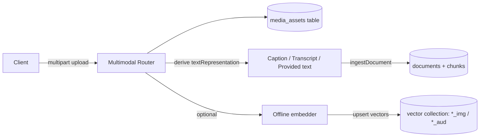

# Multimodal RAG (Image + Audio)

AgentOS’ core RAG APIs are **text-first** (`EmbeddingManager` + `VectorStoreManager` + `RetrievalAugmentor`). Multimodal support (image/audio) is implemented as a composable pattern on top:

1. Store the **binary asset** (optional) + metadata.
2. Derive a **text representation** (caption/transcript/OCR/etc).
3. Index that text as a **normal RAG document** so the existing retrieval pipeline (vector, BM25, reranking, GraphRAG, etc.) can operate without any “special” multimodal database.
4. Optionally add **modality-specific embeddings** (image-to-image / audio-to-audio) as a fast path.

This guide documents the reference implementation used by the AgentOS HTTP API router (`@framers/agentos-ext-http-api`) and the `voice-chat-assistant` backend.

## Why This Design

- **Works by default**: If you can derive text, you can retrieve multimodal assets immediately using the standard RAG pipeline.
- **Optional offline**: Image/audio embedding retrieval is install-on-demand and can be enabled per deployment.
- **No vendor lock-in**: The same abstractions work with `SqlVectorStore`, `HnswlibVectorStore`, or `QdrantVectorStore`.

## Architecture

### Ingest (image/audio)



Key idea: the **derived text** is the canonical retrieval surface. Modality embeddings (when enabled) are an acceleration path, not a requirement.

### Query

```mermaid
flowchart LR
  Q[Query text] -->|RAG query| T[(derived text documents)]
  QI[Query image] -->|offline embedding (optional)| V
  QI -->|fallback: caption then text query| T
  QA[Query audio] -->|offline embedding (optional)| V
  QA -->|fallback: transcribe then text query| T
  T -->|rank chunks| G[Group by assetId]
  V -->|nearest neighbors| G
  G --> A[(media_assets)]
  A --> OUT[Results (+ optional bytes)]
```

## Data Model (Reference Backend)

The backend stores multimodal asset metadata in a dedicated SQL table (name depends on the configured RAG table prefix):

- `media_assets.asset_id` (string) is the stable identifier.
- `media_assets.modality` is `image` or `audio`.
- `media_assets.collection_id` is the “base” collection that the derived text is indexed into.
- `store_payload` controls whether raw bytes are persisted.
- `metadata_json`, `tags_json`, `source_url`, `mime_type`, `original_file_name` are stored for filtering/display.

The derived text representation is indexed as a **normal RAG document**:

- `documentId = assetId`
- `collectionId = media_images` or `media_audio` by default (configurable)
- chunks are generated from `textRepresentation` (usually 1 chunk unless you provide long text)

When offline embeddings are enabled, the reference backend also writes into **embedding collections** derived from the base collection:

- image embeddings: `${baseCollectionId}${suffix}` (default suffix `_img`)
- audio embeddings: `${baseCollectionId}${suffix}` (default suffix `_aud`)

This keeps modality embeddings separate from text embeddings, while still reusing the same vector-store provider.

## HTTP API Surface

The host-agnostic Express router lives in `@framers/agentos-ext-http-api`:

```ts
import express from 'express';
import { createAgentOSRagRouter } from '@framers/agentos-ext-http-api';

app.use(
  '/api/agentos/rag',
  createAgentOSRagRouter({
    isEnabled: () => true,
    ragService, // host-provided implementation
  }),
);
```

It mounts multimodal routes under `/multimodal/*`:

- `POST /multimodal/images/ingest` (multipart field: `image`)
- `POST /multimodal/audio/ingest` (multipart field: `audio`)
- `POST /multimodal/query` (search derived text)
- `POST /multimodal/images/query` (query-by-image)
- `POST /multimodal/audio/query` (query-by-audio)
- `GET /multimodal/assets/:assetId`
- `GET /multimodal/assets/:assetId/content` (only if payload is stored)
- `DELETE /multimodal/assets/:assetId`

See `BACKEND_API.md` for request/response examples and deployment notes.

## Offline Embeddings (Optional)

Offline embeddings are **disabled by default** and are install-on-demand:

- Image embeddings: require Transformers.js (`@huggingface/transformers` preferred; `@xenova/transformers` supported).
- Audio embeddings: requires Transformers.js **and** WAV decoding support via `wavefile` (Node-only in the reference backend).

When offline embeddings are not enabled (or deps are missing), the system falls back to:

- query-by-image: caption the query image, then run text retrieval
- query-by-audio: transcribe the query audio, then run text retrieval

Both query endpoints accept a `textRepresentation` field to bypass captioning/transcription (useful for offline tests and fully air-gapped deployments).

## Configuration (Reference Backend)

These env vars control the multimodal behavior in the `voice-chat-assistant` backend:

- `AGENTOS_RAG_MEDIA_STORE_PAYLOAD=true|false` (default `false`)
- `AGENTOS_RAG_MEDIA_IMAGE_COLLECTION_ID` (default `media_images`)
- `AGENTOS_RAG_MEDIA_AUDIO_COLLECTION_ID` (default `media_audio`)
- `AGENTOS_RAG_MEDIA_IMAGE_EMBEDDINGS_ENABLED=true|false` (default `false`)
- `AGENTOS_RAG_MEDIA_IMAGE_EMBED_MODEL` (default `Xenova/clip-vit-base-patch32`)
- `AGENTOS_RAG_MEDIA_IMAGE_EMBED_COLLECTION_SUFFIX` (default `_img`)
- `AGENTOS_RAG_MEDIA_AUDIO_EMBEDDINGS_ENABLED=true|false` (default `false`)
- `AGENTOS_RAG_MEDIA_AUDIO_EMBED_MODEL` (default `Xenova/clap-htsat-unfused`)
- `AGENTOS_RAG_MEDIA_AUDIO_EMBED_COLLECTION_SUFFIX` (default `_aud`)
- `AGENTOS_RAG_MEDIA_*_EMBED_CACHE_DIR` (optional; recommended for servers to persist model downloads)

## Extending To Video

The recommended approach is the same pattern:

1. Persist video metadata and optional bytes.
2. Derive one or more text representations (e.g. transcript, scene captions, frame OCR).
3. Index derived text into a `media_videos` collection.
4. (Optional) add a video embedding collection for query-by-video.

This keeps the base retrieval system consistent while still allowing richer modality-specific paths.

