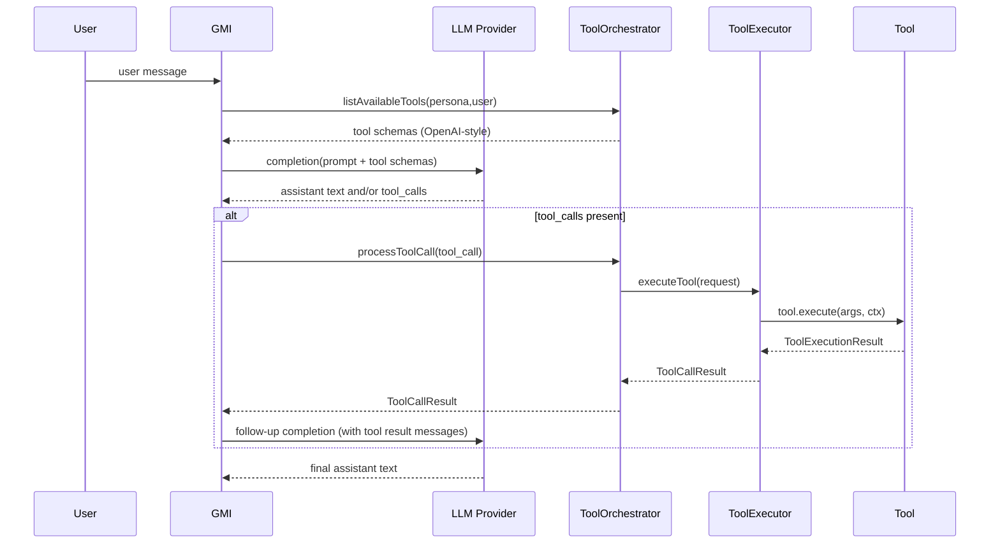
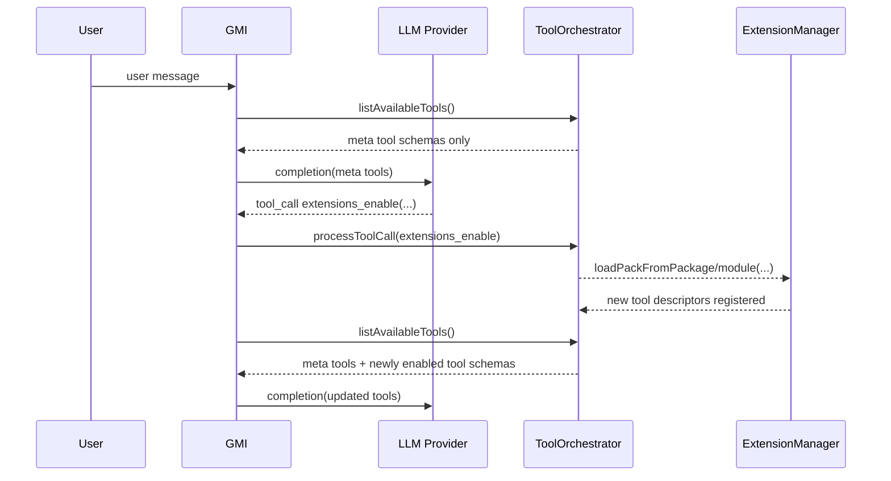

# Tool Calling & Lazy Loading

This guide explains how AgentOS wires **extensions (tools)** and **skills (prompt modules)** into a tool-calling agent loop, and what “lazy loading” means in practice.

## Tool Calling Loop (Runtime)

At a high level, each turn looks like:



Key implementation points:

- `ToolOrchestrator.listAvailableTools()` returns the tool schemas the model can call this turn.
- `ToolOrchestrator.processToolCall()` enforces permissions and delegates execution to `ToolExecutor`.
- `ToolExecutor` resolves tools from the tool `ExtensionRegistry` by tool-call name (`ITool.name`).

## Extensions: How Tools Load

AgentOS loads extension packs from `extensionManifest.packs` via `ExtensionManager.loadManifest()` and registers descriptors into kind-specific registries.

```mermaid
graph TD
  M[ExtensionManifest] --> EM[ExtensionManager.loadManifest]
  EM --> RP[Resolve Pack (factory/package/module)]
  RP --> P[ExtensionPack]
  P --> D[Descriptors]
  D --> R[ExtensionRegistry (by kind)]
  R --> TE[ToolExecutor (tool registry)]
  TE --> TO[ToolOrchestrator]
```

### Pack Resolution Modes

AgentOS supports three ways to resolve a pack entry:

1. `factory`: inline factory returning an `ExtensionPack`
2. `package`: dynamic `import()` of an npm package exporting `createExtensionPack()`
3. `module`: dynamic `import()` of a local module path exporting `createExtensionPack()`

### Descriptor IDs For Tools

Tool calling uses the OpenAI-style tool `name`, which maps to `ITool.name`.

For tool descriptors, keep:

- `descriptor.id === tool.name`

## Secrets & Required Secrets

Descriptors can declare `requiredSecrets`. AgentOS resolves secrets from:

1. explicit `extensionSecrets` (host-provided), plus
2. `packs[].options.secrets` (if provided), plus
3. environment variables mapped via the extension secrets catalog (`extension-secrets.json`)

If a descriptor declares a non-optional secret and it can’t be resolved, it’s skipped.

## Skills: Prompt Modules + Optional Tooling

Skills are prompt modules loaded from `SKILL.md` files. Hosts can inject skills into a system prompt via `SkillRegistry.buildSnapshot()`.

For “lazy” skills, load the `@framers/agentos-ext-skills` extension pack so the model can fetch `SKILL.md` content on demand (via tool calls) instead of pre-injecting everything.

## What “Lazy Loading” Means Here

AgentOS supports a few different “lazy” patterns:

- Lazy optional dependencies: registry helpers can `tryImport()` optional extension packages and skip those not installed.
- Lazy pack import: `package`/`module` entries are imported when `loadManifest()` runs.
- Lazy tool implementation: a tool’s `execute()` can dynamically `import()` heavy dependencies on first call.

### Schema-On-Demand Tool Schemas (Optional)

Tool calling still requires schemas **up front for each round**. However, AgentOS now supports a **schema-on-demand pattern** via optional meta tools that can load extension packs at runtime.

When enabled, AgentOS registers these meta tools:

- `extensions_list` — list loaded packs + curated catalog (if installed)
- `extensions_enable` — load an extension pack at runtime (side effects, HITL recommended)
- `extensions_status` — show packs loaded in this process

Because the GMI loop calls `ToolOrchestrator.listAvailableTools()` on every iteration, any tools added by `extensions_enable` appear in the **next** LLM call’s tool schemas automatically.



#### How To Enable In AgentOS

In `AgentOSConfig`, set:

```ts
schemaOnDemandTools: {
  enabled: true,
  // Recommended for production: allow curated names only (no arbitrary package imports).
  // Default: true in non-production, false in production.
  allowPackages: false,
  // Default: false (prefer curated packages).
  allowModules: false,
  // Default: true. When enabled, `extensions_enable` only loads packs present in
  // the installed @framers/agentos-extensions-registry catalog.
  officialRegistryOnly: true,
}
```

Then start your agent with a minimal `extensionManifest` (or selectively-loaded packs), and let the model call `extensions_enable` as needed.
