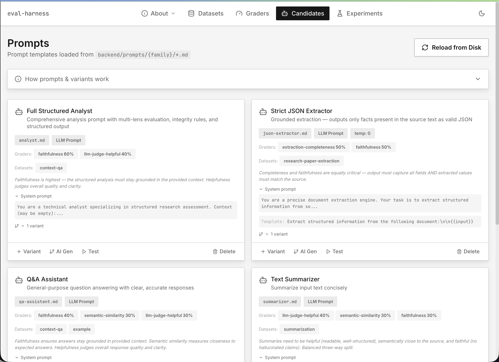
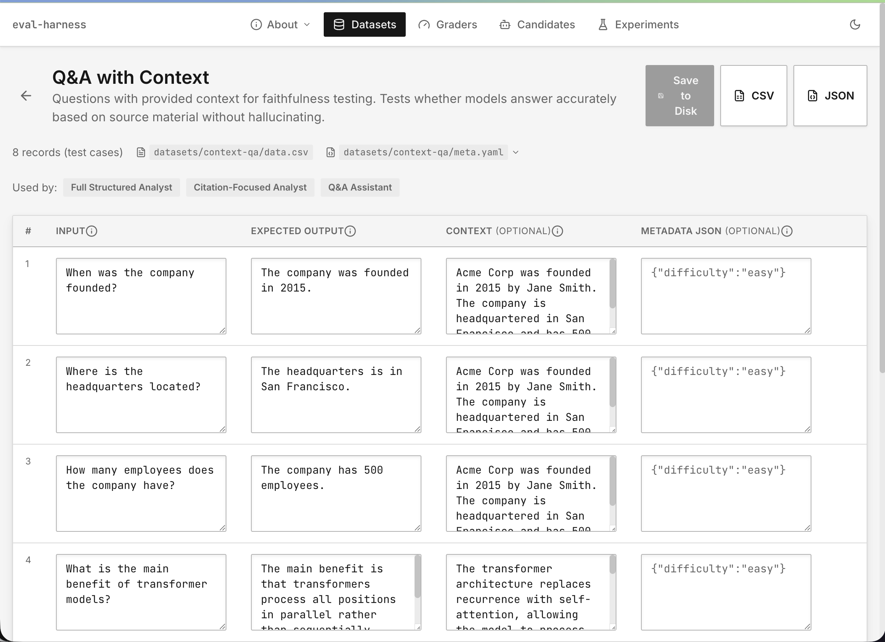
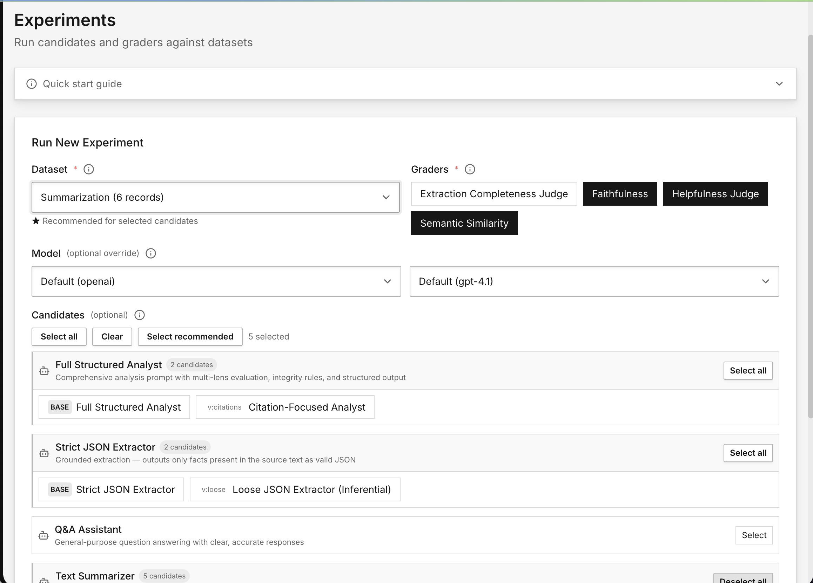
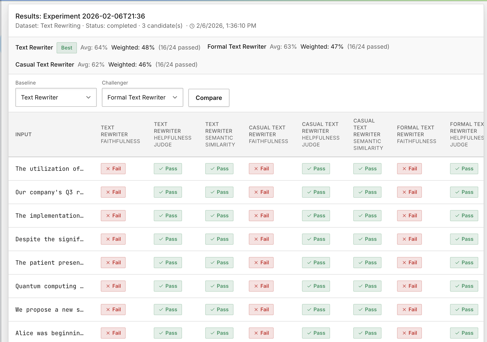

# Full-Stack Eval Harness

A lightweight evaluation harness for testing LLM prompts against datasets with configurable graders. Define prompts as markdown files, load datasets from CSV, grade with YAML-configured graders, run experiments, and compare results.

| Service      | URL                              |
| ------------ | -------------------------------- |
| **Frontend** | `http://localhost:3020`          |
| **Backend**  | `http://localhost:3021`          |
| **API Docs** | `http://localhost:3021/api/docs` |

### Screenshots

<p align="center">
  
</p>
<p align="center"><em>Candidates — browse prompt families, variants, and recommended graders</em></p>

<p align="center">
  
</p>
<p align="center"><em>Dataset detail — inspect test cases with input, expected output, context, and metadata</em></p>

<p align="center">
  
</p>
<p align="center"><em>Run experiment — select dataset, graders, model, and candidates to evaluate</em></p>

<p align="center">
  
</p>
<p align="center"><em>Experiment results — per-candidate scores with pass/fail breakdown across graders</em></p>

---

## Quick Start

```bash
# Install
npm install && npm --prefix backend install && npm --prefix frontend install

# Dev (both services, hot reload)
npm run dev

# Build
npm run build-all              # backend + frontend
npm --prefix backend run build # backend only
npm --prefix frontend run build # frontend only

# Production
npm run build-all && npm run start-all
```

### Scripts

| Command                | What it does                    |
| ---------------------- | ------------------------------- |
| `npm run dev`          | Both services, hot reload (dev) |
| `npm run build-all`    | Build backend + frontend        |
| `npm run start-all`    | Both services, production mode  |
| `npm run test`         | Run backend tests               |
| `npm run lint`         | Lint both                       |
| `npm run backend:dev`  | Backend only (dev)              |
| `npm run frontend:dev` | Frontend only (dev)             |

Configure LLM provider and API key in the **Settings** tab (stored in database, no `.env` needed). Or set defaults in `backend/.env` (see `backend/.env.example`).

---

## Architecture

```
Datasets (CSV test cases)  →  Candidates (prompt files)  →  Graders (YAML)  →  Experiments (results + analytics)
```

Everything is **file-based**: datasets are CSV, prompts are markdown, graders are YAML. All editable on disk, in the UI, or via API. SQLite stores only experiment runs, results, and settings.

### Datasets

CSV files in `backend/datasets/`. Only two columns are required: `input` and `expected_output`. Two optional columns are available:

- **`context`** — reference text the LLM should ground its answer in. Required for the `context-faithfulness` grader (RAG evaluation); ignored by other graders if absent.
- **`metadata`** — arbitrary extra fields (JSON or plain text). Accessible in prompt templates via `{{metadata.field}}`. Useful for tagging test cases (e.g. difficulty, category) but not used by any grader.

Optional `.meta.json` sidecar for display name/description. Upload via UI or drop files in the directory.

**Included:** context-qa, research-paper-extraction, summarization, text-rewriting, text-rewriting-research.

### Candidates (Prompts)

Markdown files organized in **family folders** under `backend/prompts/`. Each folder is one prompt family with a `base.md` parent and variant files. IDs auto-derive from folder structure: folder name = parent ID, `{folder}-{filename}` = variant ID.

```
backend/prompts/
  analyst/
    base.md              → ID: analyst (parent)
    citations.md         → ID: analyst-citations (variant)
  summarizer/
    base.md              → ID: summarizer
    concise.md           → ID: summarizer-concise
    bullets.md           → ID: summarizer-bullets
    verbose.md           → ID: summarizer-verbose
```

**Included prompts (12 across 6 families):**

| Family            | Parent                | Variants                        | Recommended Dataset       | Key Graders (weights)                         |
| ----------------- | --------------------- | ------------------------------- | ------------------------- | --------------------------------------------- |
| `qa-assistant/`   | Q&A Assistant         | —                               | context-qa                | faithfulness:0.4, similarity:0.3, helpful:0.3 |
| `analyst/`        | Structured Analyst    | `citations`                     | context-qa                | faithfulness:0.6, helpful:0.4                 |
| `json-extractor/` | Strict JSON Extractor | `loose`                         | research-paper-extraction | completeness:0.5, faithfulness:0.5            |
| `summarizer/`     | Summarizer            | `concise`, `bullets`, `verbose` | summarization             | helpful:0.4, similarity:0.3, faithful:0.3     |
| `text-rewriter/`  | Text Rewriter         | `formal`, `casual`              | text-rewriting            | faithfulness:0.6, similarity:0.4              |

**Recommended graders & datasets:** Each prompt declares `recommended_graders` with weights and `recommended_datasets` in its frontmatter. Any grader can be used with any prompt — the recommendations control **weighted scoring**. When an experiment runs, results include both an equal-weight average and a weighted score using each prompt's declared weights, so you can see what matters most for each candidate.

**Adding variants:** Click `+ Variant` on any prompt in the Candidates tab (or use `AI Gen` to auto-generate variants). This creates a new `.md` file in the parent's folder. You can also add files manually — any `.md` file in a family folder that isn't `base.md` becomes a variant.

**Prompt file format:**

```markdown
---
name: Full Structured Analyst
runner: llm_prompt
user_template: '{{input}}'
recommended_graders: faithfulness:0.6, llm-judge-helpful:0.4
recommended_datasets: context-qa
grader_rationale: Faithfulness is highest — must stay grounded in context.
---

You are a technical analyst...
```

Template variables: `{{input}}`, `{{context}}`, `{{expected}}`, `{{metadata.field}}`

### Graders

YAML files in `backend/graders/`. Each grader scores LLM output as pass/fail with a 0–1 score. Multiple graders combine at the experiment level via weighted scoring.

| Grader                      | Type                | Description                                                                                                                    | Config                                            |
| --------------------------- | ------------------- | ------------------------------------------------------------------------------------------------------------------------------ | ------------------------------------------------- |
| **Faithfulness**            | Promptfoo           | Checks that response claims are grounded in provided context. Threshold adjustable (0.7 moderate, 0.85 balanced, 0.9+ strict). | threshold: 0.8, assertion: `context-faithfulness` |
| **Helpfulness Judge**       | LLM Judge           | LLM evaluates if response is helpful and accurate.                                                                             | rubric                                            |
| **Extraction Completeness** | LLM Judge           | LLM evaluates extraction quality, completeness, and grounding.                                                                 | rubric                                            |
| **Semantic Similarity**     | Semantic Similarity | Measures how close the output meaning is to the expected answer. Threshold adjustable (0.7 moderate, 0.85 strict, 0.9+ exact). | threshold: 0.8                                    |

**Faithfulness** — Decomposes output into atomic claims, verifies each against the provided context via NLI. Score = fraction of supported claims. Delegates to [promptfoo](https://promptfoo.dev)'s RAGAS implementation ([Es et al., 2023](https://arxiv.org/abs/2309.15217)) — multiple LLM calls per evaluation.

**Helpfulness / Extraction Completeness** — LLM-as-Judge ([Zheng et al., 2023](https://arxiv.org/abs/2306.05685)). Sends input + output + rubric to the LLM at temperature 0.1, returns `{pass, score, reason}` JSON. Different rubrics — Helpfulness checks accuracy and clarity; Extraction Completeness checks completeness, accuracy, grounding, and JSON structure.

**Semantic Similarity** — Embeds both texts via provider APIs (OpenAI `text-embedding-3-small`, Ollama), computes cosine similarity between vectors. Falls back to Jaccard + weighted token overlap when embeddings are unavailable.

4 additional evaluation types are supported but have no seed graders (task-specific, create from the Graders tab): **exact-match**, **contains**, **regex**, **json-schema**.

Thresholds and rubrics are editable in the UI. Create new graders from the Graders tab or drop YAML files in `backend/graders/`.

### Experiments

Select dataset + candidates + graders → Run. Results stream via SSE. Each candidate gets an average score and a weighted score (using the prompt's `recommended_graders` weights). Compare candidates side-by-side with the A/B comparison endpoint.

**Prompt variation evaluation:** Create multiple variants of a prompt (e.g. `summarizer`, `summarizer-concise`, `summarizer-bullets`) and run them against the same dataset and graders in a single experiment. The results show per-candidate scores, letting you directly compare which prompt formulation performs best across your test cases.

**RAG system evaluation:** The `context-faithfulness` grader (powered by promptfoo) measures whether outputs stay grounded in the provided context — a core RAG evaluation metric. Combined with `answer-relevance` and `context-recall` graders, you can evaluate different RAG pipeline configurations by swapping candidates that call different retrieval backends via the `http_endpoint` runner type. Each candidate can point to a different RAG service, and the harness grades them all against the same dataset.

---

## API Reference

Full endpoint reference in [API.md](API.md). Interactive Swagger docs at [`localhost:3021/api/docs`](http://localhost:3021/api/docs).

---

## Tech Stack

| Layer    | Tech                                               | Port          |
| -------- | -------------------------------------------------- | ------------- |
| Frontend | Next.js 15                                         | 3020          |
| Backend  | NestJS                                             | 3021          |
| Database | SQLite (via Drizzle ORM; Postgres adapter planned) | —             |
| LLM      | OpenAI, Anthropic, Ollama                          | —             |
| Docs     | Swagger/OpenAPI                                    | 3021/api/docs |

## Project Structure

```
├── frontend/                    # Next.js 15 app
│   └── src/
│       ├── app/                 # Pages: datasets, graders, candidates, experiments, settings, about
│       ├── components/          # Navigation, ThemeProvider, Toast
│       └── lib/                 # API client, types
├── backend/
│   ├── datasets/                # CSV files + optional .meta.json sidecars
│   ├── graders/                 # YAML grader files
│   ├── prompts/                 # Folder-per-family prompt files
│   └── src/
│       ├── database/            # IDbAdapter + SQLite implementation (Drizzle)
│       ├── datasets/            # DatasetLoaderService
│       ├── candidates/          # PromptLoaderService + CandidateRunnerService
│       ├── experiments/         # Experiment orchestrator + SSE + weighted stats
│       ├── eval-engine/         # Grader implementations (7 types)
│       ├── graders/             # Grader CRUD
│       ├── llm/                 # Provider-agnostic LLM layer
│       ├── presets/             # Seed graders + synthetic generation
│       ├── settings/            # Runtime configuration
│       └── main.ts              # App bootstrap, CORS, Swagger
└── README.md
```

## Testing

```bash
cd backend
npm test                                      # All tests
npm test -- --testPathPattern=candidates       # Prompt loader + template utils
```

---

## Roadmap

### First-Class RAG Testing

Today you can evaluate RAG systems by including `context` in dataset rows and using the `context-faithfulness` grader. Candidates can also point to external RAG services via the `http_endpoint` runner type — each candidate hits a different endpoint, and the harness grades all responses against the same dataset. This means the harness works for both **prompt variation testing** (same LLM, different prompts) and **RAG pipeline comparison** (different retrieval backends, same graders).

Planned: a `rag_prompt` runner with built-in retrieval config (method, topK, chunking, reranking), dataset-level source indexing (docs/URLs → chunks → vector store), and retrieval trace persistence in experiment results for debugging.

Backend scaffolding exists in `backend/src/retrieval/` (interfaces + module stub).

### Parallelization

Experiments currently run sequentially — one test case × one candidate × one grader at a time. Since each step is an LLM API call (I/O-bound), parallelization is straightforward:

1. **Concurrent promises** (planned first) — `Promise.all()` with a concurrency limiter (`p-limit`). Graders for the same output are independent and can run in parallel. Expected 5–10x speedup for typical experiments.
2. **Batch API** — OpenAI and Anthropic offer bulk endpoints (submit many requests, get results asynchronously). 50% cost discount on OpenAI. Best for large offline runs (100+ test cases), not real-time.
3. **Worker threads** — Only useful for in-process inference (ONNX, transformers.js). Does not help with external APIs or Ollama.
