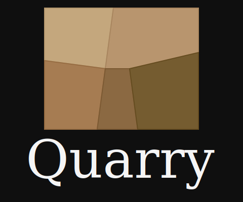

<p align="center">
  
</p>

<h1 align="center">Quarry Community Plugins</h1>

<p align="center">
  Official community plugin repository for <a href="https://github.com/framersai/quarry">Quarry</a> — the open-source AI-native personal knowledge management system by <a href="https://frame.dev">Frame.dev</a>
</p>

## What is Quarry?

Quarry is the open-source edition of Frame.dev's knowledge management platform, featuring:
- Knowledge graph visualization
- Semantic search
- Full plugin & theme support
- Markdown rendering with custom extensions
- Offline-first architecture

## Installing Plugins

### From the Registry (Recommended)

1. Open Quarry and click the **Plugins** tab in the sidebar
2. Click **Browse Registry**
3. Find the plugin you want and click **Install**

### From URL

1. Go to the **Plugins** tab
2. Click **Install from URL**
3. Paste the plugin's ZIP URL (e.g., `https://github.com/user/plugin/releases/download/v1.0.0/plugin.zip`)

### Manual Installation

1. Download the plugin ZIP file
2. Go to **Plugins** → **Install from ZIP**
3. Select the downloaded file

## Creating Plugins

### Quick Start

```bash
# Clone the template
git clone https://github.com/quarry-plugins/template-widget my-plugin
cd my-plugin

# Edit manifest.json with your plugin details
# Write your plugin code in main.ts

# Build (if using TypeScript)
npm install && npm run build

# Test locally by installing via ZIP in Quarry
```

### Plugin Structure

```
my-plugin/
├── manifest.json    # Required: Plugin metadata
├── main.js          # Required: Plugin entry point
├── styles.css       # Optional: Plugin styles
└── README.md        # Recommended: Documentation
```

### manifest.json

```json
{
  "id": "com.yourname.plugin-name",
  "name": "My Plugin",
  "version": "1.0.0",
  "description": "What your plugin does",
  "author": "Your Name",
  "authorUrl": "https://yoursite.com",
  "minQuarryVersion": "1.0.0",
  "main": "main.js",
  "styles": "styles.css",
  "type": "widget",
  "position": "sidebar",
  "settings": {
    "mySetting": {
      "type": "boolean",
      "default": true,
      "label": "Enable Feature",
      "description": "Toggle this feature on/off"
    }
  }
}
```

### Plugin Types

| Type | Description | Position Options |
|------|-------------|------------------|
| `widget` | Sidebar panel with custom UI | `sidebar`, `sidebar-bottom`, `metadata` |
| `renderer` | Custom markdown rendering | `content` |
| `processor` | Content transformation | N/A |
| `theme` | Visual theming | N/A |
| `panel` | Full panel component | `sidebar`, `metadata`, `floating` |
| `toolbar` | Toolbar buttons/menus | `toolbar` |
| `command` | Keyboard commands | N/A |

### Plugin API

```typescript
class MyPlugin extends QuarryPlugin {
  async onLoad() {
    // Register a sidebar widget
    this.api.registerSidebarWidget(MyWidgetComponent)

    // Register a command
    this.api.registerCommand({
      id: 'my-command',
      name: 'Do Something',
      hotkey: 'Ctrl+Shift+M',
      callback: () => this.doSomething()
    })

    // Register custom markdown syntax
    this.api.registerMarkdownRenderer({
      pattern: /\[\[(.+?)\]\]/g,
      component: WikiLinkRenderer,
      priority: 10
    })

    // Listen to events
    this.api.on('navigate', (path) => {
      console.log('Navigated to:', path)
    })

    // Store data
    this.store('myKey', { some: 'data' })
  }

  async onUnload() {
    // Cleanup
  }

  onSettingsChange(key: string, value: any) {
    // React to setting changes
  }
}
```

### Widget Props

Widget components receive these props automatically:

```typescript
interface WidgetProps {
  /** Plugin API instance */
  api: QuarryPluginAPI
  /** User settings values */
  settings: Record<string, unknown>
  /** Current theme name */
  theme: string
  /** Whether dark mode is active */
  isDark: boolean
  /** Whether widget is expanded to full-page modal */
  isExpanded?: boolean
}
```

#### Full-Page Modal Expansion

All widgets automatically get an expand button that opens the widget in a full-page modal. When expanded:
- `isExpanded` prop is `true`
- Widget has full viewport space (responsive inset margins)
- Modal closes with Escape key or clicking backdrop
- Widget can render different UI based on `isExpanded`

```tsx
function MyWidget({ api, settings, isDark, isExpanded }: WidgetProps) {
  if (isExpanded) {
    // Full-page view with more details
    return (
      <div className="p-6">
        <h1>Expanded View</h1>
        <DetailedContent />
      </div>
    )
  }

  // Compact sidebar view
  return (
    <div className="p-2">
      <CompactContent />
    </div>
  )
}
```

#### Position Options

| Position | Description |
|----------|-------------|
| `sidebar` | Left sidebar (below mode buttons) |
| `sidebar-bottom` | Bottom of left sidebar |
| `metadata` | Right sidebar (below Ambience section) |
| `toolbar` | Main toolbar row |
| `floating` | Draggable overlay |
| `content` | Inside content area |

**Note:** Widgets with `metadata` position appear in the right sidebar when the Plugins mode is not active in the left sidebar.

### Persisting Widget State

Widgets are rendered as **separate React instances** in the sidebar and full-page modal views. This means standard `useState` will reset when switching between views. To maintain state across remounts, use the plugin API's storage methods:

```typescript
function MyWidget({ api, settings, isDark, isExpanded }: WidgetProps) {
  // Initialize state from localStorage
  const [count, setCount] = useState(() => {
    return api.getData<number>('count') ?? 0
  })

  // Persist state on every change
  useEffect(() => {
    api.setData('count', count)
  }, [count, api])

  return (
    <button onClick={() => setCount(c => c + 1)}>
      Clicked {count} times
    </button>
  )
}
```

#### Timer State with Time Compensation

For timers that should continue running even when the widget unmounts (e.g., switching views), store a `lastTick` timestamp and compensate for elapsed time on remount:

```typescript
interface TimerState {
  timeLeft: number
  isRunning: boolean
  lastTick: number  // Date.now() timestamp
}

function TimerWidget({ api }: WidgetProps) {
  const [timer, setTimer] = useState<TimerState>(() => {
    const saved = api.getData<TimerState>('timerState')
    if (saved?.isRunning && saved.lastTick) {
      // Compensate for time elapsed while unmounted
      const elapsed = Math.floor((Date.now() - saved.lastTick) / 1000)
      return {
        ...saved,
        timeLeft: Math.max(0, saved.timeLeft - elapsed),
        lastTick: Date.now(),
      }
    }
    return saved ?? { timeLeft: 1500, isRunning: false, lastTick: Date.now() }
  })

  // Persist on every tick
  useEffect(() => {
    api.setData('timerState', { ...timer, lastTick: Date.now() })
  }, [timer])

  // ... timer interval logic
}
```

See the [Pomodoro Timer plugin](plugins/pomodoro-timer/main.ts) for a complete implementation example.

### Available API Methods

```typescript
interface QuarryPluginAPI {
  // Navigation
  navigateTo(path: string): void
  openFile(path: string): Promise<void>

  // Content
  getContent(): string
  getMetadata(): StrandMetadata

  // UI
  showNotice(message: string, type?: 'info' | 'success' | 'warning' | 'error'): void
  showModal(options: ModalOptions): Promise<boolean>

  // Storage (per-plugin)
  getData<T>(key: string): T | null
  setData<T>(key: string, value: T): void

  // Events
  on(event: EventType, callback: Function): () => void

  // Registration
  registerSidebarWidget(component: React.ComponentType<WidgetProps>): void
  registerToolbarButton(options: ToolbarButtonOptions): void
  registerCommand(options: CommandOptions): void
  registerMarkdownRenderer(options: RendererOptions): void

  // Context
  getContext(): PluginContext
}
```

### Events

| Event | Payload | Description |
|-------|---------|-------------|
| `navigate` | `{ path: string }` | User navigated to a page |
| `contentLoad` | `{ content: string, metadata: object }` | Content loaded |
| `settingsChange` | `{ key: string, value: any }` | Plugin setting changed |
| `themeChange` | `{ theme: string }` | Theme changed |
| `search` | `{ query: string }` | Search performed |

## Contributing

### Submitting a Plugin

1. Fork this repository
2. Create your plugin in `plugins/your-plugin-name/`
3. Ensure your plugin has:
   - Valid `manifest.json`
   - Working `main.js`
   - `README.md` with usage instructions
4. Add your plugin to `registry.json`
5. Submit a Pull Request

### Guidelines

- **ID Format**: Use reverse domain notation: `com.yourname.plugin-name`
- **Versioning**: Follow [semver](https://semver.org/)
- **Compatibility**: Specify accurate `minQuarryVersion`
- **Documentation**: Include clear README with examples
- **Testing**: Test your plugin thoroughly before submitting
- **No Malware**: Plugins must not contain malicious code

### Validation

All PRs are automatically validated:
- Manifest schema validation
- Version compatibility check
- Basic security scan
- Build verification

## Official Plugins

| Plugin | Type | Description |
|--------|------|-------------|
| [Pomodoro Timer](plugins/pomodoro-timer) | widget | Focus timer with work/break cycles |
| [Citation Manager](plugins/citation-manager) | renderer + widget | Academic citation support |
| [Custom Callouts](plugins/custom-callouts) | renderer | Styled callout blocks |

## License

All plugins in this repository are licensed under the [MIT License](LICENSE) unless otherwise specified.

## Support

- [Quarry Documentation](https://frame.dev/quarry/docs)
- [Plugin Development Guide](https://frame.dev/quarry/docs/plugins)
- [Discord Community](https://discord.gg/framedev)
- [GitHub Issues](https://github.com/framersai/quarry-plugins/issues)

---

<p align="center">
  <sub>Built with ❤️ by <a href="https://frame.dev">Frame.dev</a></sub>
</p>
